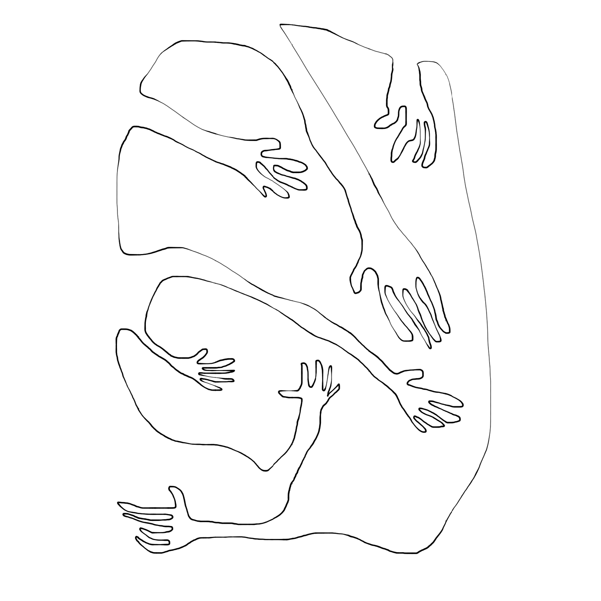

<!---
title: Art of the Living Dead Chapter 11
published: true
folder: Art of the Living Dead
layout: chapter
membersonly: true
--->
# The Threat of Creativity  
> _"I can't understand why people are frightened of new ideas. I'm frightened of the old ones."_ — John Cage

---

Zombies are drawn to the pulse of your creative spirit like a moth to a flame. They feel that their survival is threatened by your life force. Your desire to innovate is not something they can passively ignore. No, they need to destroy it. This seems like a strange reaction, doesn't it? Why would a zombie be so unwilling to invest any energy into creating their own art, and yet when it comes to destroying your art they suddenly have an unstoppable surge of aggression?  

Have you ever created something new and then been surprised by the opposition it was received with? Perhaps you have created something original that sparked an unexpected amount of brutal criticism. It seems that the best ideas are met not with open arms but hostile resistance. This is not unprecedented and it shouldn't surprise us. The stories we learn as children teach us that new ideas aren't peacefully welcomed, but met with vicious dissent. Here are some examples:  

Noah created a vessel capable of saving everyone, but only eight people had the courage to support him on the ark. Everyone else laughed and opposed his effort with righteous disapproval.  

Galileo was arrested for championing the idea that the world was not flat. Copernicus' heliocentric theory wasn't published during his lifetime because he feared the violent uprising that his suggestion that our planet revolves around the sun would instigate.  

The Reformation was not a peaceful acceptance of Martin Luther's ideas, but a bloody war of ideas that ripped the Catholic church apart.  

Composer Igor Stravinsky's masterpiece, _The Rite of Spring_ is widely considered to be among the most influential musical works of the 20th century, yet in the first public performance it caused riots because the audience wasn't ready for a revolution.  

Vincent van Gogh's genius was only recognized after death. How could 2,000 works of art by this master go unnoticed during his lifetime?  

Alice Stewart proved that x-rays during pregnancy could cause childhood cancer but it took a quarter of a century of medical resistance before the practice was curtailed.  

The implication here is that if you are going to create world-changing work it is almost guaranteed to be met with resistance. When zombies are presented with something that is original and unique they have a natural bias against it.  

Do people unknowingly prefer non-creative ideas? This hypothesis was tested by researchers from Cornell, Penn, and the University of North Carolina. Their findings are published in a paper titled, _The Bias Against Creativity: Why People Desire But Reject Creative Ideas._ What they discovered was that while participants universally agreed that creativity is a desired goal, when presented with actual creative ideas they tended to endorse the less creative options. Here is their conclusion,  

> "Our findings imply a deep irony. Prior research shows that uncertainty spurs the search for and generation of creative ideas, yet our findings reveal that uncertainty also makes us less able to recognize creativity, perhaps when we need it most."  

The study identified the trigger as uncertainty. People will reject ideas that they can't be certain about. It doesn't matter if the idea is actually good or bad, human nature condemns anything truly original. For those of us who make a living striving for originality, this can be devastating. How do you battle human nature? Many artists retreat and create safe work rather than suffer the rejection that true innovation will elicit.  

If you are going to create truly creative work you need to prepare for opposition. You will make people uncomfortable. You will offend them. They will instinctively rebel against your art. Knowing this won't make your battle any easier, but at least it won't catch you by surprise. When the uncertainty of strangers threatens your art, you will be ready.  

There isn't a magical place where all brilliant ideas are recognized and beautiful designs never go unused. In the real world you are going to have to fight for your work to see the light of day. Nobody is going to swoop in and champion your work for you. You will be much more successful when you became your own evangelist, promoter, and cheerleader. 

Once you decide to risk your reputation in support of an idea, it will be much easier gain support. When you carry the risk on your shoulders it helps the hesitant observers to get onboard because they know they can point at you when things get tough. That is okay. Your attitude needs to be, "Blame me, but don't worry. I will not let the project fail. I will do whatever it takes to get it done, whether you support me or not." The only way to do good work is to champion the big ideas yourself. Don't expect your work to be embraced. Fight for it.  

[Chapter 12. Impostor Syndrome](chapter12.html)  