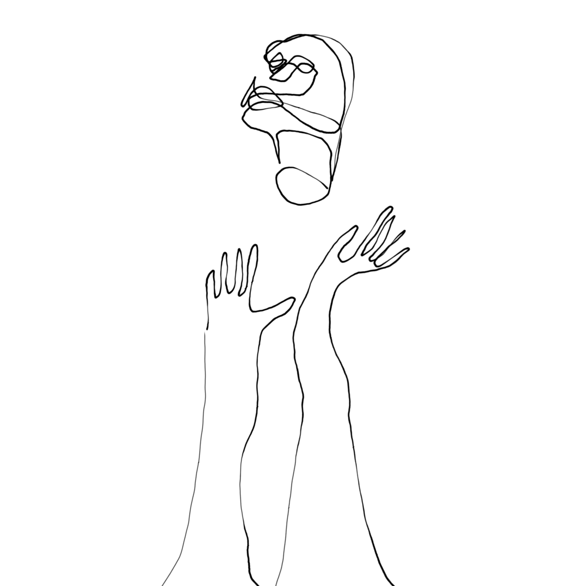

<!---
title: Art of the Living Dead Chapter 12
published: true
folder: Art of the Living Dead
layout: chapter
membersonly: true
--->
# Impostor Syndrome  
> _"I do not understand my own actions. For I do not do what I want, but I do the very thing I hate... For I do not do the good I want to do, but the evil I do not want to do, this I keep on doing."_ — Romans 7:15, 19

---

It is impossible to exist in our society without feeling the bite of zombies. It infects our mind and corrupts our best intentions. Fortunately, being bitten is not necessarily a death sentence.  

You and I and all non-zombies suffer from impostor syndrome. We have a nagging fear that if other people knew the truth, if they saw the real us, they would discover that we are figuring things out as we go. To a certain extent we are faking it. We are afraid that eventually we will slip up and people will discover something horrible, that hiding under an illusion of skill and professionalism this whole time has been a fraud. We fear that the holes in our education will be exposed. We fear that our successes were flukes that we will never be a able to replicate. We fear that when the truth comes out people will wonder how we even got hired in the first place because we are so obviously unqualified. This is completely irrational, but it is also nearly universal. 

If you have the stomach for it, I would like you to join me as I conduct an autopsy of a zombie brain. I have to warn you, this could get messy. Let's roll up our sleeves and dig in. Would you be so kind as to hand me my bone saw? Thanks.   

On the autopsy table today is a zombie named Mark, who incidentally, was my tennis coach in college. As you can see there is nothing out of the ordinary on the outside of his head. Zombie movies are vague and often contradictory about the zombie brain. Do they have a brain at all? Has it been replaced by something else? Or is the brain damaged, keeping only the functions required to lurk around and devour people? We'll find out as soon as I am done cutting.  

Finished. As the skull opens we get the first look at Mark's brain. Astonishing. The spongy pink organ looks completely normal. No signs of damage. No trace of infection, trauma, or damage of any kind. How can this be? Could Mark be human after all? No. He was definitely a zombie, incapable of any creative thought. Maybe something else is going on here.  

It turns out that we all have a zombie brain. As convenient as it would be to make a clean separation between us and them, we don't have the luxury of being able to identify them by rotting flesh, lifeless limping, or brain analysis. They look like us, talk like us, and act like us because they _are_ us. We all vacillate between mindless zombie behavior and meaningful human activities. Each of us is infected and the monster is inside our head, battling for control. Victory is not just conquering the outsiders who oppose our art, but also overcoming our inner zombies.  

In his book, _The War of Art_, Steven Pressfield identifies the enemy as "the force that prevents us from achieving our potential." Pressfield calls this "the resistance." It is the resistance that produces painters who don't paint, writers who don't write, and entrepreneurs who don't start new ventures. Pressfield explains that the way to overcome the resistance is a very intentional mental commitment. He says,  

> "As artists and professionals it is our obligation to enact our own internal revolution, a private insurrection inside our own skulls."  

We like to think of ourselves as the heroes in our own personal dramas, but the fact is that we are often our own worst enemy. We are regularly defeated by our procrastination, addiction, worry, doubt, fear, anger, blame and countless other self-inflicted wounds. It is easy to blame the external zombies for our failures, but often the blame falls on our own shoulders.  We sabotage ourselves then point blame at obstacles that didn't have anything to do with our failure. The irony is that this internal hurdle, our inner zombie, is as hard to overcome as any physical obstacle. We are on the verge of greatness, and the thing that will defeat us is not direct opposition, but self-sabotage.  

How do we fight our inner zombie? The first step is to admit that it exists. It might help to give him a name. Let's call him Hank. Identifying Hank allows us to separate ourself, our creative self, from the zombie within and gives us an enemy that we can battle.  

Hank is ruthless. He knows exactly what to say to kill forward momentum. There is a scene in _Fight Club_ where people are trying to join a secret community called _Project Mayhem_. To test the commitment of an applicant, he must stand on the front porch and endure insults for three days. The antagonist, Tyler Durden explains that, 

> "If the applicant is young, we tell him he's too young. If he's fat, he's too fat. If he's old, he's too old. Thin, he's too thin. White, he's too white. Black, he's too black." 

This is exactly how Hank operates. He insults everything you are and everything you do. When you do something obvious, he accuses you of being too obvious. When you make a subtle point Hank accuses you of being too subtle. Serious thoughts are too serious. Violent ideas are too violent.  

Hank is lazy and loves to make excuses because he desperately wants to escape from doing work. Hank says,   

> "There isn't enough time. It's against the rules. Nobody has done it before. It's not our fault."  

Hank wants to feel helpless, claiming that you don't have permission to do great things,  

> "They won't let us. We can't afford it. It's impossible."  

Hank embraces contempt directing anger at anything other than your own failure.  

> "They don't pay us enough. Our equipment isn't good enough. We have more important things to do anyway."  

Does that sound familiar? Have many times have you been paralyzed by the voice in your head? Why does Hank so regularly defeat us? 

Hank is primed to attack anything that he feels is a threat to his survival. The part of our brain responsible for survival is called the limbic system. Hank is the voice of these primal needs. In the words of former FBI agent and body language expert, Joe Navarro,  

> "One of the classic ways the limbic brain has assured our survival as a species... is by regulating our behavior when confronting danger... In order to ensure our survival, the brain's very elegant response to distress or threats, has taken three forms: _freeze_, _flight_, and _fight_."  

I wouldn't go as far as to call Hank's methods "elegant," but freeze, flight, and fight are the only three weapons in Hank's arsenal. It doesn't seem like much, but he wields them with brutal mastery. Freeze, flight, and fight are a combination of tactics that have devastated countless artists. Here is how they work...

When the opportunity to create art arises, Hank's first wave of attacks employ the freeze weapon. There are countless variations, but it is essentially a well-placed seed of doubt. Hank will say,  

> "Are you really sure this is the best use of your time?" 

or,  

> "Really? You want to create what? That is too much work and it will probably fail anyway."

Rather than confront Hank, we freeze. Like a deer in the headlights, our progress is stopped in its tracks. We fail to complete our work because we can't recover from the zombie-induced paralysis. The freeze response defeats us before we even get started.  

If we are able to withstand the freeze attack, Hank will begin to fire his flight weapon. This manifests itself in the form of procrastination. All of a sudden you will feel pressure to escape your work. You get uncontrollable urges to clean, you finally get around to organizing your files, and your to-do list is suddenly never-ending. Rather than confronting our art, Hank persuades us to escape the burden of our work by ignoring it. We end up on the sofa nursing a beer rather than fulfilling our life's purpose. The flight response defeats us because our work never gets completed.  

If you have the courage and stamina to withstand the first two waves of attack of freeze and flight, the third limbic response, fight, will begin. This is where Hank takes off his gloves and gets nasty. The reason his fight is so viscous is that his words sound like legitimate criticism. You only need to take one of his observations to heart and you are done, finished. Just because he is a zombie doesn't mean he is always wrong, often Hank is right and this is why his final attack is so effective. As I write these words, Hank is pounding me with attacks like,  

> "Really Adrian? A non-fiction book about zombies? People don't read books anymore, so why would they read one as crazy as this? We are thousands of hours short of the experience necessary to produce a quality book, we should stop wasting our time. Nobody succeeds with their first book."

Mixed into this attack is an unknowable amount of truth. If Hank's critique doesn't sink us he is already planting the seeds for a future attack. If we complete this art but it fails, Hank will never let you forget it. He loves to say "I told you so.”  

Fortunately, we have a new weapon against Hank. We know he exists. In the past, he has defeated us because we thought his voice was our own. Now we realize that he doesn't represent the living part of our mind, but the rotten dead parts. Letting him win means that we forfeit the living part of ourselves, the creative parts. If Hank wins, the infection will spread until eventually we become a zombie. Hank has conquered us more than once, and he will probably defeat us again in the future, but we can't let him win the war.  

We can defeat Hank by hearing his words and proceeding with our art anyway. You can respond to Hank's attack by saying, 

> "Hank, you may be right, but I make the final decision and I am going to finish this anyway. You are a force of evil that has never produced anything of value. You disgust me. I realize that you will fight me every step of the way, but I am prepared to battle. You will not defeat me this time."  

Hank has weaknesses. For one thing, Hank likes to sleep in longer than you. If you pay attention to the first thoughts as you awake, Hank isn't there to shoot them down. These ideas are pure and protected by the safe pillow of sleep. Hank dozes off in the car on long drives. He leaves you alone when you exercise. This is pretty universal zombie behavior, and this is why you have your best ideas in the shower, on your commute to work, or on the treadmill. These are the moments when zombies let down their guard and your creative mind can score easy wins.  

Once you get into the zone and your mind is firing on all its creative cylinders, Hank doesn't exist. Unfortunately, you can't stay in the zone forever, eventually you have to return to Hank's turf. He makes it really difficult to get back into the zone. The closer you get to completing your art, the harder Hank fights to prevent you from shipping.  

Having an inner zombie is a dark secret that we try to hide. We know it's in there, but we never admit it openly. We think that if anyone knew the truth they would reject us. In order to hide Hank from outsiders we create a persona, a myth about ourselves as humans who don't struggle, rarely fail, and have endless confidence. We do this dance with good intentions, the goal is to create art after all, but the result is impostor syndrome. Unfortunately, this is another weapon that Hank uses to slice our ambition to shreds. Hank sees the misalignment between our outward persona and our internal shortcomings and rubs it in our face whenever possible. He calls you a _hypocrite_. 

With two opposing voices in your head, it is impossible to avoid hypocrisy. At any point in time you will be betraying yourself. We think of hypocrisy as a trait of zombies, but they don't struggle with it the way we do. Authenticity doesn't matter to a zombie. They simply select the method that is the quicker shortcut to their goals, regardless of how fraudulent.  

Anyone who says they have it all figured out is lying. We are all figuring things out as we go. We put in our time, longing for the day when our work rises above mediocrity. We hope our art makes a connection with people but we know that can't be guaranteed. All we can do is keep working. If we are lucky we will complete our work. Then all we can do is submit our offering to our fellow travelers and hope it finds pleasure in their eyes.  

Another of Hank's most devious attacks is an accusation of selfishness. Compared to donating your time and resources to charity, the act of creativity might seem selfish because once you commit yourself to your craft you work with blinders on. You might isolate yourself from others to focus completely on your art. You put your money towards your endeavors first and donate to others only if there is excess cash leftover. You might not put the effort into relationships that is required to keep them healthy. Framed this way, the creative person doesn't sound like a hero at all. He sounds selfish. I don't want to discourage anyone from putting effort into being a kind, generous, and loving person. I would, however, like to try to relieve the guilt that might accompany anyone who chooses to pursue creation over other more "charitable" uses of their time and resources.  

Creativity is not selfish, it's not a luxury item reserved for people with extra income and time on our hands. Everyone has the obligation to use their creative capacity. It is not a privilege, but rather a mandate that each of us has been given from birth. Choosing not to use your creative powers is a decision to intentionally deprive the world of the most valuable contribution you could possibly make. Steven Pressfield says,  

> "Creative work is not a selfish act or a bid for attention on the part of the actor. It's a gift to the world and every being in it."  

If you really want to love your neighbor, sit down and get to work. Dedicate yourself completely to the hard work of making the world better. Cure cancer, compose your symphony, hack Ikea, or write software. You have a job to do and you can't let anything stop you. Forgive yourself. Give yourself permission to fail. If we can defeat our inner zombie, the doors of opportunity open to us.  

[Chapter 13. Zombies Don’t Cry](chapter13.html)  