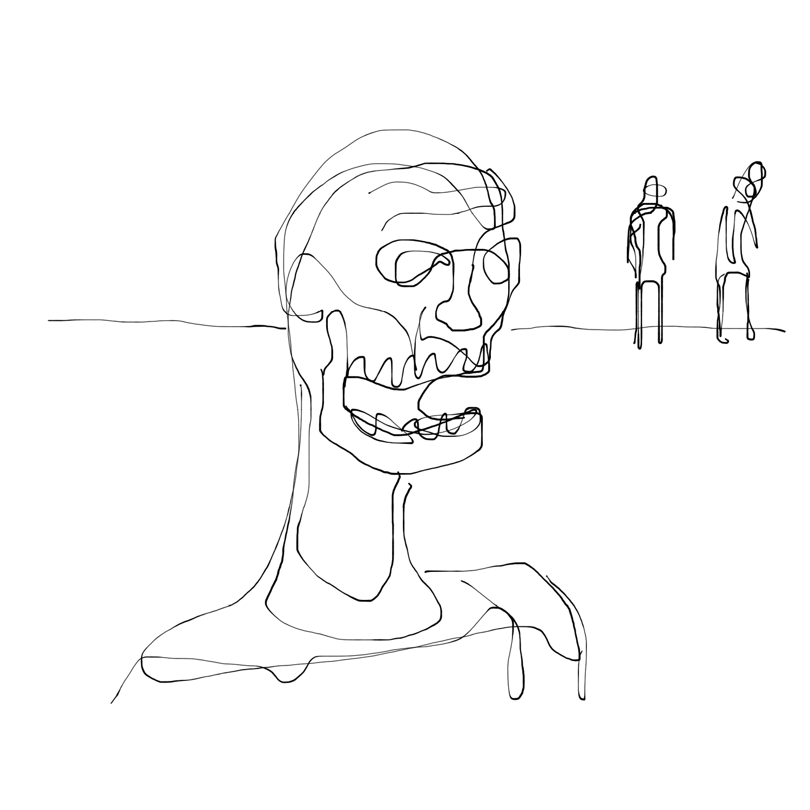
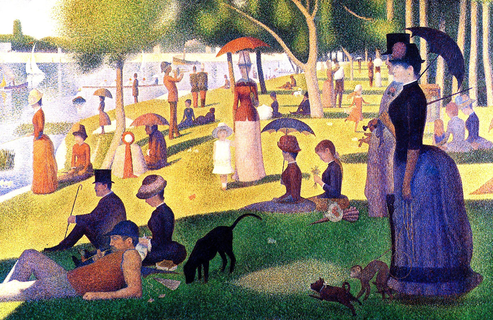

<!---
title: Art of the Living Dead Chapter 14
published: true
folder: Art of the Living Dead
layout: chapter
membersonly: true
--->
# Magic and the Illusion of Talent 
> _"Any sufficiently advanced technology is indistinguishable from magic."_ — Arthur C. Clarke

---

Do you consider yourself to be a right or left-brained person? The popular model states that the right half of the brain controls creativity and the left hemisphere is responsible for analytical tasks. Just as some people are right or left-handed, people believe that they also have a dominant brain type. Could this be the differentiator between human and zombie? The answer, surprisingly, is no. The right vs. left-brain theory is an enduring myth that doesn't hold up to scrutiny.  

A 2013 study titled _An Evaluation of the Left-Brain vs. Right-Brain Hypothesis_ by Jared A. Nielsen evaluated the MRIs of one-thousand and eleven subjects to identify whether patients really did demonstrate dominant brain hemisphere behaviors. What they found was that there is not a healthy human brain in the world that doesn't use both halves of their brain equally.  

This news should come as a revelation to anyone who was disappointed when they were unfairly categorized as a left or right-brainer. It just isn't true. Creativity is not hereditary. It is not a talent. It is not a trait limited to a segment of the population. When our brains are functioning properly they are capable of amazingly creative thought as well as deep analytical processing power. Being alive endows you with creative ability.  

How has the right/left-brain theory become such an accepted truth? Why did it take such deep root in our cultural conscience? It all comes back to shortcuts and excuse-making. The knowledge that you can create is a blessing to an artist but a curse to a zombie. Having an excuse like, "I am not creative because I am not right-brained" comforts the zombie in us. The opposite excuse has likewise prevented many artists from reaching their full potential.  

When you know you have the ability to create, the weight of this knowledge is the mandate that if you don't use this gift it will be wasted. Wouldn't it be better to not have a gift at all then to hold it in your hand and not be able to use it?  

Why would people embrace an excuse not to use their creative capacity? The answer is that making art is hard. This again rubs against a tightly held myth about artists. We like to romanticize the idea that an artist is an amazing genius. They have been blessed with special powers that allow them to create masterpieces effortlessly. Nothing could be further from the truth.  

The magician duo Penn and Teller have a routine called _Cups and Balls._ If you haven't seen the trick, it is worthy of a quick YouTube search. The trick is a straightforward deception in which balls magically appear and disappear beneath three cups. It is pretty impressive, but then they do something that goes against the rules of magic. They do the trick a second time and this time they explain how it is done.  

The second time they use clear plastic cups as Penn demystifies the trick play-by-play. The real magic is that as you watch the trick again it seems even more magical. It is virtually impossible to keep track of where the balls are, and where they are coming from even as Penn points out Teller's slight of hand. You realize that they aren't magicians. They are artists. They have perfected their craft. You can see how the trick is done, but there is no way that you could replicate it without hundreds if not thousands of hours of practice. If it is impressive when you thought it was magic, it is downright stunning when you see the mastery involved in creating the illusion.  

Artists have a similar place in society as magicians. Artists create things that seem magical. We attribute special powers to them because we can't explain how they do what the do. We think that have an inner genius, some special ability that regular people don't possess. What if this magic wasn't magical, but the result of years of practice and dedication to the craft? Would your art seem any less magical if people could "see through your cups?"  

Knowing that art isn’t magic won't make the trick any less impressive, rather it will show how amazing it is for someone to invest the effort required to acquire mastery. Teller says,

> "One of the things I learned about the world of art is there are people who really want to believe in magic, that artists are supernatural beings—there was some guy who could walk up and do that. But art is work like anything else—concentration, physical pain." 

When we understand that art isn't magic, it frees us from the burden of needing to be brilliant. We don't need to reassure ourselves with right or left-brained labels. We don't have to doubt ourselves when the stuff inside us doesn't feel like genius. All we really need is the commitment to keep working. It's still going to take thousands of hours, but it's better than hoping some mystical entity is going to come down and convert your garbage into a masterpiece.  

In describing the principles that allow our minds to accept magic as the only explanation for a trick, Teller explains a technique that artists understand. He says, 

> "Make the secret a lot more trouble than the trick seems worth." 

In other words, if you work harder than any other rational human, your art won't be received with, "I could have done that," but with "How did you do that?" Your art won't be a cheap trick, it will be indistinguishable from magic.  

Georges Seurat knew this when he painted over 6 million dots to create _A Sunday Afternoon on the Island of La Grande Jatte_.  

James Dyson produced 5,127 prototypes before he created his famous vacuum. 

Leonardo Da Vinci was 46 years old before he painted his first masterpiece. 

Michelangelo said, 

> "If people knew how hard I worked to get my mastery, it wouldn't seem so wonderful at all." 

Thomas Edison said, 

> "I have not failed. I've just found 10,000 ways that won't work."

This is the same principle that makes the iPad feel so magical. Apple's Jony Ive admits that, 

> ”When something exceeds your ability to understand how it works, it sort of becomes magical."  

Elon Musk's entrepreneurial skill feels like magic, but he too is an advocate for hard work,  

> "Work like hell. I mean you just have to put in 80 to 100 hour weeks every week. [This] improves the odds of success. If other people are putting in 40 hour work weeks and you're putting in 100 hour work weeks, you will achieve in 4 months what it takes them a year to achieve."  

Steve Jobs had similar thoughts when he said, 

> "Creativity is just connecting things... and the reason they were able to do that was that they've had more experiences or they have thought more about their experiences than other people."  

Malcolm Gladwell's "The 10,000 Hour Rule" chapter in _Outliers_ shows how Bill Gates, Steve Jobs, The Beatles, Mozart, and Bill Joy all clocked an enormous amount of practice time before they hit breakthrough. He makes a compelling argument that it is nearly impossible to reach pro status at anything without an investment of 10,000 hours.  

It takes courage for us to let go of the idea that artists are gifted and accept that they are just like everyone else. The concept that dominates the myth of the artist is the term _talent_. Most of us use the word "talent" pretty loosely. "Eric is a talented musician," we say, or, "Jane is a talented volleyball player." Jason and Jane would probably take this as a compliment, but what do we really mean when we use this word?  

We do a disservice to people who have mastered their craft by assuming they have somehow been endowed with natural ability. Yes, we are all different, but we should give credit where credit is due. By attributing success to an undefined force like talent we robs the individual of the accomplishment. To say that Jason is a talented musician ignores the fact that Jason practices more than the other students. Focusing on talent neglects to address his passion and commitment for improving his skills. The thing Jason has that we lack is that he was brave enough to overcome the resistance. He had the courage to create his art. He has endured where others have given up. The people who Jason is better than aren't any less endowed with magical skills, they just gave up. Or they didn't care. Or they didn't put the time in.  

Why do we prefer to use words like "gifted" or "talented" or "blessed" rather than acknowledging the effort behind someone's achievements? Our misunderstanding is due to our zombie-like need for shortcuts.  

We believe in talent because it gives us an excuse. It is much easier for us to excuse ourselves from creating art by believing that we don't have an innate ability than it is to face the truth that if we applied ourselves we could accomplish great things, too.  

Success doesn't just happen without a focused, intentional decision. When we commit to creating our art there is no excuse. Talent won't be what carries you over the finish line.  

Inspiration might come from the heavens, but talent doesn't. These people aren't merely exercising a rare gift. They are simply reaping the rewards of their investment in their passion.  

If pointing out a person's talent is meant as a compliment, there is nothing worse than insulting someone by saying they are a "wasted talent." Can't you just feel the smugness that comes with phrase? "It's such a shame that Jason quit playing piano. He was a natural talent you know." The thing left unsaid is that if we had been given this magical ability _we_ wouldn't have squandered it. Talent is the important thing, not the effort. The thinking is that if you are given a natural ability it is your responsibility to use it. If you are "blessed" with talent then you shouldn't waste it. There is only so much talent to go around. Zombies like us, who are born normal and without talent, are pardoned from the burden of excellence–but the talented, they just waste it.  

There are only two responses to talent and neither of them is healthy. The first is contempt. We call this bullying. The bully sees talent as a gift that he never received. Because he was unfairly skipped when the talent pixie dust was sprinkled around the universe he wants to restore order by punishing the so-called talented. He feels that it is his responsibility to balance things out by punishing the gifted. Anyone who doesn't conform will be targeted by the bully. The bully robs the artist of the ability to share her passion with us.  

The artist, whose passion for their skill is more powerful than her fear of the bully, is only inconvenienced by the attacks of the bully. It is painful, but the artist will endure. The real damage is not to the artist but to the rest of the community. The rest of us are paralyzed by the existence of bullies. We question whether our effort will be criticized. We water down our art so it won't be attacked. Maybe we never create art at all because we prefer the peace of conformity to the pain of bringing attention to our passion. We know that anything that smells like art will need to be defended. We don't invest ourselves in our work because being even slightly above average is an invitation to attack.  

The second response to talent is jealousy. This sounds less violent than bullying, but it is just as damaging. Like the impetus for bullying, jealousy starts with a feeling that you have been treated unfairly. "Why did she get talent and I was skipped over?" Jealousy makes us do things to damage the art we are jealous of. We might ignore the skill of the artist. We might downplay the effect that the art has on us. We might point out flaws in the art a little too eagerly.  

While some jealous reactions are damaging directly to the artist (sabotaging their art for example) the bigger damage is to the jealous person themselves. Jealousy is so close to inspiration. It sees the value of art and it longs to have that ability. But being jealous, rather than inspired, robs you of the authentic motives that produce art. Jealousy can generate skill, but it doesn't produce art. How many people became experts not because they had passion for their craft, but because they craved the attention that the "talented" received? These people are close to being artists, but they lack the authentic passion that would elevate their work to art. Jealousy won't challenge the status quo, it will defend it. Jealousy doesn't innovate, it just mimics the effort of others. Jealousy is selfish.  

There isn't a third response to talent because healthy responses to talent don't exist. Admiration, gratitude, and awe aren't responses to talent at all, they are acknowledgements of the abilities of the person (not her talent). Because we appreciate the dedication and commitment the person has invested, we treat her art as a gift that she gives to us, not a gift that was given to them from on high. We are the people who have been blessed, not them, because their skills aren't anomalies. They earned them, and they had the courage to share their art with us. They survived the attacks of the bully and the jealous and we are lucky their art exists.  

Is it any wonder we all suffer from imposter syndrome and self-esteem issues? The minute you think you have found your identity you are immediately reminded that you are different from everyone else. The artists with the guts to be different get ground into unsalted meat substitutes, bland and identical to everyone else on the conveyor belt. We learn this lesson in grade school where jealousy and bullying are the dominant market forces. Just when our experience clock begins ticking, the pressures of the classroom urge us to stop the timer and conform. School doesn’t create artists, it is a factory for churning out well rounded little boxes filled with the same recipe of knowledge.  

Take a moment to look at your experience clock for the skill that you most want to change the world with. If you have crossed the 10,000 hour milestone you understand how difficult your journey has been. Most of us are still on the underside of mastery. We struggle to maintain our momentum. We make excuses and seek shortcuts. We need to stop blaming our failures on lack of talent. We need to put in our time knowing that eventually we will master our art. Our patience and intentional effort will pay off and talent will have little to do with our success.  

Art isn't magic. It's the hardest work you will ever do. It will take more time to master than any reasonable person (or zombie) would invest. The economics of your decision to invest 10,000 hours into your craft won't make sense to outsiders. In the next chapter we analyze the zombie economy and observe the complex relationship between art and commerce.  

[Chapter 15. Zombie Economics](chapter15.php)  