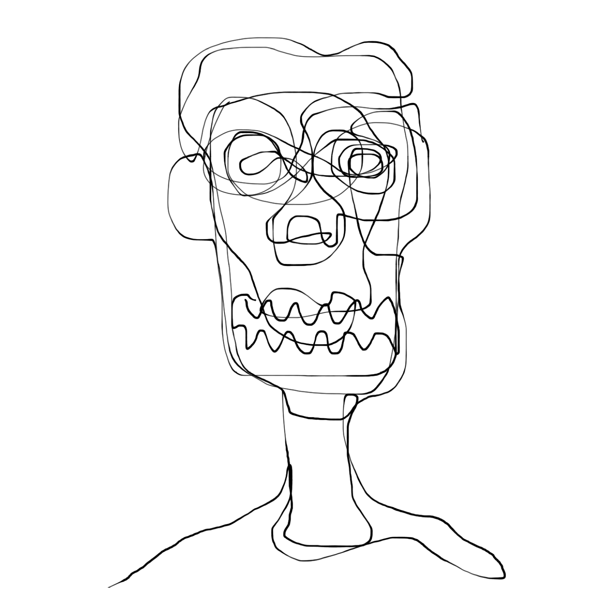
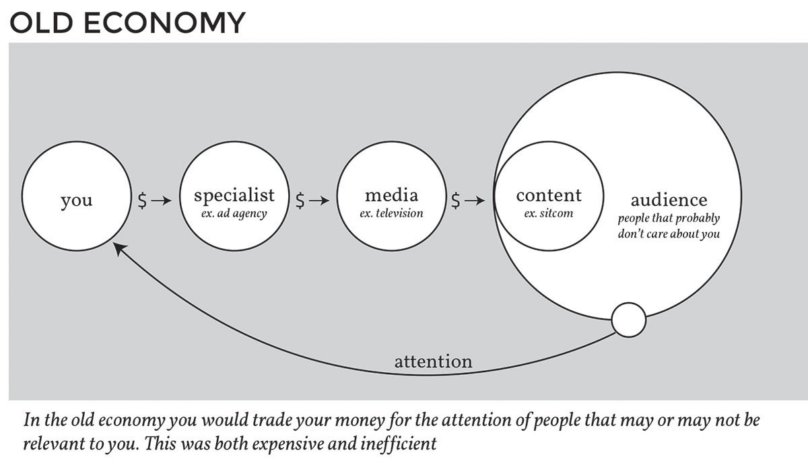
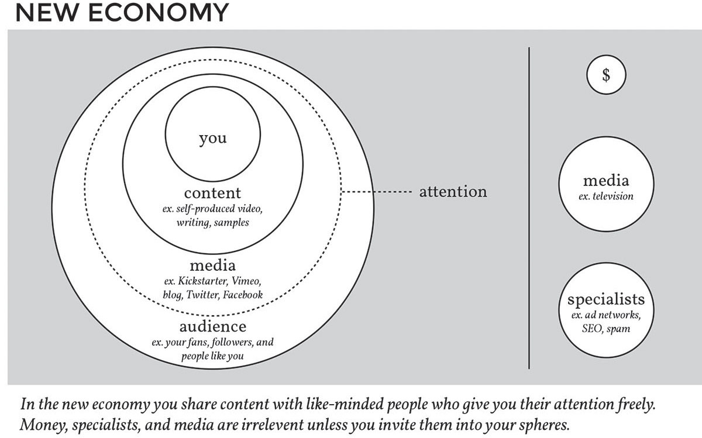

<!---
title: Art of the Living Dead Chapter 15
published: true
folder: Art of the Living Dead
layout: chapter
membersonly: true
--->
# Zombie Economics  
> "Advertising is the rattling of a stick inside a swill bucket." — George Orwell

---

We live in a time when art is easier to create than ever. The limitations that once stifled artists have disappeared. The financial cost has dropped to zero. We have access to state-of-the-art tools. An unlimited audience just needs to be plugged in to. Access to the entire knowledge of mankind is instantly accessible in the palm of your hand. With all these advantages, every person born today _should_ be an artist. How is it that we can be given such an unprecedented opportunity, and yet our population isn't flooded with new insight and invention? Instead we exist in gridlock, afraid to innovate, unable to change, slaves to consumerism, and indebted to conformity.  

What are people embracing instead of art? Put another way, what is the opposite of art? Intuitively you might jump to "trash" as art's inverse, but that's not quite right. The opposite of art is _content_. I define content as anything that gets produced that lacks quality. Similar to the adage that "the opposite of love isn't hate, but indifference," content is indifferent to quality. Art is pure quality. Art contains immortality in its atoms, stunning the senses with brilliance, taking your breath away. Content barely registers even a shrug, it's what we call work that fails to transcend mediocrity.  

As we create content, knowing it lacks the quality we so desperately want to produce, it is not uncommon to feel depression and guilt. It is depressing to work so hard and still come up short. You feel guilty when your contributions aren't making the world better, but instead add to the pile of unexceptional. The guilt comes from not being able to measure up to the standards of your high ideals and good taste. 

During these low points, the temptation for shortcuts is great. The zombie world doesn't demand art of you, and when they tell you your work is "good enough" you will want to believe them. Don't give in. Don't let your need for validation compromise the integrity of your high standards.  

The term "content" is a generic, all-encompassing way of categorizing stuff that attempts to capture attention. Zombies know they need something attention-sustaining to fill the pages or screens, but calling it art makes them uncomfortable. That is why zombies prefer content over art. In fact, many zombies aren't even shy about using the term "content" to describe their output.  

Marketers are especially comfortable with the term. They promote _content_ management systems without the slightest concern for the quality of data that will fill the CMS. Designs are created using greek copy for placement which gets replaced later on with equally generic _content_. Their teams contain specialists for optimizing _content_ for search engines, click-through performance, and maximum stickiness. _"Content_ is king" is the mantra of marketers everywhere, a rally cry so bland that they might as well be cheering "We support words!"  

The term commercial _artist_ went out of style in favor of the less controversial title of graphic designer. It is always called _copy_ writing, never poetry, reducing writing to a word count that fills the screen or pages. The code written by developers is discussed in strictly utilitarian terms, never hinting at the creativity or elegance that skilled programmers are capable of writing. 

In marketing settings, photography isn't art, it is a lightbox of images that can be filtered and searched to match against the business objectives. Every website comes with the obligatory photo of a lifeless CEO. Images rarely tell a story, the picture of a smiling model eating a salad just fills space next to text so generic that it might as well be lorem ipsum. 

Marketers prefer content to art because marketing is a business and art is messy and unpredictable. They need a repeatable process in order to consistently make predictable money. Art is difficult to sell because it is impossible to predict how long it will take to create. How can you justify charging $5,000 for a masterpiece if it took you an hour to create? How can you charge $100,000 for a project that never rose to the level of art? Free from the lofty ideals of art, profit is simply a matter of multiplying the hourly rate by the time it took to produce, without having to get your hands dirty with arbitrary, controversial judgements of value.  

At most marketing companies, a typical project starts with a question of whose responsibility it is to write the content. The implied question is "How much money does the client have?" If the budget is fat, the agency will take on the writing responsibility. If money is tight they will put the burden on the client. There is good money in either option.  

When the agency creates the art it tends to produce scenarios of endless back and forth (billed in 6 minute increments) because consensus is a notoriously hard animal to cage. If the client is responsible for creating the content, the agency makes extra money when they are inevitably called in to clean it up. Clients underestimate the difficulty of writing but soon realize that this seemingly simple task is like putting someone in front of a grand piano and asking them to write a concerto. Client created content is also a classic delay tactic when nobody at the agency wants to work on the project. Just remind the client that they can't afford for you to create art and send them back to their office to stare at a blank canvas. This instantly creates a buffer of time because the client is rarely capable of creating anything remotely resembling art. I have seen this delay projects for months. 

Zombies may prefer content, but that doesn't mean they don't recognize the market advantage that art represents. The value of content can be calculated by measuring how much attention it receives, and not surprisingly, weak content gets less attention than art. In this _attention economy_ whoever controls the attention has economic power. Because zombies are unable to create art they either have to disguise their content as art or invent ways to subvert the attention economy in new ways.  

The traditional method for generating attention for your products was to pay expensive specialists who had access to attention you hoped to access. For example, you might give money to an advertising agency. The advertising agency would keep some of your money for themselves and use the rest to buy time from a television network to run your ad between shows. The television network would pocket some of that cash and then use the rest to produce a show that would appeal to as many people as possible. If enough people watched the show your product would get the attention of a few qualified viewers who might go on to purchase your product.  

The "Old Economy" chart illustrates how you put money into the system in exchange for attention. It was inefficient, but it worked because the audiences were so large that even a small percentage of attention was enough to outweigh the expense. It was also the only game in town, so your options were either participate or be invisible.  

As the system matured, more and more people paid to get into the system and prices increased. At the same time that prices were rising, the effectiveness of advertising was declining because viewers were growing resistant to the advertising noise that interrupted their shows. This escalated to the point that advertisements were more expensive than most people could pay and the return was too small to be worthwhile. 

To excuse the growing lack of return on investment, the term "brand awareness" was coined by marketers anxious to excuse the increasingly poor ad performance. To drive awareness, ads became louder and more obnoxious as they tried to compete for the attention of viewers who in turn became more and more resistant to the ads.  

Finally, the system collapsed. Or at least it should have. But that's not what happened. Television networks are still making shows. The shows are still interrupted by ads. There is no shortage of advertising agencies begging you to put your money into this model. The continued existence of this is baffling especially when you consider the new model that has taken its place.  

The "New Economy" chart explains the new economic model for getting attention for your product. If the old zombie economy chart looks doomed, the living economy should warm your heart. In the new economy you are at the center surrounded by your art and an audience of living patrons. The zombies are on the outside, uninvited to your healthy ecosystem. Instead of paying outsiders to create content, this time you create your own message. This is possible because the cost of tools has dropped significantly in the last decade. 

Your marketing could be a low budget promotional video, product samples, a podcast, or just writing about what you learned from creating your product. Because this promotional work is so connected to the integrity of your product it is another form of art. To distribute this art you don't even consider television networks because you can use free (or at least inexpensive) services like Twitter, Vimeo, Wordpress, or other popular services. The art is meaningful (unlike an interrupting ad) so your audience is not resistant to the message. The audience is much smaller than that of a primetime show, but they are in alignment with your ideas. Instead of being annoyed by your message they are thankful for the meaningful work you have produced, even if it lacks the polish of an expensive production. You may be exposed to fewer viewers, but your conversion rate is significantly higher.  

The generosity of the people who thrive in this model has caused  many to describe the phenomenon as the _sharing economy_. Companies like Airbnb, Lyft, TaskRabbit, and EatWith are disrupting old economic pillars by trusting in the integrity of their users. We used to trust brands, preferring to rely on the reputation of large companies over the uncertainty of dealing with individuals who we don’t know. As we get comfortable trusting strangers, we start to realize the benefits of consuming the art of individuals, and become skeptical of the claims of faceless corporations.  

Aside from the few high profile companies listed above, many of the success stories will never be household names. Unless you belong to the tribe that supports their causes, you may never hear about them. The advent of crowdsourced and services like Kickstarter are funding a wave of new creators. Musicians receive funding for touring and recording directly from their fans. Movies are produced with the dollars of an audience eager to help. Television shows cancelled by zombie executives find new life when fans fund its unretirement. Small batches of artisan products get made because the connection between maker and consumer is no longer drained by middlemen or gatekeepers. More and more artists are forgoing "steady" paychecks, realizing that the security of the old economy was an illusion to begin with.  

The new model reverses the position of the players. In the new model, the middlemen are on the sideline. There is no need for specialists who create ads or negotiate deals with the distribution networks. The networks are on the outside, too, because they have been replaced by cheaper, more efficient services. Even money is outside the circles because it isn't a factor. Instead of exchanging money for attention, the new model lets attention flow freely to art that is worthy of attention.   

The old economic model survives because it is dominated by zombies. The advertising people are zombies, they don't create meaningful extensions of your art, just obnoxious parodies meant to capture attention. The television networks are zombies because they need to create one-size-fits-all programs that appeal to everyone. They don't care about your product, just the cash that they get for your ad's time slot. The audience is mostly zombies, because that is what is attracted to zombie content. To put it simply, it's zombies all the way down.  

Why doesn't this collapse when you pull your money out of the system? The reason is that not everyone is ready to embrace the new model. The new model requires a creative mind capable of creating art that can be exchanged for attention. If you are a zombie you still prefer the safety of the old model, so you keep paying the ad men and the cycle continues. Enough money remains in the system to sustain itself in a slow, cannibalizing decline. 

It would be nice if the zombies could live in their old economy and we could live in the new one. If we know anything about zombies, it is that they don't care much for peace. They will wage war on our model rather than sacrifice the world that they have dominated for so long. If they can't join us, they will try to eat us. Here are four of the ways that they try to infiltrate our bubbles.  

**1. Advertising Swindlers**  
If you were to mashup Don Draper and the Walking Dead you would get a pretty good picture of the state of online advertising. The days of popup and pop-unders and aggressive adware is thankfully behind us, but the industry that spawned the first wave of online ads is still alive and well. You can’t reform an ad zombie whose existence depends on finding new ways to put his ads in front of you. The format of ads will change constantly because the zombies just won’t die.  

As traditional ad placement dries up, the ad men are forced to find new places to put their ads. In the old economy, you paid advertisers to put your product in front of _their_ audience, but in the new economy, advertisers pay you to put their ads in front of _your_ audience. Because you own your art this time around, the tables turn. You control the coveted attention of your audience. Instead of selling you ad space, the ad men now see your art as prime real estate for ad insertion. This seems like a fair enough transaction. They get to keep selling ads  and you make a little extra cash. Unfortunately, this is not all it's cracked up to be.  

Ad avoidance has become a national pastime. Tivo launched a revolution when they allowed viewers to fast forward through commercials. The time shifting ability of DVR has made the ancient act of ad watching excruciating to anyone who has grown accustomed to the ability to skip over them. The same luxury is available online, with ad blocking software. The most popular add-ons and extensions for web browsers are always ad blockers. Pirated, commercial-free downloads of popular shows outnumber official viewership. When given a choice, even if it means complicated hacks and time intensive effort, people unanimously desire freedom from ads. Bob Hoffman says, 

> "The idea that the same consumer who was frantically clicking her TV remote to escape from ads was going to joyfully click her mouse to interact with them is going to go down as one of the all time great advertising delusions."

It is estimated that a minimum of $7 billion a year in advertising money is wasted online because of fraud. In order to compensate for the users who are desperately fleeing ads, the zombies are simulating web traffic with artificial views. The fraud is difficult to distinguish from legitimate views, but some estimates put the percentage of non-human traffic as high as 61.5% in 2013.  

The quantity of bad ads is staggering. In self-policing it's advertising network, Google admits it removed more than 350 million bad ads in 2013. Google has banned 14,000 advertisers, and removed more than 250,000 publisher accounts for policy violations. More than 3 million attempts to join AdSense were refused. Google explains,

> "This is an ever-evolving and ongoing fight. Bad actors are relentless, often very sophisticated and will not rest on their laurels."  

Google is in an impossible position. They make a fortune from owning the ad network, but in order to maintain the appearance of integrity they are forced to turn away the very customers that make advertising lucrative. The legitimate advertisers aren't overwhelming Google, it is the scum that finances the ad network and taxes the few honest participants. Put another way, in the words of Jaron Lanier,  

> "Funding a civilization through advertising is like trying to get nutrition by connecting a tube from one's anus to one's mouth."

When you accept a seemingly innocent ad or sponsorship on your website, you are putting your art in the center of humanity's war on ads. No matter how innocent your intentions or how oblivious you are to the ad landscape, your art will be compromised. People will attribute the low quality of the ad with your work. You will be accused of selling out because you are lending your reputation to the highest bidder. The best you can hope for is that ad blindness spares your work from judgement, but of course ad blindness reduces the revenue you will earn. The value of ads is a steady march towards irrelevance. You need to be careful that your art isn't brought down with them.  

As readers become increasingly immune to standard ads, the zombie marketers find new ways to combat ad blindness. Online advertisers are constantly updating their delivery methods to bypass ad blockers. YouTube videos allow you to skip ads after five seconds causing marketers to react by front loading their commercials with messages potent enough to entice you to watch the whole spot. Banner ads are constantly morphing, trying to disguise themselves as legitimate stories. Sponsored content is indistinguishable from legitimate blog posts. Gmail's interface inserts ads above your email, while other less relevant email services insert the ads directly into your messages. 

Ads in the physical world are taking a cue from the sneaky online advertisers. Your new computer comes with ugly stickers promoting Intel, Windows, and any other partner willing to pay for this ad space. Try buying a car without an ad for the dealership plastered on the car somewhere, whether it is a license plate holder, chrome badge, or decals. Fashion dictates that our clothing be tagged with logos that turn us all into walking advertisements. These tactics allow zombies to associate themselves with quality content that they can't create themselves. 

**2. Influence Manipulators**  
As artists connect with their audience, their influence grows. It takes years of hard work, but once you have an engaged following the benefits are great. You are trusted and your thoughtful endorsement moves your audience to take action. This is the ultimate envy of zombies. Unable to create art and legitimately earn influence, their only weapon is an attempt to manipulate the system.  

Manipulators of influence take many forms. Social media is flooded with "experts" who promise to improve your influence by increasing your followers. They promise to share secrets for improving the impact of your posts. They provide services for automating your social activity. Heck, for a fee they will do it all for you, eliminating the need for you to interact with your audience at all. Before you know it, your voice will be gone, replaced by the lifeless efficiency of a zombie marketer.  

Another influence manipulator is the search engine optimization (SEO) industry. SEO companies will alter  your art so that it gets a better position in search results from search engines like Google. Better rankings theoretically translate into increased traffic, which in turn can be transformed into money. The premise behind the SEO zombie's work  is that search engines are not accurate representations of the quality content of websites, but rather flexible lists that can be manipulated if you know the right tricks. 

The challenge for an SEO zombie is to stay one step ahead of the search engines. As long as they can find a flaw in the algorithms they are free to live another day. Google and the other relevant search engines have the opposite goal as SEO zombies. They are constantly refining their results with the goal of a legitimate ranking system that can't be manipulated. It isn't an exaggeration to describe the people that Google employs as rocket scientists. These are the most brilliant minds money can buy. Do you think a zombie SEO salesman can keep one step ahead of Google's team of artists?  

But even if the zombies could fool Google, that isn't the real danger of SEO. Hiring an SEO zombie requires you to turn your content over to them for "optimizing." As your art gets optimized all of a sudden your human voice starts to sound like a robot. Keywords appear in places where no person of taste would put them. Your prose gets dotted with links not intended for human navigation. As we previously discussed, the human voice is unmistakable. Once your voice is stripped out of your writing, the audience will notice and they will leave your website.  

Influence manipulation returns us to the theme of shortcuts. Zombies only hope is to short circuit the system. Why spend years in school when you can purchase an identical diploma online? Why participate in tournaments when trophies can be ordered online with free overnight shipping? Why not inflate your resume? Start your own company and give yourself the title of President, CEO, and Chief of Staff. Creating a great product is hard compared to a week long sales class that teaches you how to prey on customers. Becoming a self-made millionaire doesn't seem worth the effort when a lottery ticket only costs a dollar. Cheat codes, pirated software, cheap knockoffs, file sharing, the list of shortcuts is long and tempting. We have all fallen victim to shortcuts like this, but once we become aware of the scams we must stop. If our goal is to create art we need to commit ourselves to the difficult work and refuse to succumb to the allure of shortcuts.  
 
**3. Infrastructure Trolls**  
Have you ever wondered why companies like Facebook and Twitter are given outrageous market values of $100 billion and $31 billion respectively? These companies have yet to find a profitable business model and yet their value is off the chart. The reason is explained by our map. The zombies want to own the infrastructure because this allows them to own the attention that comes with owning the network. By controlling the pipes through which the attention flows, they hope to find ways to profit from the bandwidth. It is a safe bet that once a zombie owns an infrastructure, the ads won't be far behind.  

If you look again at the first map of the "new economy" you notice a dotted line where your audience makes contact with your art. This is your audience's attention. This attention is the main target of the zombies because it represents property that formerly belonged to them. How do they get it back? The media layer of the chart represents the infrastructure that connects our art to our fans. We rarely own the infrastructure, we rent it from services like Bluehost, Twitter, YouTube, GitHub, Wordpress, Instagram, or Kickstarter. Unlike the television network model, these services are virtually free. This is another opportunity for zombies to try to wedge themselves into our circles.  

The strategy of owning the infrastructure extends beyond the realm of just websites. The RIAA positions itself squarely between the audience and the artist claiming ownership over the music distribution system. Publishing companies want you to think that you can't print your book without their help.  

Unions make it hard for many artists to connect directly to their audience by attempting to control the distribution of labor. Medical professionals are handcuffed by the insurance infrastructure. How many companies get held hostage by IT professionals that own the legacy software they rely on? Countless jobs require licensing that amounts to little more than paying a fine in exchange for a zombie's blessing.  

The New York Times has taken the approach of the paywall. In order to access their "premium" content you have to pay. They let you view a certain number of articles for free before you get locked out until you purchase a subscription. Since launching their paywall the number of freebies has dropped from twenty to ten as they try to snag as many viewers in their net as possible. It is hard to blame them for looking for ways to monetize their content that doesn't resort to ads, but this is not an arrangement that appeals to the artists that write for them. A writer wants their work to be viewed by as many people as possible, not hidden behind a revenue gate. Readers don't want to be teased by freebies. If you love the content you might pay, but it's hard to compete with free. Eventually, the readers will leave and the authors will follow.  

The ownership of the infrastructure may seem harmless, and perhaps sometimes it is. There are frameworks that we can resist and others that we have to endure. The important thing is not to take these relationships lightly. Be aware of the zombie's attempts to wedge himself between you and someone’s art.  
 
**4. Spammers**  
When a zombie can't own the infrastructure he resorts to more destructive tactics. Because they are incapable of contributing meaningful content to the systems, zombies flood the free systems with garbage, hoping to capture some of the attention that flows through them. We refer to this junk as spam. It fills our email inboxes, floods our blogs with bogus comments, poisons our social networks, and generally pollutes any network where someone's attention can be subverted.  

And believe it or not, this is the good kind of spam. I say "good" because this is usually recognized as spam and quickly deleted or ignored. The dangerous spam is the stuff that is harder to recognize. As spammers get more and more sophisticated  it gets harder and harder to tell their output from the legitimate content. A vicious zombie product is something called the content farm.  

Content farms are websites that contain page after page of content meant to fool search engines into believing that they have legitimate content. Some of the content is automatically created by programs that spit out strings of words with keyword ratios that search engines reward.  

Other content farms don't bother with faking the content, they just unapologetically plagiarize the writing of others. It is virtually impossible to enforce copyright law online, so when your content gets stolen your only hope is to trust that Google will be smart enough to tell the difference between your art and the spammer's replica.  

There are some zombies that build content the old-fashioned way by outsourcing it. To prevent getting potentially blacklisted by Google for copying your art, zombies pay writers to create the content for them. Copywriters are expensive, so these content farms typically hire cheap labor from third-world countries to churn out keyword-rich and substance-free content.    

It is easy to get discouraged by the proliferation of imitation art, but we can't let the spam distract us from our job. Art will always be copied, but it will also be rewarded. Have faith that when your art is published, your audience, the people that matter, the people who recognize integrity, will embrace it.

The economic landscape is full of advertising swindlers, influence manipulators, infrastructure trolls, and spammers. We need to be careful about letting zombies into our new economy. We need to protect our art and we need to protect our audience's attention from the tactics of zombies. We can't fall victim to the shortcuts. We must resist the urge to trade our audience’s attention for quick cash.   

[Chapter 16. The Zombie-mobile](chapter16.html)  