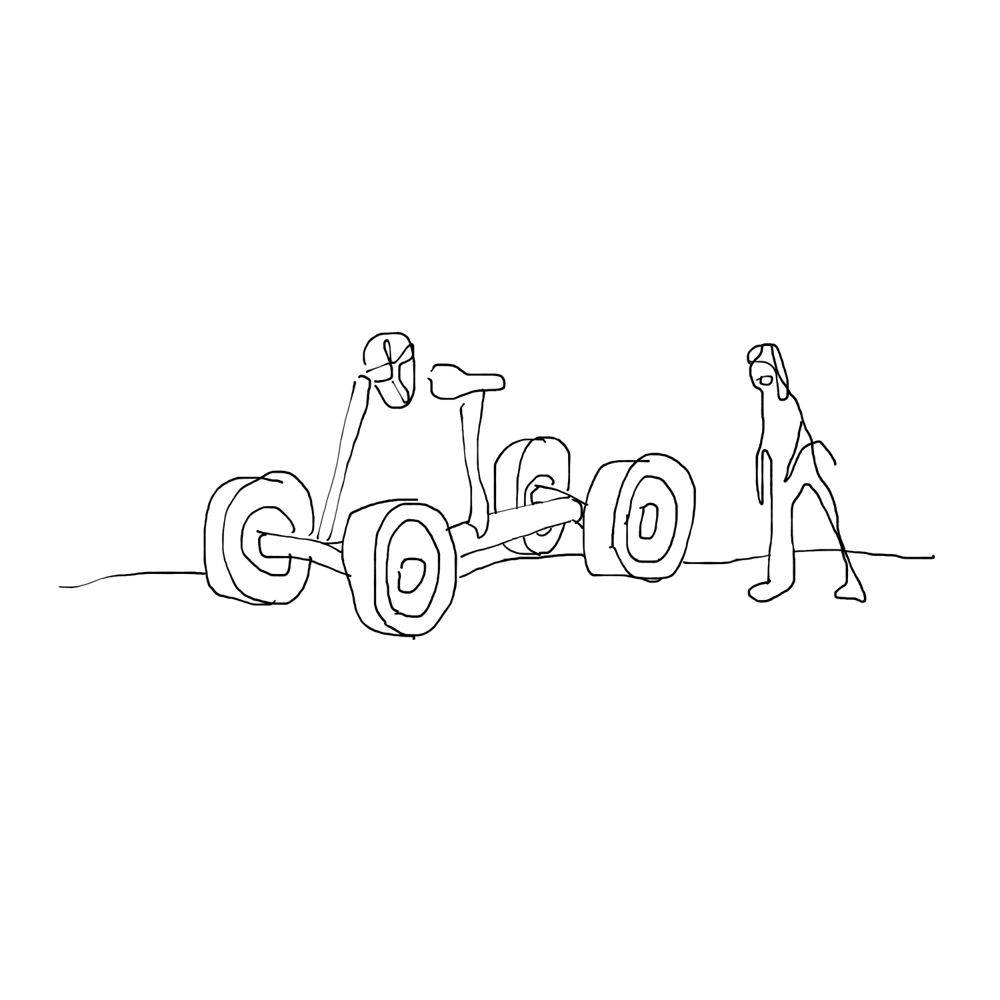
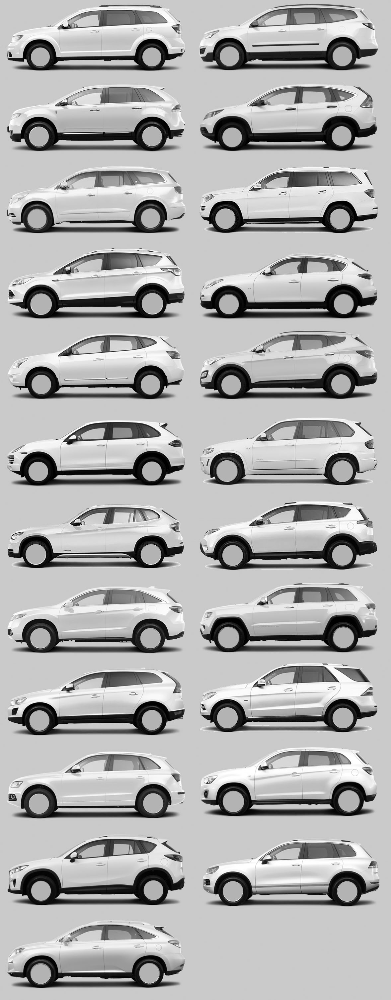
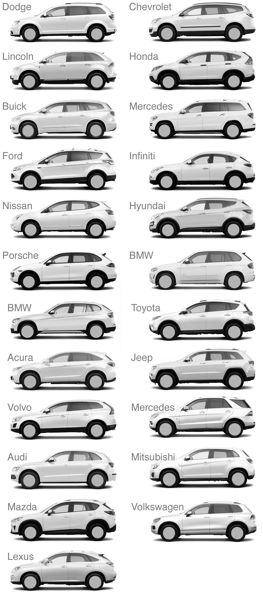
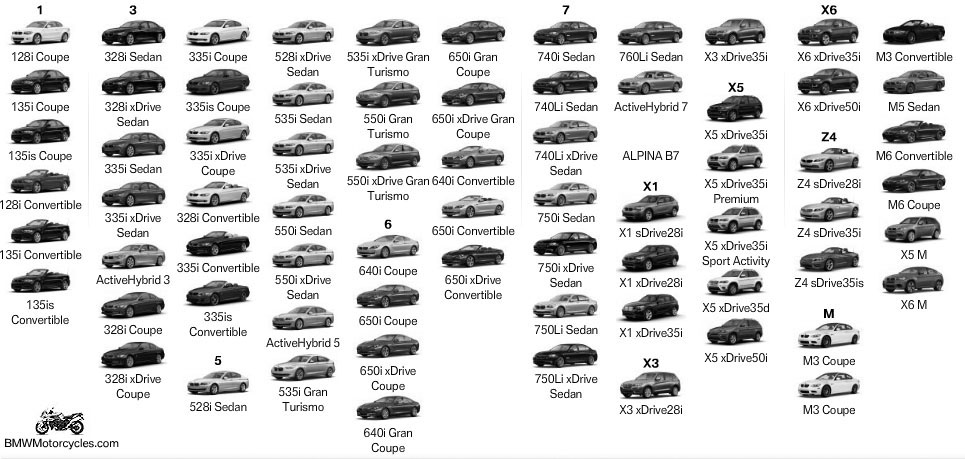
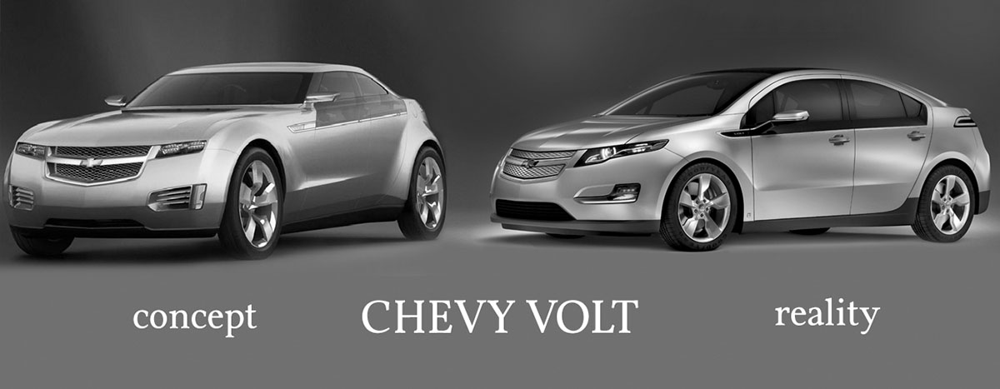

<!---
title: Art of the Living Dead Chapter 16
published: true
folder: Art of the Living Dead
layout: chapter
membersonly: true
--->
# The Zombie-mobile  
> _"Remember when we were kids? Each car looked so different, so unique unto itself. This is just oatmeal."_ — Jerry Seinfeld

---

What if I told you that after a hundred years of rigorous competition, car manufacturers have finally created the perfect automobile? Would you believe that the evolution of car design has culminated in a vehicle so perfect that every manufacturer has agreed to produce the same model? That would be absurd, wouldn't it? And yet, in 2013 that is the conclusion you might draw if you compare vehicles side by side. There has never been less differentiation between cars as there is right now. On the next page is an image containing 23 cars from 21 manufacturers. See if you can tell who makes what. How did this happen?  

Buying a car happens like this: first you decide on the category. "I want a car." Then you identify the brand. "I like Honda." Then you decide on the sub-category. "Should I get the Accord or the Civic?" Then you pick a color. "I'll take the Accord in red." Notice how you never have more than a few choices at any point in the decision process? This isn't accidental.  

People think they want a huge variety of options, but variety cripples our ability to make easy decisions. Car companies give the illusion of variety while keeping the actual categories very basic. This is why you only get 5 color options instead of choosing from a pantone book. Deciding between red and white is easy compared to deciding between fire red or cherry red.  

Car companies understand that in order for you to make a purchase they can't overwhelm you with options. There are millions of combinations of vehicles, brands, and options, but by breaking the selection down into bite-size mini-decisions, salesman are able to overcome our indecisiveness. Broad categories (car, truck, van) funnel customers towards making a purchase.  

Sometimes even the broad categories aren't enough to completely eliminate the indecision of the fickle customer. To satisfy consumers who couldn't decide between a truck, car, van, or SUV, a new category was created. It is called the crossover. The crossover is the ultimate one-size-fits-all product. It is a truck without being a truck. It is a car without being a car. It is an SUV without being an SUV. It is a minivan without being a minivan. It is fast, yet fuel-efficient, yet powerful, yet roomy, yet safe. It is as if the car companies took the wish-list of every consumer type and frankensteined it all together in a single vehicle. 

If you squint at a crossover you can impose whatever vehicle you want onto its bland exterior. It has the rounded lines of a car. It has the rugged stance of an SUV. It has the extended rear end of a station wagon. It has the space-maximizing bubble shape of a minivan. It doesn't have a flat bed, but add a hitch and a towing package and your internal truck voice will be satisfied.  

In the last decade every car manufacturer has embraced this new category and sales of crossovers have been outstanding. Consumers love the non-decision of buying a crossover.    

The crossover is not the mastery of product design, but rather a breakthrough in market research. Car companies did not stumble into this vanilla landscape by accident. You can be sure that every manufacturer is profiting more with this copycat approach than by differentiating and innovating. As competitive forces reach equilibrium, car companies don't present an assortment of products equally spaced across the spectrum. Instead, they set up shop right next-door to the most lucrative location. Brand experts insist that success comes from promoting your unique attributes, but in practice differentiation is less profitable than consolidation. In game theory, this is called the Nash equilibrium and it can be seen at every intersection where a Burger King opens across the street from McDonald's, or a Costco opens next door to a Sam's Club. Competition doesn't produce variety, it results in commoditization until we are left with 23 identical variations of the same vehicle.  

Branding campaigns spend millions to cover up this dirty little secret. As a result we are so brainwashed by brand messages that we no longer see the inherent meaning in the products we buy. Industry analyst, Horace Dediu, describes the categorization of the car landscape like this,

> "They have the same bunch of cars, the same sizes, same cookie cutter as everyone else and they are all built using the same process... It's the same process, it's the same cost structure, it's the same _quality_. So you can't differentiate anymore."

Branding is a shortcut, remember? When we get addicted to brand shortcuts, actual product differentiation gets in the way of decision making. We don’t look for the car with the best built engine, we look for the logo that has been linked in the collective cultural conscious with build quality. Imagine if all the crossovers pictured looked dramatically different. All of a sudden the purchasing decision gets hard. If I consider myself a Toyota person, but I like the body style of the Kia, I won't be able to decide. If I am looking for luxury but the Ford looks more luxurious, I again get stuck. By homogenizing the style across all brands, every brand sells more because the decision is easier. All you have to do is pick your brand and tell them which of 5 colors you prefer. You can't blame the car companies for cashing in on the mindless masses.  

We like to think of brands as a more or less accurate characterization of the products they make. What ends up happening is that a brand becomes less about the product and more of a description of the people who buy the products. Toyota built its reputation on creating reliable vehicles, but today it is rare to find a car from any brand that doesn't last 150,000 miles. The brand is no longer a representation of reliability, but a representation of a group of people who value reliability. Mercedes isn't the manifestation of luxury, but a symbol that appeals to people who can afford to pay extra to be associated with the idea of luxury. All cars contain foreign components, but purchasing a Ford or Chevy lets you apply an "American-made" sticker to your personality.  

Car brands no longer reflect differentiation, but rather fashion. This isn't entirely unprecedented as the famous Braun designer Dieter Rams observed years ago,  

> "I hate everything that is driven by fashion. In the 60's I hated the American way of styling, especially the cars. They change their styling every two years to sell new ones which has nothing to do with good design."  

The difference is that in the 60's a stylish flair could increase a brand's appeal. Today too much flair can hurt sales because the brand-hyptnotized public are afraid to embrace risky deviations from the norm. The pressure on car companies is not for innovation, but for conformity. The result is not branding, but rather _blanding_.  

A car is more than aesthetics and undoubtedly the driving experience varies from vehicle to vehicle more than their uniform exteriors. Beneath the shiny paint jobs are different components of varying quality. Is this enough to forgive the blanding effect? I don't think so. The reality is that the cars exterior should have some connection to its underlying form. Without an acknowledgement between form and function the design is just superfluous frosting. Robert Pirsig wrote, 

> "The result is rather typical of modern technology, an overall dullness of appearance so depressing that it must be overlaid with a veneer of 'style' to make it acceptable. And that, to anyone who is sensitive to romantic Quality, just makes it all the worse. Now it's not just depressingly dull, it's also phony. Put the two together and you get a pretty accurate basic description of modern American technology."  

In order to give the illusion of differentiation, manufacturers add meaningless character lines to the crossovers rather than risk non-conformity. Even the wheels are brand cues. If the wheels were not whited out in the comparison photos, the brands would be much easier to recognize.  

The company that surprises me the most in the list of brand conformity is Porsche. The design legacy of Porsche is unmistakable. A Porsche is instantly recognizable whether it was built in the 60's or the 90's. Porsche's crossover, the Cayenne, is a complete rejection of its heritage.  

Why would a sports car company make a crossover? The reason is that Porsche nearly went bankrupt in the 90's. In order to survive, they hired a new CEO named Wendelin Wiedeking. Wiedeking's philosophy can be summed up in his own words,  

> "Every product must earn money. Otherwise you are simply pursuing a hobby which is no task for an auto-business." 

In other words, creating cars is not about making art, it is about making money. Through this lens it is not surprising that Porsche was an early adopter of the crossover, if they didn't create it outright with the Cayenne. Purists were shocked that Porsche would build something other than a sports car, but it makes sense as a financial decision. Wiedeking explains, 

> "For Porsche to remain independent, it can't be dependent on the most fickle segment in the market...We have to make sure we're profitable enough to pay for future development ourselves."  

Wiedeking's use of the word "fickle" is telling. To translate, "People with taste are picky. The only way to make money is by satisfying those who can't discern quality." The waters of quality are polluted by Porsche's willingness to lend their brand to non-art.  

The decision to make the Cayenne wasn't a rejection of the heritage of creating great sports cars but rather a compromise that allowed them to survive so that they could still make their true objects of passion. In order to keep producing art, Porsche is funded by zombie-satisfying, conformity-driven products. The only reason you can still purchase something as brilliant as the Cayman is because Porsche's best-selling model is the Cayenne crossover. There is no alternative. Porsche either goes out of business, or it makes a concession to the zombies.  

Another powerful brand that has succumbed to the crossover craze is BMW. They have a great slogan, 

> "We only make one thing, the ultimate driving machine." 

Wow, one thing. That is the essence of branding, to associate one thing with your company. Would it surprise you to learn that BMW actually offers 71 models? That doesn't include their motorcycle division, either. With a dozen BMW crossovers to choose from it is surprising the fickle consumer can decide which "one thing" to buy.  

Have you ever wondered why concept cars are so innovative, but the production models end up so bland? Many cars start out with bold ideas, only to become watered-down later. A great concept car is amazing because it represents a new idea. A concept car can capture people's imagination because people have never seen anything like it before. By the time the car that wowed fans at car shows hits the showroom floors the art seems to have been squeezed out of it. 

The hype and excitement surrounding a concept car can be enough to launch the car from concept to reality. That leap is usually when things fall apart. The project gets handed from the dreamers to the crew that built last year's top-selling model. Before you know it, the "next big thing" gets diluted by budgets, committees, focus groups, and the scrutiny of timid engineers. The art that breathed life into the car can't survive the wind tunnel of the zombies. 

In both the literal and metaphorical wind tunnel every unique angle and differentiating shape gets questioned. One by one, every original idea gets put under air pressure until it finally folds. Instead of innovation we get slightly rounder versions of our dream cars. Too often the only thing that comes out the other end of the wind tunnel is conformity. 

The pressure for conformity isn't limited to car design, it affects _everything_. Even in 1966, Bruno Munari observed,  

> "Thus in the recent past we have had the aerodynamic style, which has been applied not only to airplanes and cars but to electric irons, perambulators and armchairs. On one occasion I even saw an aerodynamic hearse, which is about as far as aerodynamic style can go (speeding the departing guest?)."  

In the hands of the Wright brothers (who we will study in depth later) the wind tunnel changed the world. In the hands of mindless zombies, it has become a crutch. It is no longer a tool, but a twisted procedural substitute for innovation. That is not to say that aerodynamics is not a worthy field. The danger is that instead of using the wind tunnel as a tool for improvement, it becomes a process above scrutiny. The wind tunnel's usefulness has been perverted to legitimize the destruction of progress.  

If you consider yourself an artist, you probably feel that life is much like a wind tunnel. The wind is always blowing directly in your face. You can't tell if you are actually moving or if it is an illusion caused by the air moving around you. The wind exposes your uniqueness which promptly get flagged for painful scrutiny. Corners get rounded, edges are sanded down, and if you give in to the resistance you will be transformed into a vanilla downgrade of your ideal self. The wind tunnel wants to turn you into a Ford Taurus. 

Society doesn't appreciate your uniqueness. Your value to the zombie community is your ability to conform. If you aren't in the mold of a crossover they don't know what to do with you. How do you maintain your independence when the headwinds are so powerful? Why are we surprised that our art encounters wind resistance? 

There are only two directions that you can go in the wind tunnel; you either get blown away, or move towards the wind. Take comfort in the feeling of resistance, it means you are heading in the right direction. Seth Godin puts it well,  

> "The desire that we have to do something that's _never_ been done before means that the people who are around you generally will not encourage you to do it ... if they _were_ encouraging you to do it, then other people would be doing it already and it wouldn't be unique." 

If you _aren't_ feeling wind resistance then you might be going the wrong direction in the wind tunnel. Savor the feeling of the wind on your skin. Your heroes faced the same winds and overcame similar objections. Eventually, the headwinds produced lift and launched their work skyward.  

[Chapter 17. Inside or Out](chapter17.html)  