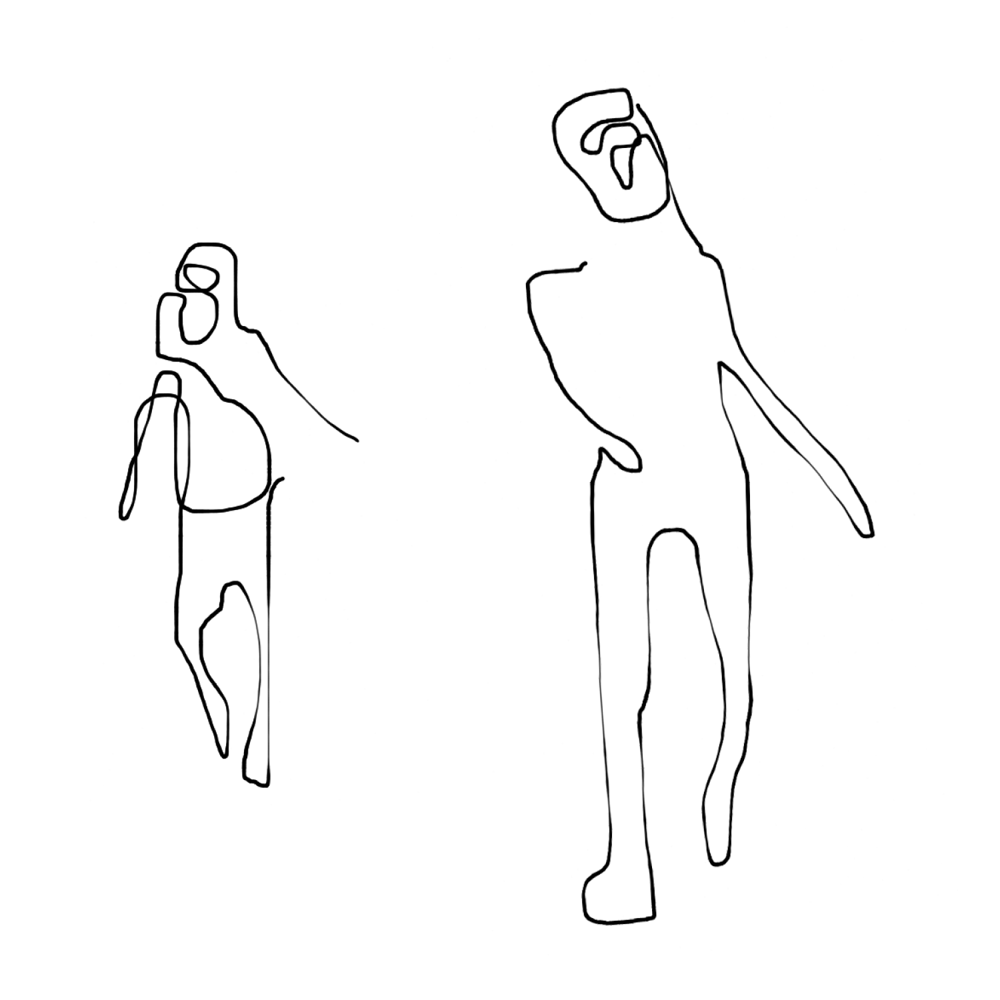
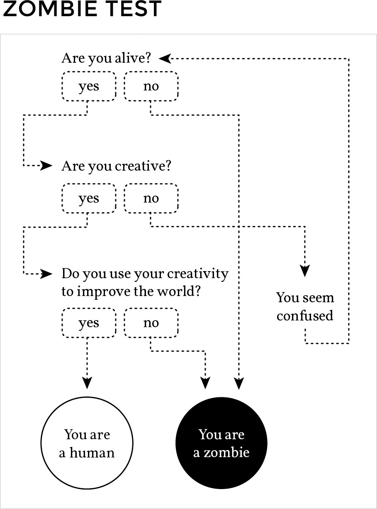

<!---
title: Art of the Living Dead Chapter 2
published: true
folder: Art of the Living Dead
layout: chapter
membersonly: true
--->
# Armageddon  
> _"Honestly, if you're given the choice between Armageddon or tea, you don't say 'what kind of tea?'"_ — Neil Gaiman

---

What if humanity's capacity to innovate disappeared? I hate to be the bearer of bad news, but there has been an outbreak of a new virus. It has spread across the planet, infecting anyone who comes in contact with it. It passes from person-to-person corrupting mind after mind. Entire races of vibrant, creative people have become ill. The future of our species is in danger.  

We are living in the zombie apocalypse. The zombies are all around us, but they aren't the disfigured monsters from the movies. Don't mistake their normal appearance for normality, however, they are bloodthirsty killers.  

Who are these zombies? They are the bodies who stumble through life without thought. They don't question. They don't base their decisions on right or wrong. They survive through memorization of rules, minimization of effort, and deferral of responsibility. They satisfy every urge, never challenge the status quo, and never produce personal work.

Today's zombies are quite literally the living dead. Life is the force that produces meaningful work and ultimately joy. It is under attack. Zombies need to destroy life to survive. Some zombies are activists, swarming and attacking anything with a creative pulse. Others are slow-moving and passive, content with a mindless existence, occasionally luring others into their lifeless routines. Whether active or passive, zombies are always dangerous. They will kill you, and make no mistake, this is war.  

What does armageddon look like? We imagine burning buildings and a desolate wasteland, but that's not the form this apocalypse has taken–at least not yet. Right now, armageddon looks like gridlock. Political progress is stifled by division that has ripped us right down the middle. Consensus is absent from the critical issues of our time, from global warming to equality. We desperately need revolutions in education, economics, medicine, government, religion, energy, health, technology, and every aspect of civilization. Humanity's progress is stagnating.  

There isn't an issue that doesn't seem to teeter on the brink of disaster. Taxes, obesity, gas prices, addiction, immigration, unemployment, heart disease, lawsuits, antibiotic-resistance, corruption–the list of doomsday ingredients never ends. We are bombarded with warnings of impending meltdowns, bailouts, war, and disaster.  

Like a plague, the zombie infection has spread and now there isn't a corner of the world untouched by the disease. Government spending. Cookie-cutter houses. Fast food. The ear worm of pop music. Companies limp along, too big to fail and too weak to innovate. Pushed forward by the inertia of their huge size, they are unstoppable.  

How do zombie mobs gain such momentum? In their infancy even the most hopeless institutions were built on the hard work of artists. Trace the history of any zombie organization to its source and you won't find a zombie, you will see an artist. America's founding fathers weren't flip-flopping politicians, they were the articulate inventors of democracy.  

Medicine was pushed forward not by regulation-compliant cowards, or patent-protective corporations, but by heroes like Jonas Salk who volunteered his family for the polio vaccine trial, then refused to patent his life-saving drug.  

Tech companies like HP and Microsoft seem doomed today, but we forget the visionary leaders (Bill Hewlett, Dave Packard, and Bill Gates) that carried them to such great heights.  

The zombie-infected institutions of today have all corrupted the art of their founders. There isn't a single point where infection enters the host organism. It is the culmination of tiny compromises that grow exponentially until everything living has been expelled from the structure. The atmosphere, once hospitable to innovation, turns toxic and the artists were either corrupted or were forced to flee the hostile ecosystem.  

The common characteristic of all mobs is that creativity exited their ranks long ago. It may have begun with the utterance of a seemingly innocent idiom. We have all heard and perhaps repeated the phrase unwittingly. It is typically uttered with complete conviction and without a hint of embarrassment. 

> "I'm not creative." 

Few realize that when used this way the word "creative" is divisive. It draws a battle line between all humanity and forces you to decide if you are creative or not. This division of humanity says "pick your side" and then promptly covers you in armor, puts a weapon in your hand, and enlists you in a lifelong battle against your enemy. Collaboration with the enemy is treason. This may sound like an exaggeration because it has become an accepted truth that people are either creative or not.  It isn’t true. Nevertheless, with imaginary battle lines drawn, 
society marches forward, organizing around systems that attempt to mitigate the tension between these two opposing groups.  

The division between creatives and non-creatives is reinforced by both sides. Even self-proclaimed non-creatives who respect creativity hold it at arm’s length, uncertain of its legitimacy. They reserve the right to strike it down should the power of the art make them uncomfortable.  

So-called creative people are just as guilty of reinforcing these battle lines as non-creatives. They invent mysterious personas, act intentionally eccentric, and disengage from subjects that they deem uncreative and unimportant. Artists benefit from this division and have little incentive to tear down this wall.

The division of humanity between creative and non-creative has left both sides struggling with opposite sides of the same armageddon. In _Zen and the Art of Motorcycle Maintenance,_ Robert Pirsig sums the situation up like this,

> "We have artists with no scientific knowledge and scientists with no artistic knowledge and both with no spiritual sense of gravity at all, and the result is not just bad, it is ghastly."

This creative/non-creative division is a dangerous myth that I need to debunk up front because if I don't the rest of this book could be misunderstood. Without clarification, my zombie metaphor could be seen as a reinforcement of these battle lines–as if I am a militant on the creative side throwing a grenade by calling the non-creatives a nasty name. This would be a tragic misinterpretation of my intent.

Let me be clear. When I talk about zombies I am not talking about non-creatives. Everyone is capable of creativity. I refuse to acknowledge this creative vs. non-creative categorization as a legitimate explanation of human behavior. It isn't accurate, and it gives creativity a mystical quality that clouds our perceptions about what is required to make things.

Somewhere along the line the word "creative" got imbued with special powers. Despite the fact that our culture celebrates creativity more than any time in history, art is not necessarily a label that we eagerly assign to the meaningful work we do. It is a word loaded with mysterious associations, burdened by misunderstanding, and exaggerated by dangerous stereotypes. 

If we strip away all the fairy dust and glitter from the word "creativity" it just means "having the capacity to create." There is nothing extraordinary about it. As a result of being human, you can make things that change your surroundings. This is called creativity. A person can create things. A rock cannot create things. Therefore, a person is creative, but a rock is not. That's the only rational definition of creativity because beyond that you have to divide humanity along creative versus non-creative battle lines. When that happens there can be no winners.  

We all have the capacity to create. The simplest example is our ability to talk. Every word that comes out of our mouth is a creation. Our words shape our reality and change our environment. Our words have measurable consequences and yet we take for granted that simply speaking is a creative act. Some of us are better talkers than others, but _everyone_ creates words. To believe that a human is incapable of creation (non-creative) is ludicrous.  

If you are the type of person who identifies with a label of "non-creative" I hope my book causes you to reconsider. Yes, accepting that you have the capacity to create is a burden, but not because it puts you on the other side of imaginary battle lines. It is a burden because it acknowledges your own role in shaping the surroundings. It forces you to ask what you are doing to improve your world. You don't have to transform into a stereotypical artist, you just have to get to work. Keep it a secret if you must, but don’t let the non-creative excuse prevent you from making a difference.  

It is tempting to classify entire industries as zombie-infested. Lawyers, advertisers, journalists, and politicians notoriously belong to, shall we say, challenged industries. To use the word "art" or "creativity" in the context of politics, science, religion, or education might seem out of place. The impulse is to exclude or excuse them from our analysis of creativity. That would be a mistake.  

You might think, "I may not be creative, but at least I am not as bad as the politicians." Or you might excuse yourself by saying, "but I'm a lawyer, and nobody expects a lawyer to be innovative." The existence of stereotypes like these are not grounds for disqualification from the revolution of creative thought that our movement requires. It is exactly the opposite. Because the politicians are so famous for gridlock is precisely the reason that a hero is needed to change the system. Because lawyers are so notorious for exploiting the gray areas of right and wrong is precisely why the law industry needs a hero who sees in black and white. It doesn't matter what industry you find yourself, you can change it for the better.  

The landscape is bleak. The world is corrupt, mindless, and out to destroy us. We need change that is only possible as a result of deep creative insight. We need your art. The meaningful work that you decide to do can change the course of history. There is no shortage of catastrophes. Pick your poison, and dedicate your life to solving the problem. The stalemate is waiting for you to give it the shove that will tip the issue in the right direction.  

If humanity is going to survive we need heroes. We need artists. We need ideas and achievements that have never been done before. This book won't win you friends. It won't make creating your art any easier. I am not going to list simple shortcuts for success. This isn't _Creaativity for Dummies_ or _Chicken Soup for the Zombie Soul_. There aren't any guarantees that you will even succeed. To quote a demotivational poster, 

> "It could be that the purpose of your life is only to serve as a warning to others."

Taking this book to heart can't stop the onslaught of mindless attackers. The odds are stacked against you, but the world needs you. We need your art to survive.  

[Chapter 3. The Birth of a Zombie](chapter3.php)   