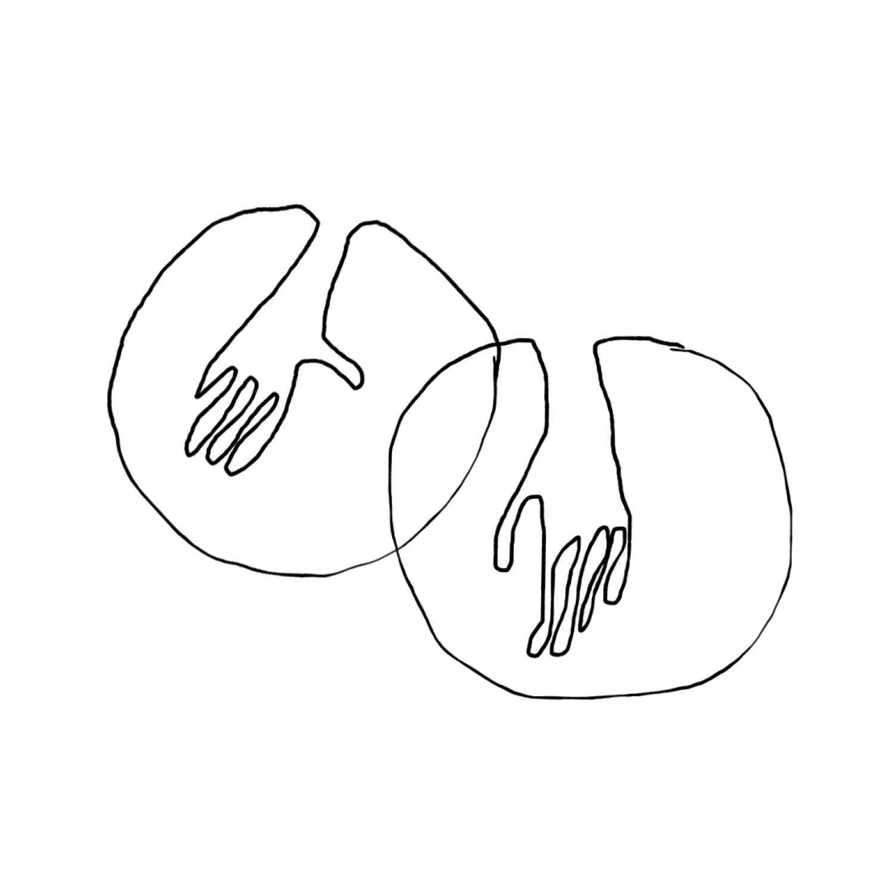

<!---
title: Art of the Living Dead Chapter 21
published: true
folder: Art of the Living Dead
layout: chapter
membersonly: true
--->
# Ingredients of Creativity  
> _"For a charm of powerful trouble, like a hell-broth boil and bubble. Double, double toil and trouble; fire burn, and caldron bubble."_ — William Shakespeare

---

So far we have mostly talked about creativity with sweeping generalities. It is time to get practical. Wouldn't it be nice to have some tips that you could use to give your work the best chance of success? 

What are the ingredients of creativity? The best answer to that question that I have found came from a lecture given by John Cleese in 1991. What follows is my own spin on his ideas, but I highly recommend you seek out the video of his presentation online as well. It should be noted that there are countless paths that lead to creativity, so if the following formula doesn't ring true for you, feel free to pave your own path.  

If we were to mix a cocktail for setting yourself up for creative breakthrough, it would have four ingredients: space, time, trust, and play. The Wright brothers, whether intentionally or by luck, had the ideal environment for creativity. Let's go through the ingredients one by one.  

**1. Space**  
The first ingredient of creativity is space. Ideas need room to develop. The space we carve out for creativity needs to be an oasis where we separate ourselves from distraction. The Wright brothers' breakthroughs didn't happen at a desk in a cubicle in an office building. Their laboratory was a sandy beach miles away from civilization. They left their business and escaped to Kitty Hawk, North Carolina. The residents of Kitty Hawk were poor, but self-reliant people who lived well outside the mainstream. Here, away from public scrutiny, the Wright's had plenty of room to refine their theories.  

The space you create doesn't have to be as isolated as the Wright brothers, but you do need to be intentional about this first ingredient of creativity. Creativity is elusive within the daily grind and nearly impossible in a cubicle. You either need to leave your cube or find a way to isolate yourself from the interruptions and motivation traps of your typical workspace. You need to seal yourself off. Find a quiet place where you will not be disturbed. 

The atmosphere of your space will vary depending on your work style. Some embrace clutter while others require pristine order. At Pixar, animators can design their own custom workspaces to reproduce whatever environment makes them comfortable, whether that be a hut, castle, or modified Tuff Shed. Steve Jobs preferred to leave the office altogether, conducting business during long walks. Ernest Hemingway preferred to write standing up in his bedroom. Andy Warhol covered his studio in tinfoil. Eccentricity is optional, the important thing is that you make an effort to find the space you need to do your work.

**2. Time**  
The second ingredient of creativity is time. Time needs to be carved out in three installments. The first installment is designating a specific time where you will dedicate yourself completely to your work. It needs a specific starting time and a specific ending time. You need to be sure that in this time you will be absolutely uninterrupted. No phone calls, no email, no random pings from friend's status updates. You need assurance that you won't have any excuses to avoid the work you have committed to doing.  

The Wrights obviously didn't have smart phones to distract them from their work, but they did have a business to worry about. If they didn't make time to separate themselves from their day jobs they never would have been able to escape distraction. All of us are busy, but we can't let our overwhelming to-do lists cause us to postpone our creative time. John Cleese puts it this way,  

> "It's easier to do little things we know we can do, than to start on big things that we're not so sure about."  

Plan to spend about 90 minutes in your oasis. Any shorter and you won't give yourself enough time to get into the flow. If your time block is too long, fatigue will lead to frustration.  

The second installment of time is giving your ideas room to percolate. Once we have an idea that seems good, there is pressure on us to take decisive action. Uncertainty is uncomfortable, leading us to want to find the answer as quickly as possible. Resist the urge to take the easy way out through being decisive before you need to. We need to force ourselves to stick with the problem as long as possible.  

Creative people have learned to endure the discomfort that accompanies being unsure. As a result, they put more time into pondering the solution and often come to a more creative solution.  

Time was not on Samuel Langley's side. While the Wrights had the freedom to work within their time oasis, Langley had committed to a government deadline that was dictated by the threat of war. He promised that,  

> "The machine will be completely built and ready for trial within a year." 

It took him five years, and even that was not enough. It is hard to imagine Langley being able to be creative under these conditions.  

Giving yourself time to defer decision making is not the same as indecisiveness, although that is what zombies will accuse you of because they can't endure the uncertainty that you are embracing. Again, in the words of John Cleese respond to these accusations with,  

> "Look, Babycakes, I don't have to decide 'til Tuesday, and I'm not chickening out of my creative discomfort by making a snap decision before then, that's too easy."  

Identify the deadline early and then use the entirety of that time to wrestle with the discomfort of not knowing the answer. Make your decision when the deadline comes and not a minute sooner. Don't limit your creativity by deciding too early just because you are uncomfortable with uncertainty.  

The third and final installment of time is an investment toward the 10,000 hour milestone. You can't become an expert until you have put an incredible amount of time into practicing your craft. At age 52, Langley's clock was starting at zero when he started working on the problem of flight. After eleven years Langley had hit the 10,000 hour mark when his first aerodrome models made successful flights.  

**3. Trust**  
The third ingredient of creativity is trust. Fear of making a mistake is the biggest killer of creativity. How can you do something that has never been done without sounding silly when you first describe it? You need to have the confidence to be able to explore any idea, no matter how crazy, because that is where the creative solutions will come from. You need to be open to all possibilities without fear of judgement.  

Because they were brothers, Orville and Wilbur had a trust that is very hard to achieve without a family bond. Having witnessed every embarrassment in the other's lives since birth, they never had fear when it came to sharing creative ideas. They never questioned the other person's motives or withheld their opinion out of fear of being judged.  

Disagreements are often a source of friction that can debilitate creative thought. In situations where there isn't any trust, disagreements derail progress. In the context of trust, disagreement is a powerful tool for finding the correct solution. Wilbur affectionately described his disagreements with Orville not as confrontations, but as playful scrapping. He said,

> "I like scrapping with Orv, he's such a good scrapper."  

Can you recall any work situations where disagreements were healthy? Probably not, it's rare. The reason is that we almost always lack the trust required to transform conflicting ideas into creative output. The default method for generating creativity within most organizations is the group brainstorming session. These meetings inevitably fail to generate quality ideas due mainly to the lack of trust between the participants. Real trust is not something that happens between competitive co-workers naturally. Brainstorms are not typically an oasis of time, space, and trust. They are more often attempts to shorten the time that we have to wrestle with the discomfort of uncertainty.  

How do you generate trust? It is earned through many battles fought side-by-side with fellow soldiers who share your commitment to quality. As time passes you share victories and defeats, and this ultimately forms a bond that allows you to collaborate deeper than superficial brainstorm meetings would allow. If you achieve this level of trust, cherish your time with these people because it is rare.  

If you don't have the luxury of healthy collaborators, another option is isolation. Time spent in an oasis alone is a viable escape from a creativity-crippling environment of cynicism. Be careful of who you solicit for feedback. When you can't trust those around you, trust yourself.  

**4. Play**  
The final ingredient of creativity is play. In order to loosen our assumptions we need to experiment with deliberately crazy connections. Years ago I worked with a friend named Travis. He has the rare ability to transform absurd, humorous ideas into  real things. You can be laughing with him one moment and then, before you know it, you are creating something fun and unusual. Our workspace felt like a mad scientist's laboratory where we were free to produce whatever crazy idea crossed our minds. We perfected the art of molding gummy bears into other shapes. We built an oversized putting course. We wrote a song to accompany our daily pudding breaks. We invented complex games involving cowboy boots, Nerf guns, spare change, and tacos. As you might expect, client tours typically bypassed the creative department. At the time I didn't realize how rare and special this playful environment was.  

To the outsider, playfulness like this might seem like a waste of time. You wonder how much billable time we wasted. You wonder how we got away with goofing off. You may wonder if we got our work done or missed deadlines. You might think we didn't take our jobs seriously. You would be wrong. Our work only benefited from the unorthodox environment. Our work was smart, effective, and done on time.  

The magic that this environment created was an atmosphere of fearless creativity. After sculpting a life-size replica of a human arm out of gummy bears, otherwise crazy ideas for product promotion don't seem so outlandish. 

Often the places where creative solutions are desperately needed are situations where it would seem inappropriate to be playful. Because of the seriousness of the task at hand, playfulness rarely gets invited to the meeting.  

Have you ever been in a tense situation that was relieved by humor? A little laughter goes a long way to remind us that we are human. Humor makes us playful. If you are working with people who are defensive and insecure you lose the confidence to play.  

When you play with others, don't betray their trust by saying, "no" or dismissing their ideas. You can't have the trust needed to be creative if you can't play together.  

The few photos we have of the Wright brothers make them seem very serious, leading us to conclude that they were solemn, serious people. It is surprising to read their correspondence because it shows a side of them as funny, playful individuals. Within their close relationships they played pranks and were full of good humor. It's hard to imagine the brothers experimenting with kites, gliders, and bicycles with grim expressions. No, they were surely having fun. 

In 1925, over a decade after Wilbur's death, Orville filed for the last patent that would bear one of their names. Was it for a new airplane innovation? No, it was for a children's toy called _Flips and Flops_ which launches a toy clown onto a trapeze. This wasn't his only play-related patent, he also created a press that could print on balsa wood and cut out wood shapes for toy airplanes. Orville undoubtedly understood how much play contributed to creative thought.  

People think of toys as something we grow out of. We remember our toys with nostalgia. Like holy relics from an ancient time, the toys that survive our childhood are cherished. We place them in positions of honor, lining the alters of our desks and adorning the walls of our cubicles.   

One of the most popular pieces of desk flair are Legos. Most of us start building with Legos at a critical point in our childhood development. Legos appeal to us at the age where our imagination is still alive and limitless. As children our fantasies are still real to us and we spend our days passing back and forth between the real world and the imaginary. This doesn't feel weird, yet. It is only later that adults convince us that our fantasies are silly, unimportant, or just a waste of time. That tragedy will happen soon enough, but for a few short years our toys still maintain our full attention.  

The other thing that is happening in our childhood brain is a huge discovery. We learn that we have an amazing power. We can create things. Anything that we imagine we can build—space ships, castles, trucks, boats, or trains. Toys aren't just something that we play with, they are something that we create worlds for. Since our imaginary worlds haven't yet been severed from the physical world, our creations are real to us. We _really are_ creating bridges. The race car is _real_ and it was created by you. This isn't trivial. This is an achievement that will echo into our adulthood. You remember the sense of achievement from your childhood forever. Many of us spend our adult lives trying to recreate that feeling.  

Is it any wonder that so many engineers, designers, and professional builders proudly decorate their desks with Legos? We keep these items because they remind us that we were once 8-year-olds. We once had the power to create ships that traveled at light speed. We could engineer cities beneath the ocean. Anything our imagination could think of was possible. It still is, of course.  

---

The four ingredients of creativity sound simple, but they are rare. Instead of a creative ecosphere, our days are ruled by distraction, urgency, cynicism, austerity, and stoicism–the exact opposite of space, time, trust, and play. The space we carve out for creative time is routinely invaded. Our time get divided into tiny billable increments depriving us of the oasis we need to be creative. Our calendars are filled weeks and months in advance giving us the perfect excuse to avoid our art. Trust is betrayed, work relationships are strained, office rivalries erode our creative foundations, and blame is quickly identified and spread equally across the herd. We trust nothing except for an unwavering commitment to compromise. Having toys on your desk might cause some employees to roll their eyes and maybe even take your work less seriously. Laughter is frowned upon in professional situations, and play is unheard of.  

This infertile climate is compounded by our culture that teaches us to pursue a good education, wealth, and fame. If we are honest with ourselves, rather than change the world, instead we crave fame, fortune, and credentials. Even if we combine the ingredients of creativity and overcome the cultural myths surrounding success, the shape that emerges from this sketch of a creative human is not particularly attractive. If exaggerated, he looks poor, uneducated, and unpopular. He is a loner who spends all his _time_ obsessed with his craft, rarely interacting with people outside his close, _trusted_ friends. Few are invited into his creative _space,_ so outsiders conclude that he is wasting his time goofing off _(playing)_ with crazy ideas. The next chapter profiles a man who matches this profile pretty well. His name is Robert Goddard and he is the father of modern rocketry.  

[Chapter 22. The Moon Rocket Man](chapter22.php)  