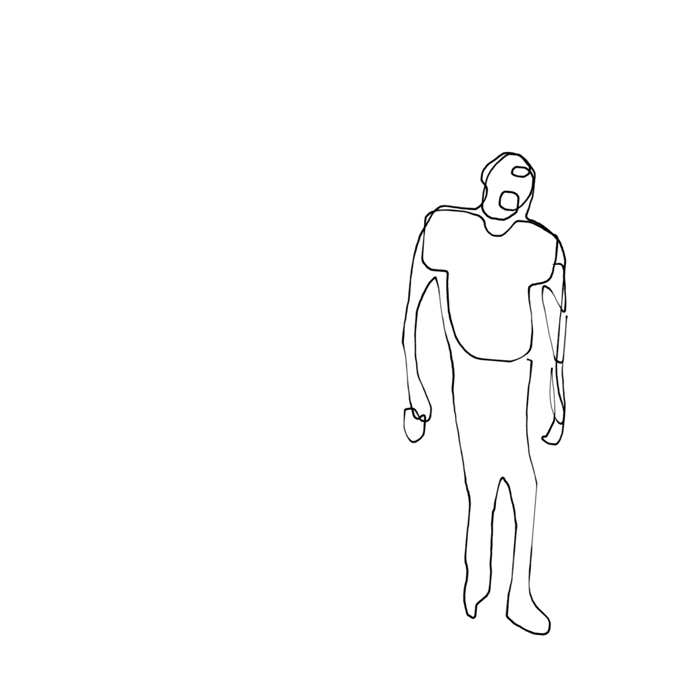
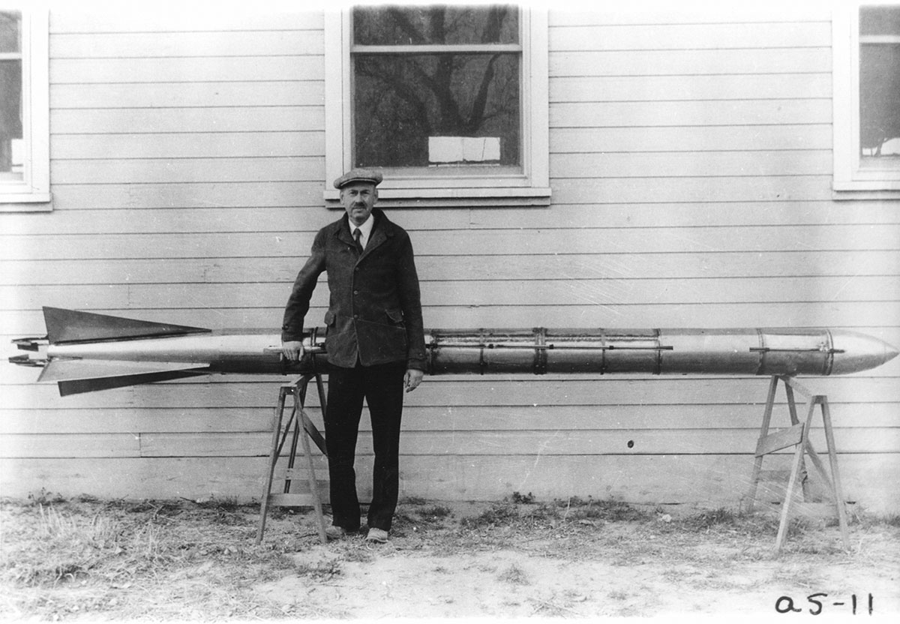
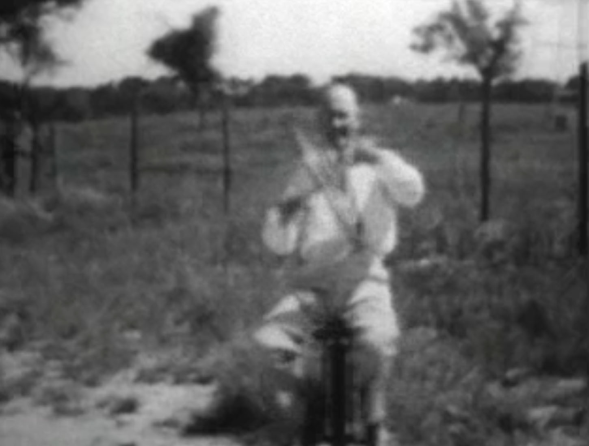

<!---
title: Art of the Living Dead Chapter 22
published: true
folder: Art of the Living Dead
layout: chapter
membersonly: true
--->
# The Moon Rocket Man
> _"Every vision is a joke until the first man accomplishes it; once realized, it becomes commonplace."_ — Robert Goddard

---

Days before Neil Armstrong became the first human to walk on the moon, the _New York Times_ published a retraction to a story published in 1920. Half a century earlier, an inventor named Robert Goddard was making headlines for his claims that it was possible to create a rocket capable of reaching the moon. Back then, few believed him. The _Times_ rejected Goddard's research saying, 

> "He seems to lack the knowledge ladled out daily in high schools." 

The _Times_ recited the belief of the day that the thrust which propels a rocket within earth's atmosphere couldn't exist in the vacuum of space. 

The Times was not alone in criticizing Goddard. The press was ruthless, dismissing his work and mocking him with the title "Moon Rocket Man." Even after _successful_ rocket tests, the headlines ridiculed him saying, "Moon Rocket Misses Target by 238,799 1/2 Miles."  

Had Goddard lived today, he would surely be the nightly punchline for late night comedians. Goddard would eventually be recognized as the founding father of modern rocketry despite nearly universal opposition during his life. How did he have the audacity to reject accepted truths and carry on in the face of such public criticism? 

In 1899, as the Wrights were still experimenting with kites, Goddard set his sites on the moon and committed his life to making his vision a reality. From the characterization of him in the media, you would think he was a lunatic, but by the time his work was in the news in the 1920s, he had already patented a multi-stage rocket and a liquid-fuel rocket. Goddard was so alone in his expertise that it would take decades before the rest of the world would catch up and recognize the brilliance of his work.

It is tragic that Goddard's brilliance wasn't fully appreciated during his life. Goddard's life reinforces the same patterns that we observed with the Wright brothers and Samuel Langley. The decoy factors of education, fame, and money were not influential in his art, but he did have all four ingredients for creativity (space, time, trust, and play) in abundance. Let's explore these factors one at a time.

_Education was not a factor_ in Goddard's success. He struggled in school, partly due to poor health, and was two years behind other children his age. Ironically, the _Times'_ insult that he lacked the force-fed knowledge that comes from school might not have been entirely inaccurate. That's not to say Goddard was uneducated. He had a Ph.D. in physics and accepted a research fellowship at Princeton. His most valuable education, however, came from trial-and-error. When Goddard failed, he called it "valuable negative information." Of one-hundred and six official  flight tests, forty failed to even lift off. His optimism was not deterred.  

_Fame was not a factor_ either, at least not after he had learned to avoid it. The early publicity of Goddard's work painted him as a mad scientist. Nationally he was a punchline. Locally, he was a nuisance, his rockets disturbing the peace and occasionally damaging property. After a particularly loud rocket test, complaints about his stunts reached the state fire marshall who, seemingly overstepping his jurisdiction, banned any flight to the moon from Massachusetts. The painful experience of fame sent Goddard into isolation. He became very secretive and protective of his work. He moved to Roswell, New Mexico where he could conduct his experiments in seclusion.  

The high point of Goddard's experiments was when his rocket, named Nell, reached 9,000 feet in March 1937. It was an event that didn't make headlines and was unattended by the press, sponsors, or official United States representation.

_Money was not a factor_ in Goddard's success, either. Goddard funded his first modest experiments himself. Eventually, when his money ran out, he received a $5,000 grant from the Smithsonian, and later funding came from Daniel Guggenheim, whose foundation gave $100,000 over four years at the urging of Goddard's friend, Charles Lindbergh. His friendship with Lindbergh, I would speculate, is what allowed these funds to be used without the strings and conditions that might have forced his work into the dangerous realm of public scrutiny.  

The most money received by Goddard came after his death when the U.S. Armed Forces and NASA paid out an award of one million dollars to settle patent infringement lawsuits. That sum exceeded the total amount of all the funding that Goddard received for his work, throughout his entire career.

Unimpeded by the trappings of fame, fortune, or educational bias, Goddard thrived because he had the real ingredients for creativity in abundance.

_Goddard had space._ His New Mexico oasis afforded him isolation for miles in every direction. The desert is where Goddard's most fruitful work took place. Alone, far from the public eye, and miles from disrupting other citizens, Goddard was free to experiment and fail without fear of mocking headlines.

_Goddard had time._ The years he spent perfecting his art were free from distraction. There were no deadlines. His ideas could percolate indefinitely until a flash of inspiration lead to new experiments. Completing as many as 50 tests a day, he easily passed the 10,000 hour mark until eventually he became a master rocket builder. In his own words, 

> "Work that is finally successful is the result of a series of unsuccessful tests in which difficulties are gradually eliminated." 
 
_Goddard had trust._ Being burned by publicity, Goddard surrounded himself with a small, select group of supportive friends and family. He only shared his discoveries hesitantly outside this community. After his death, Goddard was criticized for not sharing more with outsiders during his life. The people who tried to replicate his experiments later struggled to understand the nuances that can only be learned from years of isolated experimentation. 

_Goddard could play._ The term "rocket scientist" is a brainy stereotype, but Goddard had great fun building his rockets. There was nothing he would rather be doing. His wife Esther says, 

> "To him it was seventh heaven to spend all day every day on rocket research... My husband was a highly gifted and a very very happy man because he was doing precisely what he wanted to do most in all the world."  

 

---

Goddard died at 62 of cancer, essentially unknown to the world. He had invented the liquid-propelled rocket, the multi-stage rocket, the bazooka, rocket-assisted plane takeoff, and enough breakthroughs to eventually claim 214 patents. While history recognizes his work in hindsight, why wasn't the world able to appreciate his genius during his lifetime?  

Does humanity have the ability to receive revolutionary ideas with anything other than hatred? If in hindsight we recognize our errors, is correction enough to reverse the damage? Robert Goddard had been dead twenty-four years when the following apology was published by the _New York Times_,  

> "Further investigation and experimentation have confirmed the findings of Isaac Newton in the 17th century and it is now definitely established that a rocket can function in a vacuum as well as in an atmosphere. The Times regrets the error."

How many revolutionaries have we missed because humanity's collective scorn downed their creative ambition? If humanity's bias causes us to attack heroes like Goddard, to embarrass heroes like Langley, and to dilute the lessons of the Wright brothers, how can we possible expect to reverse armageddon? We tend to think of mankind's progress as a steady march forward from knuckle-dragging fool to enlightened savant. Could this optimism be another example of survivorship bias? A better metaphor might be a missile. Our progress is a rocket hurdling through space with little more input than a map scribbled on the back of a napkin as guidance. We are navigating the cosmos with blind faith in what amounts to little more than a compass and candlelight, oblivious to whether our ship is heading up or down. When we see the ground hurling towards us, we curse the map, sound the alarm, and frantically try to pull the nose upward.  

[Chapter 23. Origins of Inspiration](chapter23.php)  