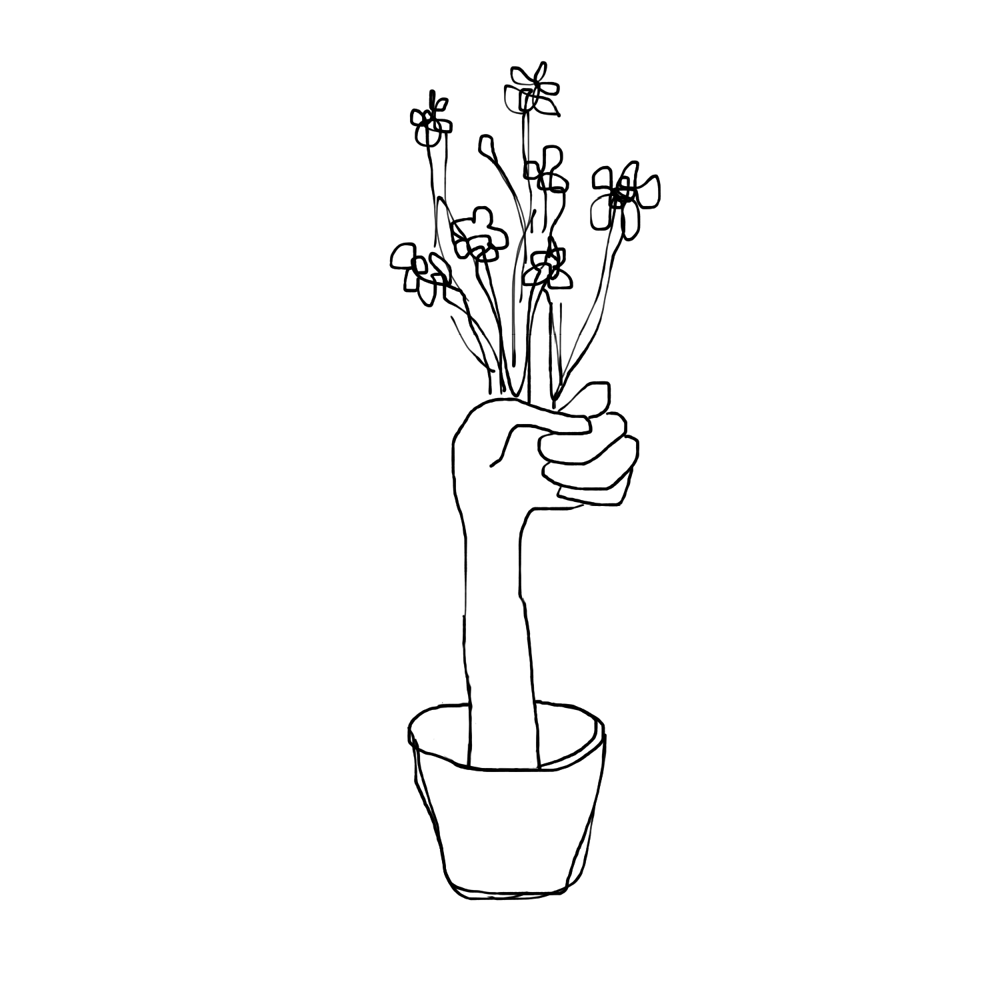

<!---
title: Art of the Living Dead Chapter 23
published: true
folder: Art of the Living Dead
layout: chapter
membersonly: true
--->
# Origins of Inspiration  
> _"We don't do anything without an idea. So they're beautiful gifts... And if you catch an idea that you love, that's a beautiful, beautiful day."_ — David Lynch  

---

As anyone who has been defeated by a blank screen or canvas knows, the desire to create art isn't enough. An abundance of space, time, trust, and play can't guarantee success, either. You also need inspiration, the spark of an idea worth pursuing. Without it you can't begin. Waiting around for it to hit you can be excruciating.    

Inspiration seemingly appears from nowhere. The inspiration that fueled Robert Goddard's ambition came to him in a vision when he was seventeen. It appeared seemingly from thin air in an experience he described like this,

> "On the afternoon of October 19, 1899, I climbed a tall cherry tree and, armed with a saw which I still have, and a hatchet, started to trim the dead limbs from the cherry tree. It was one of the quiet, colorful afternoons of sheer beauty which we have in October in New England, and as I looked towards the fields at the east, I imagined how wonderful it would be to make some device which had even the possibility of ascending to Mars, and how it would look on a small scale, if sent up from the meadow at my feet... I was a different boy when I descended the tree from when I ascended, for existence at last seemed very purposive."  

Ask anyone who has been inspired to do something amazing where their idea came from and they will likely tell you a similar story. You are simply going about your business and all of a sudden inspiration hits you and you are on fire with passion for your idea. It sounds like divine intervention and as a result, inspiration has become a mystical term, reserved for a holy few for whom the clouds part, angels appear, and ideas are revealed with a parade and trumpet serenades. Inspiration is a mystery, yes, but we need to be careful not to elevate it so high that it is out of reach. It is something we all feel and with practice we can learn to recognize it better.   

On a humid evening in 1990 somewhere in Missouri I was fishing in a pond with my sister. I was about twelve years old and my sister was six. We heard a splash on the far side of the pond. At first I thought it was a fish jumping and I wondered if we had picked the wrong side of the pond to cast our lines. When the splash did not dissipate, it was clear that it wasn't a fish. Something was swimming toward us. My next thought was that it must be a dog but as it got closer it looked less and less dog-like. Dogs usually don't swim so gracefully and this animal was cutting through the water more cleanly than you would expect from a four-legged canine. 

Whatever it was, its head was more triangular and not much of it was sticking out of the water. Could it be a snake? Estimating from the size of the head, if it was a snake it would have to be enormous. As the animal reached the center of the pond we could see ears, so the snake theory was no good. It had to be a dog. But what kind? The head was so unusual. Maybe a greyhound?  

Finally the animal reached our side of the pond. It came out of the water on the other side of a tree where the bank was less steep. I put down my fishing pole to cautiously greet our new friend. It wasn't a dog. Standing there dripping wet and panting heavily was a fawn. It looked up at me with big Bambi eyes and the beauty of the moment sent shivers up my spine, like the crescendo of a symphony. It was so perfect, so beautiful.  

Creative people are always in search of ways to find inspiration. We make routines, schedule brainstorming meetings, read books, and invent scenarios with the hope that we can isolate the formula for creative thought. These creativity rituals might be helpful, but creativity isn't a stocked pond where wild ideas can be fished out. Creativity is found in the wild in the unpredictable landscape of doubt and uncertainty. We sit patiently on the banks of a pond, hoping that inspiration will nibble on our strategically placed lines. Then when you thought you were fishing, inspiration appears and it isn't a fish at all.  

Inspiration is like that fawn. It is a wild animal. If you are looking for it, you may never find it. Then, when you least expect it, it appears out of nowhere. From a distance you won't even recognize what it is. You will mistake it for a stray dog or a dangerous snake. Inspiration can be deceiving. Even if you are lucky enough to encounter it and are able to correctly identify it, this is only the beginning. What do you do with it?  

As my sister watched, I slowly approached the fawn. Would he let me pet it? I got a few feet from the baby deer before it took off. It blew past me and ran straight into the woods. Like any boy my age, I chased after it. I left my sister alone behind me still holding her pink fishing pole. In a flash, I was gone, dashing off into the trees.  

When inspiration moves, we can either pursue it or watch it escape. Will you give up and walk back to your fishing pole and cast your line back into the pond of mediocrity? It is safer and besides, you can't leave your family behind. They wouldn't understand your need to chase the wild animal. Embracing inspiration is not easy. You will try to talk yourself out of it, but if you have the audacity of a child you might chase your inspiration. With reckless enthusiasm you will run head first into the dark forest.  

The fawn was fast, but to my surprise I could almost keep up. I had chased plenty of rabbits, chipmunks, cats, and squirrels before. These animals are so quick that once they realize they are being pursued they vanish in a burst of speed or disappear into a secret hiding place. Somehow I was able to keep the fawn in sight.  

We ran and ran. The trees were a blur and my lungs began to burn. Finally, as I was about to give up my pursuit, the fawn stopped. It lay down and tried to camouflage itself on the ground. I caught up to it, tried to grab it, but it took off again. My legs were on fire but the new hope of capture kept me running.  

After you accept inspiration, the chase begins. The ground flies beneath your feet and the scenery blurs around you. As you are creating your art you are focused. Your heart pounds and your lungs burn. This is the thrill of creation, the pursuit of meaningful work. You have never felt so alive. Eventually the exhaustion of creating will catch up to you. You will question whether or not you can keep running. Just as you are about to give up, a tiny breakthrough will be enough to keep you running.   

I kept running and eventually the fawn once again lay down on the ground. This time I slowed down and approached the deer slowly. This was partly so I could catch my breath and partly so I could try to avoid scaring it away again. The fawn was crouched down in the leaves in an open space between the trees. It didn't look at me, but remained perfectly still. I was steps away from it. Closer. Closer. Slowly. Finally, I put my hand on its back. I held it down as it tried to get up. Exhausted, it stopped fighting. I lifted up the deer gently, with one hand on each side of its back. I could feel its heart beating. I was afraid it would bite or kick so I held it as far from my body as I could. The fur was still wet from its swim, but it was warm. I marveled at the white freckles on its back and how little it weighed. It was so beautiful. This moment was one of the most exhilarating experiences of my childhood.  

The journey of creation is an excruciating chase. Finally, you catch the creature who has managed to stay just out of your reach for so long. It surrenders to you and lets you lift it with outstretched arms. You hold your prize with a cautious fear of your creation. It is beautiful. You have completed your art. This is one of the most exhilarating moments in your life.  

Because I assumed my chances of catching the fawn were so slim I hadn't really thought about what I would do if I caught it. Standing there in the woods I wondered, "What now?" The realization was sinking in that there weren't many scenarios where a boy and a deer can live together in peace and friendship. Could I keep it? Would my parents let me have a pet deer? I turned to walk back to the pond and show my sister our new family member.  

We are so consumed by our creative process that completion can catch us by surprise. With the chase complete, now it's time to carry your art back to civilization. Will they let you keep this pet? Will your art be embraced or met with appalled stares? You realize that you and your art don't have a good chance of a peaceful life together, but you take the next step anyway.  

I had barely turned homeward when something happened that scared the life out of me. The fawn began to yell. Or cry. Or scream. It's hard to explain the sound exactly, but it was loud, sad, and it didn't stop. I didn't want to hurt the animal, and the terror in its voice begged me to release it. I was so startled by the sound that I had to put the fawn down. It ran away again and this time I didn't pursue it. I watched it disappear in the distance.  

The creative journey doesn't end peacefully. Before your art can be brought into the world it will scream and cry in agonizing horror. It is not loyal to you. The better your art, the more terrifying it will be when it begs for you to spare it from entering the world. It would rather die in the wild than be butchered by zombies who won't see its beauty. Do you have the courage to hold on to it, or will you watch as it disappears in the distance?  

I walked back to the pond in awe of what had happened. The grownups would tell me that the fawn had probably lost its mother. Perhaps she had been hit by a car or shot by a hunter. The fawn was probably exhausted, afraid, and near death from starvation. It swam to us out of desperation. The cries I heard were its final attempt to reach its mother. If its mother had been in the area it would have attacked and possibly killed me. The adults scolded me for putting myself in such danger. I was lucky that the mother never came.  

The grownups said that since I let the fawn go it probably died, too. A baby animal can't survive without a mother to care for it. This explanation horrified me. If I wouldn't have let it go, perhaps I could have saved its life. I wanted to love it, but instead it died because I lacked the courage to hold on to it.  

Creating art is easy compared to the pain that comes at the very last moment. You either have to let it go, knowing this means certain death for your art, or you hold on to it, carrying it kicking and screaming into the world of zombies. This is the final leg of the creative journey. Even after making it this far, there is no guarantee that you will have the courage to hold on to your vision.  

Years after the fawn and the pond I had another deer encounter. Youth brought the desire to run away and live in the wild, alone and separate from society. Perhaps I sensed the zombie armageddon long before I had the words to describe it. The closest I ever came to realizing my dream of an isolated oasis was family trips  to Colorado, to visit my grandma. I would spend my days on the side of a mountain surrounded by boulders and pine trees, armed with my slingshot and a dull bowie knife. 

On one lucky afternoon I spotted a doe about 100 meters away. It was standing below a section of rock that rose about fifteen feet above her. At the top was a clear section that I knew I could easily approach from the back side. I could hike to that location and be completely shielded from the doe's view.  

After a quick hike, I was on the rock ledge quietly approaching the ledge. Previous failures had taught me that it would take more than a slingshot to bring down a full-grown deer. I took the knife out of its sheath and asked myself how badly I wanted the deer.  

Without a sound I looked over the edge to see if I could see her. I couldn't believe it. Directly below me, the deer was still grazing. All I had to do was jump. I could land directly on top of its back like the Lone Ranger mounting his horse. "Hi-yo, Silver!" 

I started making some mental calculations. When I took into account the height of the deer it was probably an eleven foot fall. Easily survivable.  

The thought of holding the knife as I jumped made me a little nervous. What if I fell off the deer and landed on the blade? If I left my blade sheathed, I probably wouldn't have time to get the knife out once I landed on it.  

The next question was what to do with the knife once I was on the deer. Was my knife sharp enough to cut its neck? It seemed unlikely that I could deliver a fatal blow in this way with my blade's dull edge. The tip was sharp. I could stab its side and hope that I struck the heart. The blade was about six inches long. Stabbing seemed like the best option. I think the heart would be a few inches in front of my knee once I was on top of it.  

I don't know if I made a sound, but finally the deer realized I was there. Unlike the fawn years earlier, this one didn't run. It stood motionless and looked me in the eye. It was as if it offered itself to me. It dared me to jump. All I had to do was take one more step.  

This is another metaphor for creation. We can see our art in the distance. We can recognize the opportunity and make a brilliant plan. We can take the steps necessary to put ourselves in the perfect position to make our art. We can get right up to the very edge and look down at the possibility. The last step, the only one that matters, is the hardest. This isn't about zombies, it is our own fear, our inner resistance preventing us from embracing inspiration.  

I didn't jump. I stood there and the deer casually walked away, knowing that it had defeated me. I put my knife away, disappointed by my lack of courage. For the rest of my life, all I can do is wonder what would have happened if I had had the courage to jump. It isn't regret exactly, just a nagging question that haunts me. If I wasn't going to jump, why did I work so hard to put myself in exactly that position?  

There aren't many people who can take that last step of the creative process. We all want to get to the endpoint, and most of us put significant effort towards setting ourselves up. This is the final obstacle, and it is where too many have failed. Few people have the courage to leap off the cliff, risking their life, sacrificing their safety to complete their art. When you arrive at the decisive moment will you stand there, hands shaking, calculating your odds of success? Will opportunity mockingly look back into your eyes and seeing your fear, casually walk away? Or will you step into the void, ready to accept the consequences, whatever they may be? 

If you don't commit to your art all your work will be in vain. Without conviction you are reserving a front row seat where the question of "I wonder what would have happened" will haunt you for the rest of your life. When the time comes, jump. Lack of conviction leads to compromise which results in watered-down versions of your art, but if you have conviction your art has a chance at immortality. In the words of Albert Einstein,  

> "Profess no belief without conviction. To conform, means often death; to non-conform in this is often life, often life eternal."   

[Chapter 24. Success, Turbulence and Implosion](chapter24.php)  