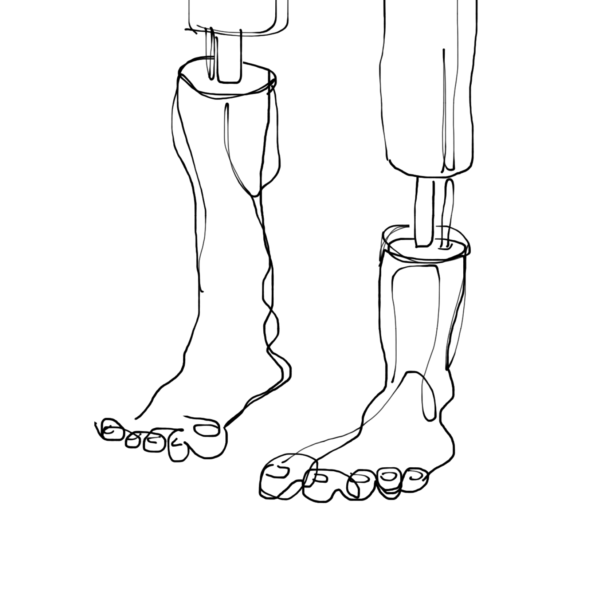

<!---
title: Art of the Living Dead Chapter 24
published: true
folder: Art of the Living Dead
layout: chapter
membersonly: true
--->
# Success, Turbulence and Implosion   
> _"I am afraid, my friend, that your usually sound judgment has been warped by the desire for great wealth."_ — Octave Chanute (to Wilbur Wright)

---

Let's entertain the idea for a moment that this all works out. You use the ingredients of creativity to complete your masterpiece. You find inspiration, overcome resistance, and you conquer the zombies. Finally, you achieve success. What happens then?  

As much as I would like to leave the story of the Wright brothers with a happy ending, I can't simply let them fly peacefully into the sunset. Unfortunately, the second act of their story is a tragedy in which our heroes play the role of villain.  

Imaging you just created one of the most important inventions in the history of mankind. What would you do next? You don't just donate your invention to the world, naturally, you would want to make money from your invention. You would seek fame, fortune, and power. You would work to protect your priceless secrets. That is exactly what the Wright brothers did. They stopped innovating and put all their attention in defending their creation and milking it for every dollar they could squeeze out of it.  

Soon after their first flight, the Wright brothers applied for a patent. After it was initially rejected, they hired a lawyer and three years later, they owned the rights to flight. The patent was so broad that they could essentially sue anyone who built an airplane or flew without permission from the Wright's. They essentially closed up shop, stopped flying, and started attacking their rivals. Focusing on litigation full-time, they didn't make a single flight in 1906 or 1907.  

Manned flight was in its infancy, and anyone interested in advancing the art would face massive lawsuits unless they payed a $25,000 licensing fee to the Wrights. In addition, the Wrights wanted $1,000 for every airplane made. All aircraft in America was essentially grounded as the Wrights served injunctions to every pilot, enthusiast, and business man with ambition of getting off the ground.  

The Wrights won nearly every lawsuit they filed. Court battles consumed the Wrights, especially Wilbur. Wilbur took the lead role in the patent fight because he felt he was fighting for a moral cause. He said,  

> "It is our view that morally the world owes its almost universal system of lateral control entirely to us. It is also our opinion that legally it owes it to us."  

This is a shocking reversal of the humble attitude Wilbur possessed at the beginning of his work when years earlier he said,  

> "I wish to avail myself of all that is already known and then, if possible, add my mite to help on the future worker who will attain final success."  

How does someone change so completely from a creative being into a life-sucking zombie? The success of the Wrights corrupted their values, transforming their morals into twisted inversions of what they formerly believed. Eventually, the testifying, consulting with lawyers, and preoccupation with legal issues took its tole, and in 1912 Wilbur died. The official cause of death was typhoid, but his family attributed it to the stress of the patent war.  

In addition to the loss of life, the legal battles drained their fortunes. Orville would estimate that the court battles cost about $150,000. To put this in context, remember the record-breaking $50,000 that the government invested in Langley's aerodrome? It is painful to imagine the innovation that could have happened if the Wrights wealth and skill could have been invested in furthering advancement in flight rather than attacking new innovators.  

As a result of the toxic environment created by litigation, the only place where flight innovation could take place was outside the United States where patents were harder to enforce. German aviation thrived while the USA fell behind. By the time World War I broke out, America was so far behind that the government stepped in to stop the patent war. Driven by military demand, the government reduced the Wright's royalties from 20% to 1% and started making war planes. The Wright planes, having advanced little since the initial flight, begin to look more and more obsolete compared to those of rivals, and in 1914 Orville sold the Wright Company and retired. It is a sad ending to an amazing story. Maciej Ceglowski summarizes the tragic finale like this,  

> "The Wright brothers won every patent case they fought, and it did them absolutely no good. The prospect of a fortune wasn't what motivated them to build an airplane, but ironically enough they could have made a fortune had they just passed on the litigation. In 1905, the Wrights were five years ahead of any potential competitor, and possessed a priceless body of practical knowledge. Their trade secrets and accumulated experience alone would have made them the leaders in the field."  

The demise of the Wrights could easily turn into a critique of the zombie patent system. Yes, today's patent system is still broken, but if the patent war hadn't sunk the Wrights it could just as easily been something else. Leaders fall every day, brought down by scandal, abuse, corruption, and countless other sins.  

If we survive the zombie apocalypse, there is a chance that maybe, just maybe, our efforts will find success. The choices available to a successful artist seem bleak. The fate of Robert Goddard was to die in obscurity. The fate of Wilbur Wright was to die from the exertion required to protect his creation. The words of Harvey Dent from _The Dark Knight_ come to mind,  

> "You either die a hero or you live long enough to see yourself become the villain."  

This book has plenty to say about doing meaningful work, but unfortunately I have little advice for what happens if you succeed. Seeking space, time, trust and play is laughable advice to someone whose success leaves them sitting on a mountain of cash surrounded by a hoard of zombies larger and more vicious that the ones conquered to achieve success in the first place. Eventually, the corrosive forces of fame and fortune will immerse and perhaps overwhelm you.  

The hope is not in a fairy tale ending, but in finding joy in the journey. The meaningful work we do is an end of itself. Our work defines us, and it is this effort towards excellence that we must embrace, protect, and cherish because if we don't our legacy will not be the death of a hero, but the limping march of a lifeless being, unable to change his world, hostile to change, tragically impotent, and staggering eternally towards irrelevance.  

[Chapter 25. Post Apocalypse](chapter25.html)  