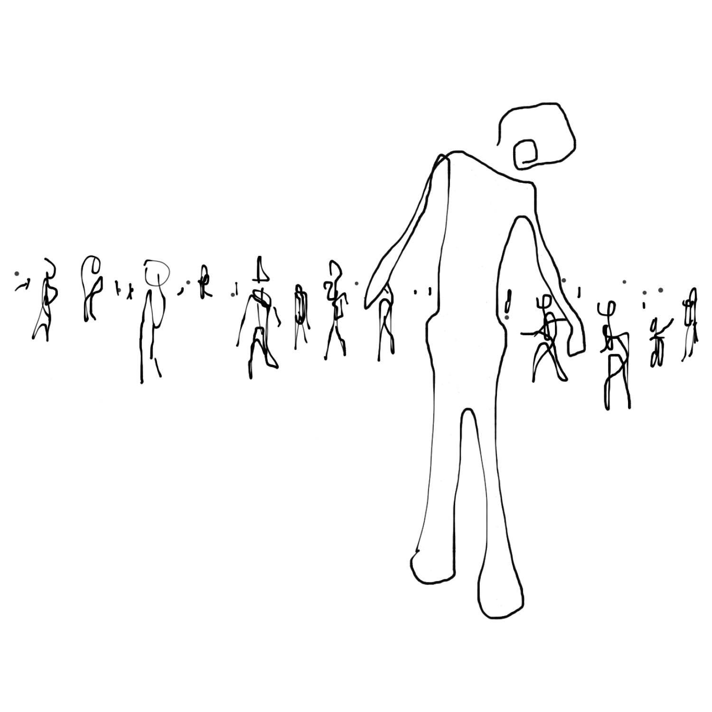

<!---
title: Art of the Living Dead Chapter 25
published: true
folder: Art of the Living Dead
layout: chapter
membersonly: true
--->
# Post Apocalypse  
> _"It is difficult to say what is impossible, for the dream of yesterday is the hope of today and the reality of tomorrow."_ — Robert Goddard

---

When you arrive at the end of a zombie story, you can't exactly call it a happy ending. The hero returns to camp bloody, exhausted, and emotionally scarred. The fighting is over, for now. There has been so much destruction. We have come a long way, so let's summarize the ideas that have brought us this far.  

Zombie stories appeal to us because they represent a fundamental fear we all share — that we are all alone, that we are surrounded by mindless fools (chapter 1). Humanity faces armageddon because we seem to have lost our ability to innovate, our creative capacity has been crippled (chapter 2). The battle is between the living who create life, and the zombies who destroy creativity.  

We learn at a young age that we have a great power: the ability to create (chapter 3). This art isn't something we can learn in school, we each have to discover it for ourselves (chapter 4). Art history ended with the corruption of artistic integrity. We need to reclaim it (chapter 5).  

Lack of creativity creates absurdities. Intentional thought leaves traces of the integrity of its creators (chapter 6). We create our art despite being surrounded by dysfunctional institutions. Participating in the system means death. Attempts to violently destroy the system get us nowhere (chapter 7).  

Sometimes doing nothing is better than doing something (chapter 8), but laziness breeds shortcuts. We become addicted to these shortcuts and they fail us (chapter 9). Having good taste is critical (chapter 10) and it is the only sure way to avoid the pitfalls of our shortcut addiction.  

Creativity is a threat to zombies (chapter 11) including the zombie voice in our head (chapter 12). Too often we stifle emotion to the detriment of our art. The human voice is changing everything. It's a revolution (chapter 13). People can't distinguish art from magic. Creating art is the result of hard work, not trickery (chapter 14).  

The result of this revolution is that the economics are changing. Attention is the new currency (chapter 15). The establishment of name brands seemed like a good idea, but while we think we are differentiating ourselves with brands, what we are really driving towards is conformity (chapter 16).  

There are talented people on the outside and inside of zombie institutions. Both insiders and outsiders face crippling challenges, but the distribution of zombies within an organization has a big effect on whether you succeed or fail (chapter 17).  

In chapter 18 we dissected a prototypical zombie organization, American Airlines, and saw how neither talented insiders or passionate outsiders could save the company.  

Chapter 19 contrasted a doomed insider (Pierpont Langley) with successful outsiders (The Wright brothers). These case studies show how we make mistakes about what we think makes people successful. Our survivorship bias leads us to wrongly believe that money, fame, and education are the keys to success (chapter 20). The real ingredients of creativity are space, time, trust, and playfulness (chapter 21). Although Robert Goddard (chapter 22) had all the ingredients of creativity and experienced incredible breakthroughs, he still died unknown and under appreciated. This doesn't look like success, but we forget that he was happy and his art changed the world.  

The final requirement for creating meaningful work is inspiration (chapter 23), an elusive and wild animal. If it finds us at all, we may not have the courage to follow it into the abyss.  

Victory is not the end of your struggle. Even if your goal is achieved, the turbulence of success can corrupt even the noblest of heroes (chapter 24).  

In a few minutes you will put this book down and re-enlist in the war. As you return to battle remember…  

Fight hard. Your effort must surpass that of the desperate masses who defend the status quo.  

The enemy is relentless. Keep moving. Never get too comfortable in your well-defended positions.  

Cling to hope. Perhaps we will live to see the day when the waves of zombies subside.  

Trust your instincts. If doing the right thing feels like anarchy, you must rebel.  

Mourn the lost. As we pick up the weapons of the fallen, learn whatever you can from their stories.  

Hold your fire. Conserve ammo. Both friends and foes wear zombie disguises. We can't afford losses from friendly fire.  

Most importantly, question everything. Remember, the voice in your head is a zombie, too.  

In the rare moments of victory, savor the tranquility with your fellow survivors. The bonds of battle have made us strong. We know how much the fight has cost us and today life is more precious than ever. We cling to hope that one day the battle will end. War is hell, but tonight the hero rests.  

As the camera slowly zooms out, a dark smoldering world is revealed. While there may be peace tonight, the sun will rise again tomorrow casting light on the devastated world. The battle never ends, and tomorrow the artist will fight on.  

[Epilogue](chapter26.html)  
