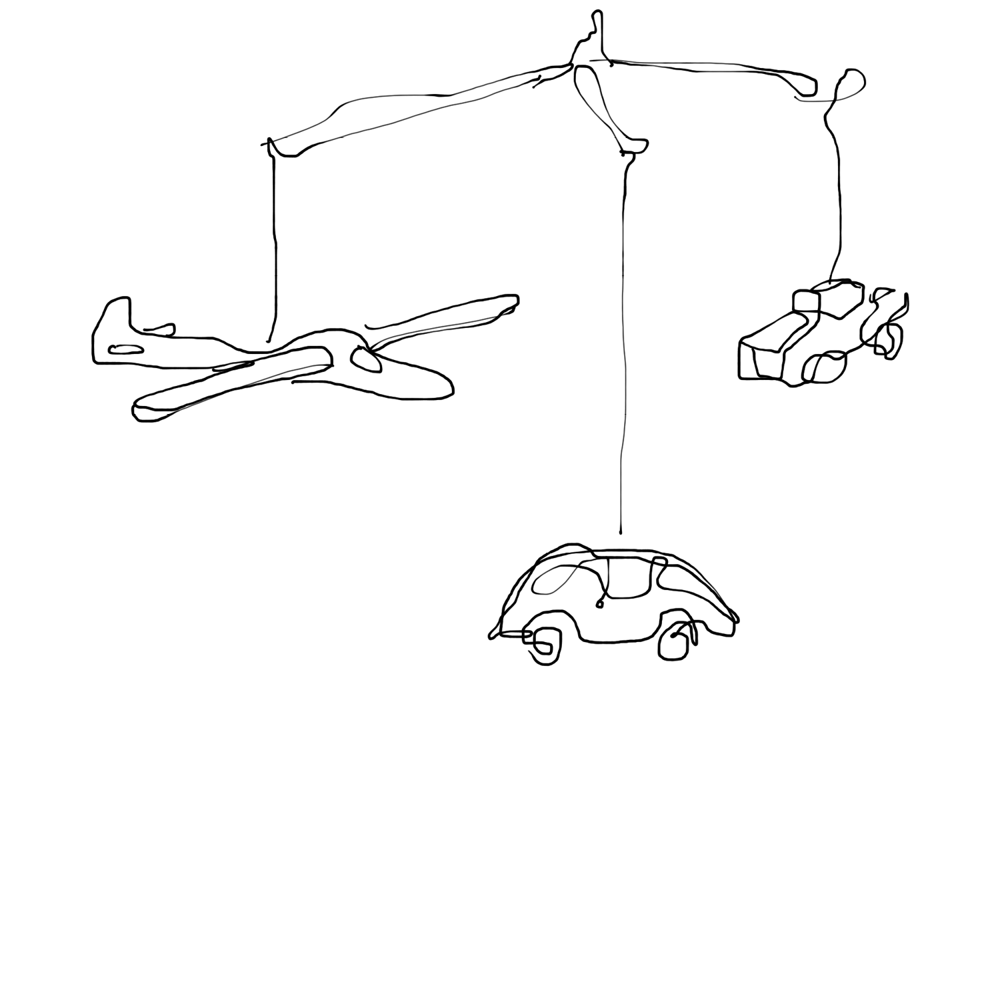

<!---
title: Art of the Living Dead Chapter 3
published: true
folder: Art of the Living Dead
layout: chapter
membersonly: true
--->
# The Birth of a Zombie  
> _"Every child is an artist. The problem is how to remain an artist once he grows up."_ — Pablo Picasso

---

Contrary to popular belief, life doesn't start at conception or the instant of birth. Life begins at the moment when you discover your ability to create. This is not a philosophical, political, or religious statement, it is just an observation that helps us to differentiate between the living and the living dead. The living create. Zombies destroy life.  

At the moment when a child first holds a crayon in her fist and realizes that she has the ability to make marks on her environment she awakens. Her life has begun. She sees her surroundings not as static limitations, but as movable, changeable opportunities. Something in her mind comes to life. Empowered by this realization, she can't help but test the powers of her new ability. Is an 8.5 x 11 sheet of paper enough to contain her enthusiasm? No. Everything in the world is now a blank canvas where she can apply her artistic vision. Thrilled, she runs down the hall, crayons in both hands, arms stretched as far as they can, leaving rainbows of color behind her.  

We know this story doesn't have a happy ending. The walls are covered with scribbles and at some point a zombie will appear. He will see her creation as a horrible mistake. He will punish her, perhaps even taking her crayons away. Her eyes will fill with tears as her very first creative act gets erased. Her rainbow-colored walls once again become beige boundaries. The zombie has won. His scolding rips her creative spirit limb from limb. The lesson she learned today was not that the world is a limitless canvas for her to fill with beauty. The lesson is that creativity will be punished. She internalizes this message and conforms. _A new young zombie is born._  

How can a child possibly understand our zombie world? She has seen how her hand can change the world and yet she is expected to be content to use her crayons to fill in the holes between thick black outlines of coloring books. She knows it doesn't have to be this way, but adults enforce these rules ruthlessly. How can she fight them? Adults are monsters.  

Parents do this every day of course, without considering the implications. We correct our children's grammar. We dress them in "appropriate" clothing. We make their beds for them when they don't do it right. We send them to schools where they learn to follow more rules, recite memorized answers, and most of all respect authority. If they are lucky the authority figures will grant them recess and maybe 30 minutes once a week for creative arts. This begs the question, are we creating mini-zombies?  

Don't get me wrong, I am not endorsing a style of parenting or teaching that allows kids to draw on walls, disrespect grownups, and indulge their every whim. That would cause certain anarchy and a scenario that would rival our zombie apocalypse. My point is that our innate ability to create encounters resistance at a very young age. Whether or not we are defeated by this opposition dictates whether we end up being humans or zombies.  

Now let's imagine a scenario where our crayon-wielding hero doesn't end up as a meal for her zombie parent. We pick up at the moment where she is in tears after being scolded by her monstrous father.  

The pain of the scolding she received is slightly less intense than the thrill of discovering her ability to create color. The lesson she learned was not that her creative abilities are bad. She learned that her creativity is powerful. It is so powerful in fact, that adults fear it and may punish her for using it. She understands that she will have to wield her power more carefully in the future.  

She dries her eyes. Despite her father's efforts to erase her art, a hint of the crayon is still visible as a faint halo still clinging to the walls. Her art has endured. For the rest of her life she will get better and better at avoiding zombies as her art blossoms and flourishes. _A new young artist warrior is born._  

Although our young artist has survived her first zombie encounter, that doesn't mean it will be any easier for her to protect her art. Fast forward and she is drawing now, not on walls, but in a sketchbook. Like all children her age the drawings are crude by adult standards. There is no understanding of proportion, perspective, or accuracy. It has none of the elements that make a piece of art "right" by traditional measurements.  
 
This doesn't deter our hero because she is oblivious to the constraints that will soon stifle her spontaneous creativity. Her perceptions have not yet been infected by formal, literary, or visual prejudices. Unaware of any right or wrong way to draw, she just creates. Her eyes savor everything they see and she is learning to explain this on paper with ever-improving skills.  

She draws things from all sides. Front, back, and inside-out. Proportion is something felt rather than measured. Her father is the biggest influence in her life, so she makes him big. He is not a tall man, but on paper he is the biggest part of the picture, bigger than trees, cars, or houses. 

She draws the things she knows and loves. Her bike, mom, dolls, and her kitty. Love is expressed not by the accuracy of her lines but by the feelings inside her as she drags her markers across the paper. Literal perspective doesn't interest her because she draws what something feels, not how it appears. Her marks are a tribute to the most important things she knows. For a while these masterpieces get posted on the refrigerator like treasured artifacts, held up by loose magnets.  

Then something terrible happens. Another zombie. But this zombie encounter is different. This time there isn't a monster insulting her work or threatening to stop her creative aspirations. This zombie appears in her mind. Her own brain threatens to destroy her art.  

It is unclear from where this zombie came, but self-criticism crept it. Things no longer look right. She has become unsatisfied with the result of her artistic efforts. Did she come to this harsh realization on her own? Had she observed the difference between her output and that of older kids? Did a trip to a museum expose a talent gap?

Perfection has become the new goal and her inner zombie tells her that if her art is going to be good, it needs to look realistic. From this day forward she holds her drawing up and compares it against a more photographic representation of the world. The discovery of realism is a critical moment in her development because it presents her with a choice. Should she try to perfect her drawings or learn to accept the criticisms that accompany the imperfections? The threat of negative feedback convinces her to choose realism and she accepts the challenge of making her drawings look more and more real.  

She puts away her crayons. She learns to use both sides of the pencil, lead and eraser. She learns to shade. She burns through erasers as correction after correction are made. She takes measurements. She asks her mom to buy her tracing paper. Eventually her drawings start to look more like photographs.  

This new art is hard. Where is the fun in reproducing photos? She can impress her critics with her technical abilities, but she feels her drawings are missing something. She wonders if changing her art would allow her to recapture the fulfillment that her old pictures gave her. Her drawings used to be expressions of what was inside her, now they were just reflections. She doesn't know whether to satisfy her inner zombie or nurture her inner artist. This is the battle that she will fight for the rest of her life.  

Our young hero is fighting the same battle as all of us. Our inner zombie tells us that our work isn't good enough. It begs us to create safer art that won't be criticized. Our zombie brain praises us for work that is embraced by other zombies and ridicules us when we attempt to innovate.  

The zombie apocalypse is a war fought on two fronts. The first is the countless mindless creatures that oppose our best work. Like a parent erasing crayon marks where they don't belong, the external zombies will never support our artistic vision. The second front is a battle against our own inner zombie, the voice in our head that sabotages our best intentions and frightens our creative ambition. Victory requires winning on both fronts. Before we can fight, however, first we need to have a better definition of art.  

[Chapter 4. Learning the Unteachable](chapter4.html)  