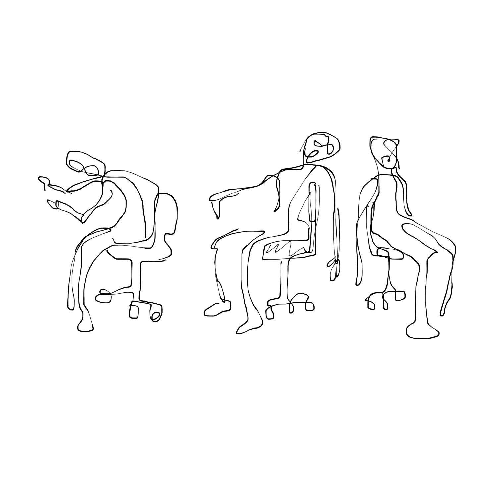

<!---
title: Art of the Living Dead Chapter 4
published: true
folder: Art of the Living Dead
layout: chapter
membersonly: true
--->
# Learning the Unteachable  
> _"We know that only the technical means of artistic achievement can be taught, not art itself."_ — Walter Gropius, founder of the Bauhaus

---

I was a junior in high school when my art teacher, Mr. Schatz, shattered my understanding of art. The assignment sounded simple enough at first. "Create something that represents your family." That was all. The class was confused by these vague instructions, so we raised our hands with questions.  

"So, you are asking us to draw a picture of our family?"  

"No. The assignment is to create something that represents your family," Mr. Schatz replied.  

"Do you mean a sculpture, then?"  

"No. The assignment is to create something that represents your family."  

Why was Mr. Schatz being so vague? We tried to ask the question differently. "If I take a photo of my family and then make a painting from it, will I get a good grade?"  

"Probably not."  

The class was baffled. How could we complete an assignment if we couldn't define its parameters? We continued to press our teacher, but the more we pressed, the more confusing the assignment became.  

"So if we can't use realistic representations of our family, does that mean you want us to create something abstract?"  

"Not necessarily."  

The novelty of this exercise was wearing off as we realized he wasn't going to tell us what to do. It didn't seem fair. Frustrated, we asked, "How do we know what the correct format for this assignment will be, if you don't tell us?"  

"The medium isn't important."  

Confusion started to turn to panic as we realized Mr. Schatz wasn't going to give any further direction. Someone asked, "So are you saying that it doesn't matter what we make? It can be anything we want?"  

"No, it matters. It should be the correct format to best represent your family."  

We were bewildered.  

"So different families require different mediums? How do we know which is correct?"  

Finally Mr. Schatz gave us a clue, saying "That's the wrong question. First you must figure out what your family is. What is your family?" 

We responded with the obvious answers, reciting the inventory of our families. "I have a sister, a mother, and a father."  

Mr. Schatz explained that, "Lot's of people can describe their family that way. What is _your_ family?"  

With a tone of desperation, someone asks, "Is it a set of beliefs, traditions, and feelings?"  

"I don't know. Is it?"  

After we exhausted every line of questioning, Mr. Schatz said, "For the rest of the hour, I would like you to think about what your family is, what it means, and how you would convey that idea to someone who doesn't know your family. Figure this out first, then the art will come later. Before you can create anything, first you must understand it."  

It is hard to understate how frustrating this was to my classmates and I. A decade of classes had led us to believe that school was a process of memorization and pattern repetition. Success involved remembering what hoops to jump through and in what order. If you do a, b, and c you earn your diploma. Without a clearcut formula we were lost.  

This was the first time an art assignment had been hard for any of us. Before that day, all that was needed was patience and practice. You find something beautiful and draw it. It didn't even really have to be good because you could always fall back on the subjectivity of art. Art was supposed to be _easy_. No one said this outright, but we were all thinking the same thing, "Listen, Mr. Schatz, this is an art class, and I need an A. You need to tell us how to do this, so we can get our grade."

My classmates were bewildered, but I was terrified. I was supposedly one of the “talented” artists in the class and I had no idea what I was doing. I was lost. I realized that the thing that defined me, my art, was a mystery. I thought I knew what art was, but that day I was reduced to an amateur. I had some skills, yes, but mentally I was still an infant. My turf suddenly felt foreign to me.  

As I struggled with the assignment, things gradually became clearer. The challenge was not the assignment, it was coping with the knowledge that everything I understood about art had just been shattered. I knew that being technically skilled was no longer enough. The next step wasn't a lesson I could learn in school. Grades were meaningless. There wasn't a formula to follow. The teachers could point me in the general direction, but I had to do the work myself.  

Most people define art by dividing it into simple categories. They wrongly assume that visual art consists of drawing, painting, sculpture, photography, sculpture, printmaking, or pottery. Music, literature, dance and other arts can likewise be sliced and diced into chunks.   

By dividing art into categories, the definition of art has been distorted by zombies. The categories are not art. Those are just activities. In order for something to transcend these activities it needs something else, something deeper. To borrow a quote from _Fight Club_, "Putting feathers up your butt doesn't make you a chicken." Likewise, being able to draw, paint, or dance doesn't make you an artist.  

The missing link between artistry and an easily defined category is quality. A dance is not art unless the artist has the ability to infuse his work with quality. A sculpture isn't art without the quality that causes it to transcend the stone it was carved from.  

You can't get from activity to art by following instructions, although that's the formula our schools follow. How do you teach the unteachable? You divide art into categories and subdivide it into teachable chunks. Learning to draw involves micro-lessons about paper, pencil sharpening, eraser technique, hand-eye coordination, and methods for making marks. Put it all together and what do you get? The result may satisfy the requirements completely, but it still isn't art.  

In _The Medium is the Massage_, Marshall McLuhan wrote, 

> "Education must shift from instruction, from imposing of stencils, to discovery–to probing and exploration and to the recognition of the language of forms."

Mr. Schatz removed the stencils by hiding the categories of the assignment. We could create art in whatever medium we wanted. Why should this be so terrifying? We don't realize how much comfort we get from categorization and rules. We will never admit it, but we love to be told what to do. Zombies don't just devour the living, they also include those who ingest the words of others without thinking for themselves. That, too often, sums up our educations.  

Assignments are comforting because it is easy to reproduce a photo with a pencil and turn it in by next Tuesday. Producing something meaningful without restrictions feels like navigating a mine field without a map. Without clear rules to follow, the uncertainty is crippling. How will we know what is good without a manual to test our answers against?  

The educational system of memorization and recitation cripples young people's creative courage. The assignment from Mr. Schatz taught me that exploration outside the typical assignment is a fertile and empowering journey. School should nurture the ability to thrive in situations where there isn't a clear right or wrong answer. An education should cultivate strength of character that doesn't define self-worth as a measurement of how accurately we conform. Too few leave school with these skills. Most graduate not with an appreciation for ambiguity and an appetite for the unknown, but with a loyalty to rigid rules and an unwavering belief in the infallibility of memorized correct answers. Graduation happens when the last item in the list gets checked off and you can finally stop learning.  

With education out of the way, we begin our professional lives and enter the vacuum of the real world. Here, the uncertainty is crushing, so we try to recreate the comfort of school in our jobs. We replace our teachers with a boss who gives us our daily assignments. Our syllabus is replaced by a job description. Our report cards come in the form of quarterly reviews where we defend our performance and argue that we deserve A's instead of B's.  

Art isn't the only place where humans comfort themselves by lumping things into big categorical buckets. The definitions of doctors, scientists, teachers, carpenters, and fast-food workers are categories that allow for very little "mixed media."  

Professionals have difficulty transcending their job categories. When conversations stray beyond the literal, the artist will see the terrified bewilderment of a teenager in the face of co-workers. Like school children, the zombie employee prefers the cubicle comfort of measurable activities over the uncharted territory that artistic ideas represent. They swim away from uncertainty, but you swim toward it because that is the only place where art can exist. If you survive swimming against the current, eventually you arrive on the island of uncertainty alone, exhausted, and wishing there was someone, anyone, who could understand your achievement. This is the journey of the artist. The next chapter retraces the steps of the historical artists who shaped our understanding of what it means to be and artist. What if art history got a few things wrong?  

[Chapter 5. The Historical Conquest of Art](chapter5.html)  