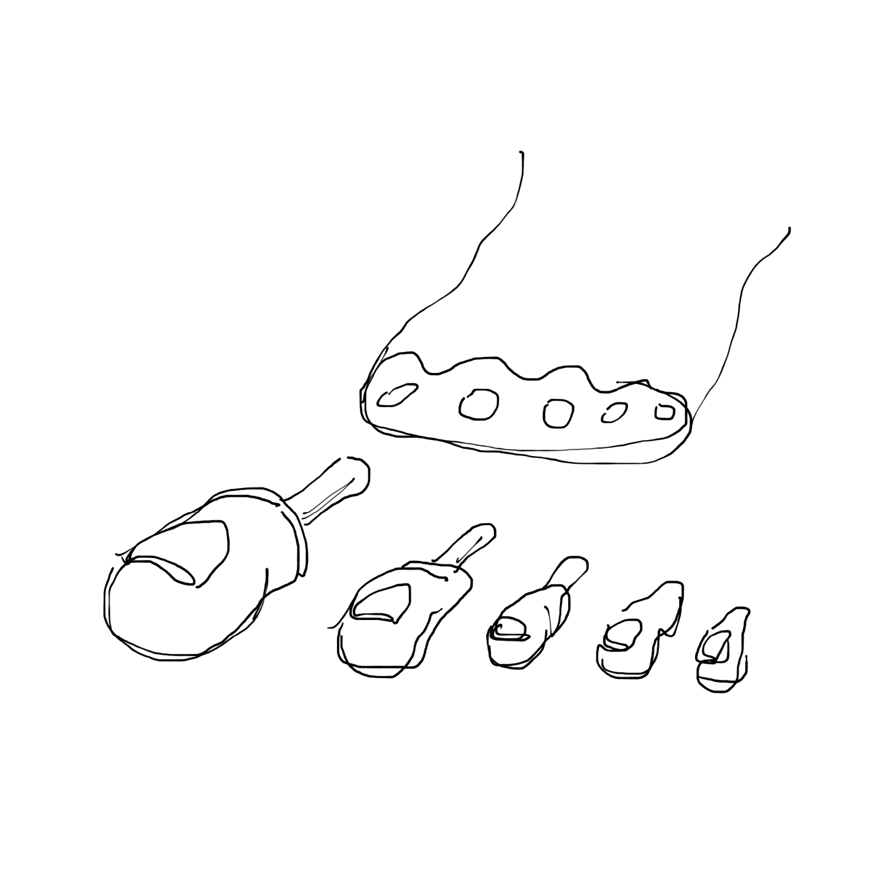
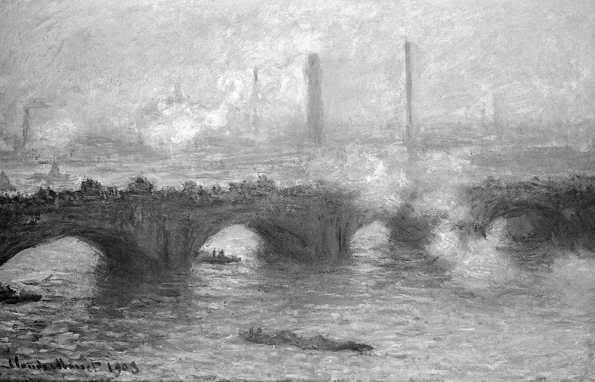
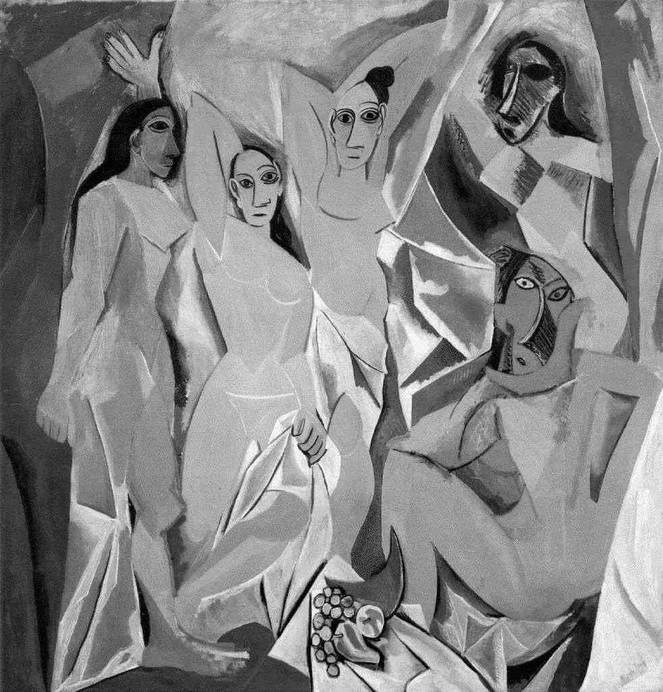
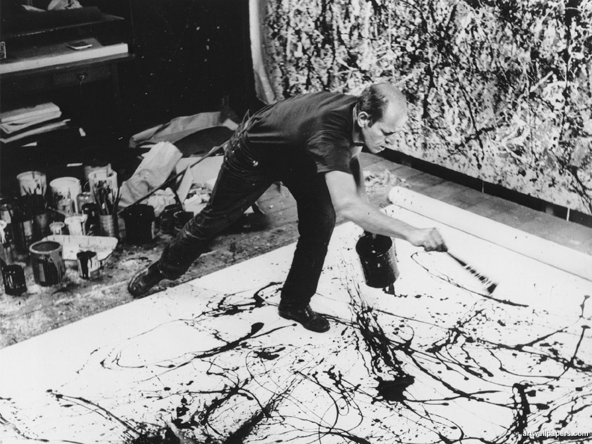
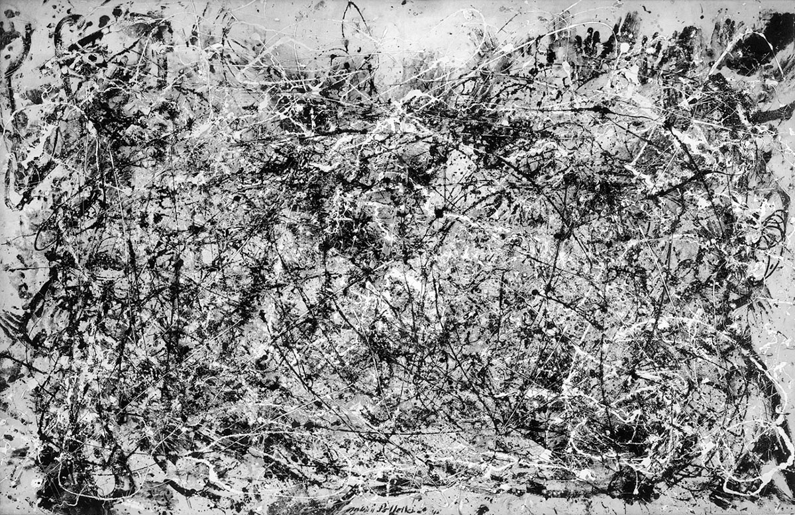
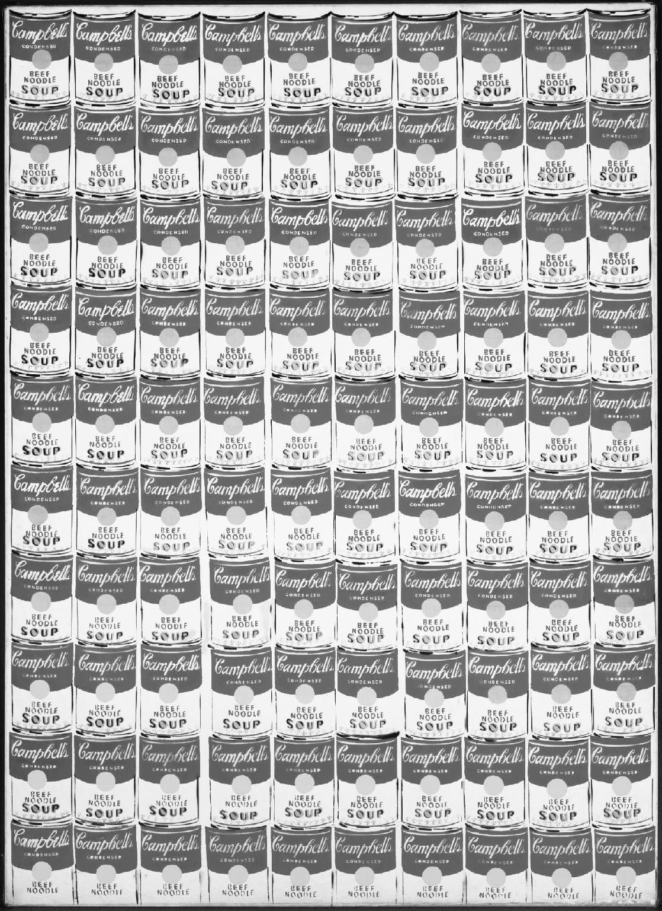
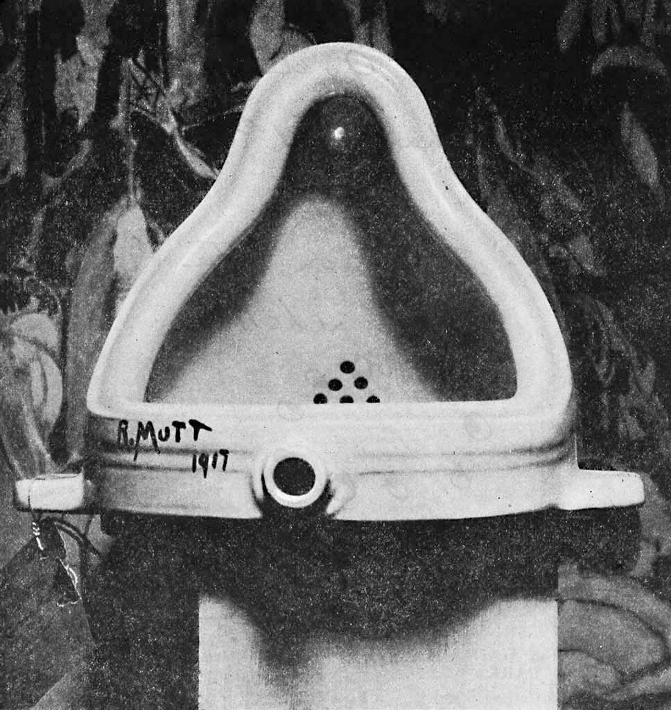
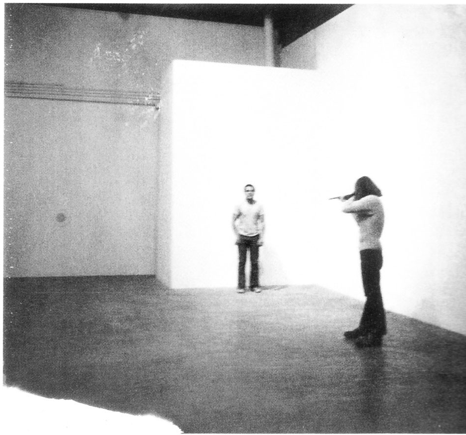
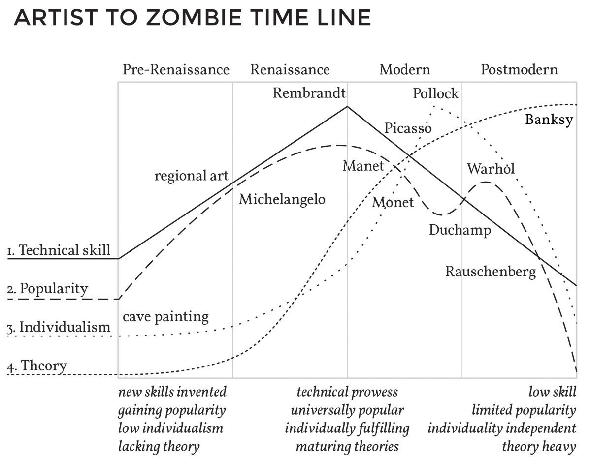
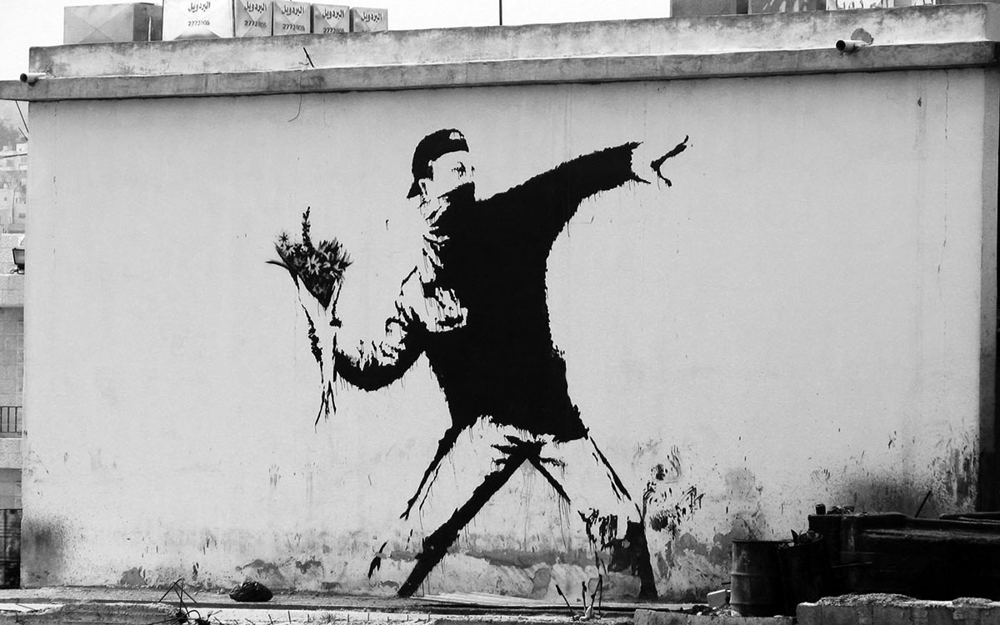

<!---
title: Art of the Living Dead Chapter 5
published: true
folder: Art of the Living Dead
layout: chapter
membersonly: true
--->
# The Historical Conquest of Art  
> _"Art is anything you can get away with."_ — Andy Warhol

---

When you hear me use the word "art" you might have an instinctual eye roll reaction. You are not alone. Step inside the modern wing of any art museum and you will probably hear someone saying, "How is that art?" Despite thousands of years of artistic tradition we are still debating art and its role in society. Art has evolved into something that is at best misunderstood and at worst despised by the general public. How did we get here?  

There is a reason so many people slept through the mandatory art history class. The academic worship of dusty antiques is worlds apart from the frenetic buzz of our digital lives. Since this is a zombie book, forgive me for the following made-for-tv reboot of art history. Put your seat belts on because we are going to fly through art history at warp speed and cherry-pick the key concepts that transformed art into the lifeless corpse that dull professors are still projecting onto walls  of dim rooms filled with kids struggling to stay awake.  

**Cave Art**  
The first art was smeared on the walls of caves. The audience of cave dwellers was astonished by this new way of thinking. Marks on a wall can represent a horse! _Brilliant._ It's not a horse, but it looks like a horse. _Mind blown._ It is silly in hindsight, but like the invention of the wheel, everything has to start somewhere.  

Art didn't stay on the walls of caves, however, and the first counter-movement took place. Rebellious young artists rejected the cave wall in favor of a new more mobile venue. Animal skin, canvases, and scrolls revolutionized art, allowing it to move from location to location exposing the art to more and more people. People were astonished by the new accessibility of art. It was a hit. Charcoal was replaced by paint and sticks were replaced by brushes. It became easier to create art. No longer limited to the indie caveman, art went mainstream.  

**Religion**  
The second chapter of art history focused on meaning. Now that art was easier to create, people realized that the subject matter they selected was important. They couldn't just document their hunting trips like the unenlightened artist of the past. They began to aspire to more spiritual themes. The art movement joined forces with the church. Religious themes dominated art for over a thousand years.  

**Realism**  
It is hard to imagine a world before the invention of the photograph, but there was a time when realism was a revolution. Before the invention of the camera, the progress towards realism was driven by the invention of the mirror and cutting-edge techniques like chiaroscuro, perspective, and shading. As artists recognized the ability to make their art realistic, they felt a growing responsibility to accurately represent how things actually looked in their paintings. Realism was more than a fad, it became the standard by which an artist's skill was measured.  Paintings by artists like Vermeer were so realistic that debates rage to this day about whether or not their work was aided by optic lenses or a camera obscura.  

**Secularism**  
Breaking from the tradition of church-driven art, secular themes were an acknowledgement of the merit of subject matter beyond the religious. It started as a way for kings to attempt to put themselves in the same realm as gods. As the economic conditions changed, eventually it was affordable for art to be created without the financial assistance of the church, government, or the wealthy. As the sources of funding changed so did the subject matter of art. Secular themes weren’t an abandonment of religion, but rather a broadening acceptance of non-traditional ideas.  

When the common person became the subject of art, the popularity and controversy surrounding the art grew. To paint an ordinary traveler or a peasant was a revolutionary concept. It challenged the dominant institutions of the time. It empowered the individual, threatening zombie institutions (the church, the throne, or the government) who used art's power to control the masses. Art had a new role in society not because it represented the sacred, but because it was a reflection of the common man. Art became democratized. The power of the elite was subverted by art they once monopolized.  

**Individualism**  
As the popularity of art increased, artist celebrities emerged. Individual styles grew out of the need for artists to differentiate themselves from their competitors. The subject matter was still important, but now how it was painted and who it was painted by was also important. The priority of art shifted slightly away from realism, because absolute realism leaves little room for personal style. Artists embraced looser brush strokes, personal subject matter, unique color theories, and selective attention to detail to create one-of-a-kind, ego-driven styles. Thanks to the advent of style, Art was sought after as much for the brand of the artist who created it as it was for the merit of the work itself.  

**Impressionism**  

When we observe the soft, flowery paintings of the impressionists it is hard to appreciate just how subversive this movement actually was. Impressionists appalled their peers by applying paint as loosely as they could. Colors weren't pre-mixed on palettes, but slopped right on the canvas where it was mixed by the eye of the viewer. In a sense, it was artistic heresy because they were challenging the very idea of what a painting was.

To the impressionists, the subject matter wasn't just a flower or a building, the subject matter was also the light that shaped the objects. The subject was also the paint and how it was applied to the canvas. Impressionists took a huge step towards abstraction and breaking the strangle hold of realism.  

Recognizing the subversion of the new way of painting, the zombie power structure of the art world prevented the impressionist's work from being displayed side-by-side with the anointed work of the traditional artists of the time. The impressionists broke through not by critical acclaim or acceptance into the Salon, but by subverting the art world further when they displayed their work in an underground art show of their own.  

**Cubism**  

The shift away from realism was completed by the cubists who embraced abstraction. Expanding the ideas of the Impressionists who broke down the painting into dots and splashes of color, the Cubists broke it down even further, reducing objects to flat shapes and fragments. Cubists gave themselves the freedom to paint objects from different points of view within the same painting. Realism disappeared almost entirely leaving only a hint of what the subject actually looked like. Ignoring the mandate of the past to accurately replicate reality, abstract artists  thrived by subverting the definition of art and deconstructing notions of what art was.  

**Abstract Expressionism**  
Careful brushwork hides the artist, but flinging paint from a stick is a technique that makes marks as unique as the artists–or so the abstract expressionists believed. Artists like Jackson Pollock pushed ego into the spotlight making their individual expression the subject matter. The way that the artist applied his paint was more important than anything else. The artist’s expression was what mattered. Abstract Expressionism was a projection of the artist's ego directly on the canvas. Whether it was huge canvases of color or paint flung spatters, the technique was owned by the artist and that alone was the subject matter. The artist had become the art.  

**Art Theory**  
The new art of the expressionists, cubists, surrealists, and  other idea-driven movements were confusing to an audience that expected art to be a primarily visual experience. With the appreciation of art increasingly having less and less to do with observable visual rationality, there grew a need for explanation of the thinking behind the new modern art. Art critics stepped in to fill the void by inventing art theory. Technique was no longer enough. If art was to be taken seriously, it also needed a theory as compelling as the artwork it described. theory became more important than the artwork. Tom Wolfe sarcastically lamented,

> "Without a theory to go with it, I can't see a painting."

He wasn't alone. In his book, _The Painted Word_, a scathing social critique of modern art, Wolfe describes the effort the audience put into "seeing" the art theory,  

> "How they tried to _internalize_ the theories to the point where they could _feel_ a tingle or two _at the very moment_ they looked at an abstract painting ... without first having to give the script a little run-through in their minds. And some succeeded. But _all tried_!"

Professional art critics are not inherently dangerous, but as we will see shortly, their existence introduces a huge loophole that zombies can use to corrupt meaningful art. The necessity of art theory as a requirement for making new work will give zombies the opportunity to reduce art from a noble endeavor to a playground for fools.  

Let's pause here and see if we can identify the role that zombies have played in art history up to this point. Unlike the artists we will explore next, the artists up to this point are relatively innocent. They commit their life to their craft and advance art forward as if they were adding bricks one on top of the other. Even the shift towards egocentricity is relatively pure. It is hard to criticize ego-driven art like abstract expressionism when these people were the first to ever explore these ideas. They couldn't predict the doom that their art pushed civilization towards.  

So no, the zombies were usually not the artists, they were the outsiders looking to co-opt the power of art. Zombies within the church recognized the ability of pictures to manipulate the illiterate public. Zombie royalty understood that a portrait was a way to elevate themselves to the level of gods. Zombies were the committees who rejected the impressionist paintings from inclusion in the Salon because they clung to the power and influence that art distribution gave them. The first businessmen who realized that people would pay to see the work of the artists were zombies. The critics who selected art because it made a good newspaper review were zombies. Corruption was something that happened after the artist created the art. That wouldn't always be true.   

**Pop Art**  
Rounding a corner of the St. Louis Art Museum as a boy, I distinctly remember coming face-to-face with a canvas filled with Campbell's soup cans. I thought maybe I was lost. Had I stumbled on a gallery of children's artwork? I read the name "Andy Warhol" printed on a tiny board pinned next to the painting. My shock was not unlike the reaction the art world had when the Pop Artists appeared in the 1960's. 

Pop Art wasn't about realism or artistic expression. Its subject matter wasn't holy material of devotion, but rather objects pulled from the newspapers, comics, advertisements, and store shelves. Pop Art promoted indifference to artistic technique, instead embracing commercial themes and industrial processes. Andy Warhol chose commercial printing techniques because it freed him from the burden of personal expression. It wasn't even important that the artist create the work themselves, and indeed Warhol hired others to help produce his paintings for him. Personality-exposing brush strokes were replaced by giant mechanical dot matrixes. The flat colors in a Lichtenstein painting have more in common with wallpaper than the earlier romantic flatness of abstract painters.  

Pop Art was understandably controversial. Since the beginning of time, art had been revered as the product of master craftsmen, hung in cathedral-like shrines where people solemnly paid homage to their one-of-a-kind brilliance. Now a gang of anarchists started manufacturing paintings that looked identical, were quickly produced, and sometimes weren't even created by the artist's own hand.  

Despite the blasphemy, or perhaps because of it, the popularity of art remained high, perhaps higher than ever. Pop Art was accessible in a way that the more cerebral alternatives weren't. The "enlightened" appreciated Pop because it made them feel superior to those who weren't in on the joke. The rest of us liked the fact that you didn't need a philosophy degree to enjoy the fun, bright, playful pieces of art. Andy Warhol just stepped back and watched, careful not to break the illusion of either audience. 

**Conceptual Art**  

The notion that at its core art is an idea doesn't fit nicely on a timeline of art history. From Dada in the early 20th century, through cubism, within the art theory-driven abstractionists, and powering the pop artists, concept was king.  

Marcel Duchamp is considered the father of conceptual art, ushering in the movement with his submission of a urinal to the exhibition of _the Society of Independent Artists_ in 1917. It was not the submission of a sculpture, but the submission of an idea. Conceptual art was born.  

Pop Art was the triumphant climax of concept as art. It pushed concept as far as it possibly could without getting rid of the object altogether. In Pop Art the idea itself was what defined the art. It was art about art. It was the culmination and conclusion of art as a physical artifact. So of course, the only thing left to rebel against was the canvas, itself.  

As conceptual art got into full swing, the ideas of the artists got progressively more absurd. Robert Rauschenberg erased a painting by de Kooning and exhibited the blank canvas. The art wasn't the painting, but an idea that questioned the value of authorship, beauty, and technique.  

John Cage composed a symphony consisting completely of 4 minutes and 12 seconds of silence. The silence of the audience became a performance in itself. The art wasn't the music, there wasn't any. The art was the idea about what music is in the first place.  

A work called _Iron Curtain_ by Christo consists of a barricade of oil drums that blocked the streets of Paris in order to create an artistic traffic jam. Christo's massive installations typically overtake entire landscapes, and the resulting confusion and public outrage is as much a part of the art as the materials used or the visual absurdities.  

This is where the forward progress of art begins to stall. Don't get me wrong, these are beautiful ideas, but as ideas get more and more outrageous, art begins to feel like a joke. Was art still a noble endeavor, or an activity practiced by visual tricksters and supported by the conning art critic theorists? Francis Bacon acknowledged the imploding state of art when he said,  

> "You see, painting has become–all art has become–a game by which man distracts himself. And you may say that it always has been like that, but now it's entirely a game. What is fascinating is that it's going to become much more difficult for the artist, because he must really deepen the game to be any good at all, so that he can make life a bit more exciting."  

If anything and everything is art, then nothing is. There is no road back and no map forward. If art is an idea, you can't revolt against it. Well, you can revolt against it, but the only way to revolt against good ideas is to champion bad ideas. And that is exactly where art went next.  

**Postmodernism**  
Up until this point we have been able to roughly group art history into chunks of styles, ideas, and movements. The final movement is actually a non-movement called postmodernism. There are no household names from this movement, no prototypical postmodern pieces, and no agreement on what postmodernism even is. Inevitably, after conceptual art reduced art to an idea, the next step was that art became a rejection of ideas, or at least the rejection of _good_ ideas.  

According to the new rules, if you don't like something it is probably good. If you hate it, it is probably great. If an artist is rebelling against good ideas he has become a zombie.  

Today the only art to make headlines are the ideas that are so terrible that only fools have the audacity to execute them. The worse ideas you have, the better your chances of getting noticed and the more likely you are to be successful. Examples of this include Chris Ofili, whose _Holy Virgin Mary_ uses elephant dung to depict Mary surrounded by images of female genitalia cut from pornographic magazines. Shooting yourself can be art (Chris Burden). Squirting paint out your eyes through your tear glands (Leandro Granato) is art. In 2001, Martin Creed won the Turner Prize for _The Lights Going On and Off,_ which consisted of an empty room in which, you guessed it, the lights go on and off. There is no nobility in these ideas. Postmodern art deconstructs the ideas of art indiscriminately, flipping rationality on its head.  

The general public's response to this art is either outrage from those who still see art as an important cultural component or a shrug from everyone else who dismiss art as irrelevant. Outside of artist circles, art is one of three things. For some it is a relic of the past that you can honor by visiting museums to mourn the loss of a long-dead civilization. For others, art compliments their anarchist world view, praised as a tool that allows you to subvert art even further, continuing to push art toward irrelevance. For everyone else, art is something that you disregard completely because you believe it is disconnected from the forward progress of society. These three views leave little room for non-zombie artists.    

It is from this ambiguity that five words have emerged which can cripple or inspire creative spirit depending on how the message is internalized. The words are, "I could have done that." This proclamation of truth inspired a generation of artists and also empowered a wave of zombie destruction.  

When you realize that you are capable of creating art, you are faced with a choice. Your decision dictates whether you end up a zombie or an artist. Realizing that he could have created the art, the zombie’s response is to dismiss it. A living human however, hears the same truth and is empowered. The zombie is incapable of creating anything of value, so he sees things that he could have created as a meaningless void. The living human recognizes his ability to create, and is validated and inspired.  

The zombies of course will never actually create anything. The zombie instead has a new pleasure, the joy that comes from feeling superior to the people who do the creating. The zombie's criticism takes the form of eye-rolling, righteous disgust, and being offended by art. The zombie's thinking goes like this,  

> "I am average, therefore anything that I can do is worthless, or at best average. If it was truly good, I wouldn't be able to do it. Therefore, I am incapable of creating art, and anyone who is doing something that I could do is just as worthless as myself. Artists think they are better than me, but they are the same, and that makes them worse."  

It reminds me of the Yogi Berra quote, 

> "I don't want to belong to any club that would have me as a member."  

And so the zombies have created an excuse that excludes them from having to create anything while at the same time allowing themselves to feel superior to the people who actually do the creating.  

The non-zombie response to "I could have done that" is much different. They _could_ just reproduce what they saw, but creative people never choose this approach. They have been given permission not to recreate the work of others, but to explore the limits of their new capacity. A human, empowered by the realization that they are an artist, doesn't reproduce the work of others, but embraces their ability to create their own personal and meaningful work. The artist's thinking goes like this,  

> "This art was created by people like me. I have value, and the ideas of these artists resonate with me. It inspires me to explore my own ideas and produce work that adds to the meaning and value of other artists."  

The artists form a community where their art builds off the work of others. New art gets created and the craft is advanced. But in the postmodern world there is a problem. It is impossible for outsiders to tell the artists from the zombies because when art became an idea it also created a giant loophole that allowed zombies to infiltrate the artist ranks. If anything is art then we no longer have an excuse to reject zombie art. Zombies have an open invitation to create anything they like and there is nothing you can do to stop them. If art is an idea, you can't differentiate between good and bad without making a seemingly arbitrary judgment call. There is no limit to what is art, and recognizing this, the zombie artist desecrates art itself by flooding the system with objects that assault good taste.  

The non-zombie artist is in an impossible position. Zombies have an excuse to reject any and all of our creations using art history as backup. If you create religious art you will get classified as unenlightened. If you create realistic art you will be insulted for not understanding the values of abstraction. Cubist art was cute, but surely you missed the lessons of the expressionists. Create expressive art and you will be labeled as an egotist. If you create pop art you are rejected because you are still connected to the romantic notion that your art needs to be a physical artifact. If you create conceptual art your ideas are easily zombified by competing non-ideas. Zombies are well defended, secured by the excuses that the evolution of art history itself gave them.  Zombies have an excuse to participate in art, polluting the waters with nonsense, and we have no defense that allows us to reject their work.  

The transformation from artist to zombie is complete. There are four forces that cause art to have cultural significance. They are skill, popularity, individualism, and theory. Skill is mastery of technical ability. Popularity is the ability of art to resonate with the audience. Individualism is the extent that a person's character affects the work. Theory is the recognition of the additional meaning that original ideas contribute to a work. The rise and fall of art as a societal force can be seen by charting these four trend lines.  

Starting on the left in Pre-Renaissance times, the humble beginnings of the cave painter didn't require complex theories. Art was pushed forward by the novelty of new techniques.

In the second quadrant, art during the Renaissance period flourished because of the technical prowess of artist celebrities like Michelangelo and Rembrandt. The popularity of art as well as the first acknowledgements of the artist's ego (individualism) cause all four trend lines to rise.  

As we enter the third quadrant representing modern art, the lines start to cross. The average of all four trends is highest in this section, but they are also the most chaotic. Manet and Monet revolted against realism, gaining popularity for their individual styles. Picasso and the Cubist movement's fame was fueled by art theory. Pollock rose to the top of the art world riding a wave of individualism.  

As modern art matured, the increasingly cerebral requirement hurt its popularity within the general public. This can be seen as a dip in the popularity trend line. Popularity rebounded slightly as Warhol and the Pop Artist's appropriation of popular culture gave art's appeal a boost as we transition into the Postmodern quadrant.  

As postmodernism got into full swing, conceptual art has continued to rise. Technical ability lost its throne as pop artists outsourced the production of their work. Individualism dropped, too, shrugged off with quotable phrases like "fifteen minutes of fame."

The chart ends and we enter today's art landscape. Art has never been less popular. Technical ability doesn't matter. The contribution of the individual is irrelevant. The only thing that remains is theory.  

So today the prototype artist has emerged. He is anonymous, he shuns popularity and the spotlight, his technique is speed and stealth, and above all he exists solely in the realm of conceptual ambiguity. The epitome of this ideal is an anonymous artist going by the name Banksy. Banksy's art isn't made for museums. It is a combination of graffiti, performance art, and anarchy. He balances pop culture, social commentary, wit, subversion, and awe-inducing courage—all outside the incestuous fine art system.  

Despite the low impact of today's art, it is hard to have anything but respect for Banksy or similar artists like Shepard Fairey. While their work is fascinating, the question we must ask is does this work change the world in any meaningful way? It blends nicely alongside the tabloids and clickbait of internet culture. It may make headlines, but does it change anything? It is entertaining, but does it push humanity forward? Is this the type of artist we want to emulate, or is it possible for us to be artists who exist outside the hopeless endpoint illustrated in this timeline?  

At some point we stopped creating meaningful work. We started taking shortcuts. We became lazy, embracing shock and awe over committing ourselves to the difficult task of doing the work. We allowed zombies to corrupt the most meaningful endeavor that anyone can pursue—the desire to create objects that change people for the better. The lessons of history give us a clear choice. We can either become destructive zombies or constructive creators.  

Let’s start over. If your goal is to create a spectacle that can be immortalized by a single slide projected on the wall of an art building, by all means try to out-Banksy Banksy. If not, let’s leave art history in that dark classroom with the dull professor. If we learn anything from this history lesson let it be that we recognize a dead end when we see it. Starting now, we will define art as the creation of meaningful work. 

You may not have a desire to make music, paintings, dance, or sculptures, but every living person shares a desire to create. When this desire is exercised the final result is art, regardless of whether or not it fits nicely on an imaginary timeline of art history. This desire fills you with life and gives your life purpose. Without this life-bringing force you are nothing but a walking corpse.  

With this new definition, art is not limited to the historic concept of artifacts hanging on gallery walls. If you are passionate about teaching, the education you produce is art. If you are passionate about creating software, the code you create is art. Builders of all kinds are artists when they exercise their creative ability. The innovation you bring to your field of expertise is art.  

In a way, the entire history of mankind (not just art history) can be seen as a struggle between artists who create and zombies who destroy. Isn't the history of religion equally marked by a distinction between zombies who were paralyzed by the status quo and a living population who created new ways to advance their beliefs?  

The history of science is plagued with zombies who held too closely to their knowledge and artists who forced us to re-examine the shape of our flat world. A scientist can't innovate without acknowledging the artistic freedom that gives him permission to build on the art of his predecessors.  

Political history is infested by change-resistant zombie politicians in opposition to the revolutionary leaders who inspired us to reshape society. Were Abraham Lincoln, John F. Kennedy, or Martin Luther King anything less than artists who embraced their ability to create change?  

The history of technology is filled by zombies who defend outdated standards and oppose disruptive innovations. The heroes of tech are the artists who build on the inventions of others and create things that couldn't exist without disruptive artistic breakthroughs.  

In all these realms, the artists are the exceptions and zombies are the norm. The lessons of history give us a clear choice. We can either become destructive zombies or constructive creators. 

Postmodernism has degraded art into near irrelevance, and perhaps that is for the better. There is only so much that we can do within the cathedrals of fine art. If we seek deeper impact we must abandon the idea that artists are superhuman savants. _We_ are artists too and our work changes the world. When we define art simply as “meaningful work” and let all the historical baggage decay with the zombies we allow ourselves to find artistic fulfillment in areas much wider than narrowly defined artistic genres. We should embrace the Balinese proverb that says,  

> "We have no art, we do _everything_ as well as we can."  

With this, we part ways with art history, and enter today's zombie environment. As we survey the landscape, the ghastly artifacts require some investigation. In the next chapter we scrutinize some of man's absurd inventions. It’s time to wake up, art history class is over.  

[Chapter 6. Artifacts of Thought](chapter6.html)  