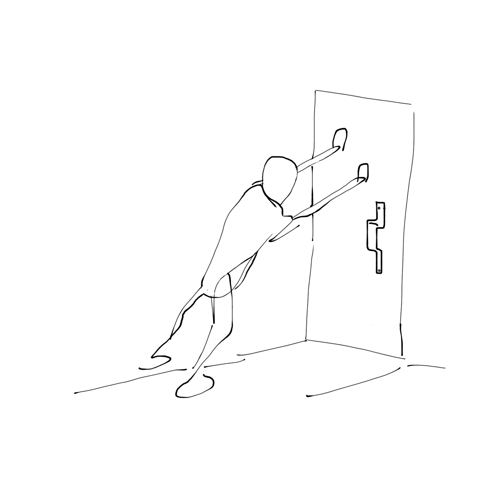
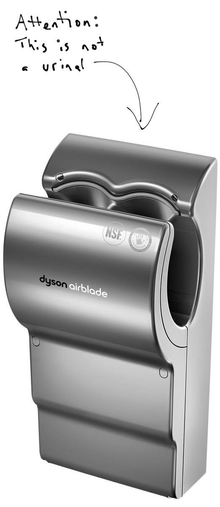

<!---
title: Art of the Living Dead Chapter 6
published: true
folder: Art of the Living Dead
layout: chapter
membersonly: true
--->

# Artifacts of Thought  
> _"An inventor's path is chorused with groans, riddled with fist-banging and punctuated by head scratches."_ — James Dyson

---

Worlds away from the art museum where visitors scratch their heads in confusion as they analyze a black and white photo of Duchamp's urinal, there is a public restroom. In this restroom is a hand dryer. There is no debate about whether or not this hand dryer is art, but there is definitely confusion. In an attempt to reduce user error, a restroom attendant has created a sign that reads,  

> "Attention: This is not a urinal."  

This sign was immortalized by the popular FAIL Blog found at _failblog.cheezburger.com._ This website is an archive of hilarious photos of handmade signs as well as dysfunctional solutions to common problems, and other humorous artifacts of thought. People build water spouts that drain onto electrical outlets. They pave roads around parked cars. They fix anything and everything with duct tape. They create signs that say things like, "COMPARE AND SAVE UP TO 20% LESS THAN OTHER SUPERMARKETS" or "MACY'S ONE DAY SALE, JULY 16 & 17," unaware of the absurdity of these statements. FAIL photos regularly go viral because we love to reverse engineer the intention of their creators.  

What if we applied the same criticism to the less obvious examples of poorly designed objects that we encounter every day? We are surrounded by low quality objects that we have adapted to. Daily use has created blind spots that prevent us from seeing the absurdity of everyday interactions with bad design.  

Everything that we create contains traces of the thought that we put into them. The living are defined by our ability to create, but that doesn't mean that a zombie can't make things, too. If aliens came to earth what would they deduce about us from the objects they encounter? Would they learn through trial-and-error that we were careless, or would they easily grasp our intelligence as they recognized the utility of our inventions? By decoding even our most mundane creations it becomes clear whether or not the object was made by an artist who cared or a zombie who FAILed.  

A well-designed object's purpose is easily understood. A poorly designed object causes people to make mistakes. The classic example of this is the Norman door, named after Donald Norman, author of _The Design of Everyday Things._ A Norman door is the door that you mistakenly pull instead of push. If you are unfamiliar with the term, you have undoubtedly come in contact with these doors. The affordance of the handle is a misleading clue prompting you to grab the door and pull it open. The door doesn't open, so you pull again a little harder thinking it might be stuck. Again, the door doesn't open. Now, slightly embarrassed, you realize that the door opens in the other direction and you awkwardly push it open.  

Embarrassment is a strange reaction in this situation. It wasn't your fault that the creator of the door didn't care enough to make the door user-friendly. If you use this particular door regularly enough you learn to change your tendencies. You adapt. You memorize this door so that next time you are in this spot you won't make the same mistake again. A little bit of space in your brain is wasted to store this scenario. Worse, you have learned a lesson that you can't trust the affordance of objects. Your innate sense of how the world works has been compromised. When you stop trusting the design of the the objects around you, your ability to recognize the value of well-designed objects becomes numb. Gone unchecked, this numbness will overwhelm your good taste, zombifying your ability to differentiate between legitimate quality and fraud.  

Just as we have adapted to Norman doors, how many things do we interact with every day without recognizing the FAIL blog worthiness of their intent?  

Many of us use poorly designed software every day, oblivious to the “Norman door” flaws. This design blind spot results from having trained ourselves to jump through hoops of terrible interfaces in programs like Microsoft Word and PowerPoint. Once we memorize the unintuitive patterns of clunky programs it no longer feels like extra effort. Once learned, we don't recognize the extra clicks required to do a task. We reset our default expectations to the poorly designed software. Instead of trusting the affordance of a well-designed interface we rely on the patterns that have been burned into our minds through repetition and the punishment of our previous errors. Once you have learned PowerPoint it is really hard to embrace an alternative even when vastly superior user experiences are available. We prefer PowerPoint not because it is good software, but because we have invested so much effort into memorizing its quirks.  

Our addiction to shortcuts exaplains why terrible software (Windows, Excel, Outlook, etc.) never becomes obsolete and never receives upgrades that address their core flaws. Software developers know that improvements would actually hurt the user experience because it would require effort from the users to alter their hard-earned brain patterns. The Microsoft Office Suite has changed little in the last twenty years not because they can't make better software, but because they know that better design would be painful to their user base. People who have learned to use Microsoft Office won't invest the effort required to learn new ways of doing things because it is easier to maintain a mediocre experience than to learn something new and uncertain. We save time, effort, and money by maintaining the status quo, and as a result zombie software limps along into eternity.  

Zombie software is just one example. Loyalty to bad design explains the existence of things that should have been obsolete long ago. Fax machines still take up space in our offices. Gas guzzling vehicles remain on the road. We poison ourselves with fast food. We regularly purchase cheaper products because we don't recognize the importance of the well-designed alternatives. New ideas are boycotted not on merit, but on our estimation of the the effort required to learn their new systems. Rather than move the parked vehicle in our path, we pave the road around the obstacles. Humanity FAIL.  

Why do solutions that will make life better get rejected in favor of the existing broken systems? After we have invested time to learn a difficult system we become loyal to it, regardless of quality. Worse, we become biased against good design. Loyalty to bad design is not healthy. It stifles innovation. It cripples our culture.  

There are few relics of excellence in our daily lives that will get passed down to future generations. Instead, most of what surrounds us will get dynamited and bulldozed over. The goal is never transcendence, it is always economic functionalism which says, "Let's build things as cheaply as possible and see what happens. If we have any money left, we can hire an artist to decorate it after the fact." This non-thinking forces us to accept any easy solution that works now, and defers failure until later when a Band-Aid solution is required. Dull, mundane surroundings result from design by committee, a form of mob behavior worse than crowd violence.  

As a result of urbanization, now nearly every single thing that surrounds us has been planned. The ugliness around us is not an accident. It has been built _exactly_ to specifications. If we learn the vocabulary of design, when we recognize the artifacts of intention, we realize how poorly humans have done. This design literacy requires practice to maintain, and the result is not pleasant. You view the world with new eyes, alerted to and haunted by the flaws of workers who didn't care enough to do thing right. As you study the artifacts you realize how careless our surroundings have been put together.  

Let's take a closer look at the hand dryer from the beginning of this chapter. Could the unfortunate zombie who supposedly mistook the dryer for a urinal be a victim of "Norman door-esque" bad design? On the contrary, this particular hand dryer probably _is_ the closest thing to art that you will encounter in a public restroom. It is called the Airblade and it is the result of years of research and dedication. The drying of hands is actually a very serious design problem. Americans use 13 billion pounds of paper towels each year. That is about 45 pounds of paper towels per person, per year. Old hand dryers are inefficient, expensive, and unhygienic. Creating a better hand dryer is a noble cause.  

After revolutionizing the vacuum industry, James Dyson set out to improve the hand dryer. His award-winning Airblade solves several issues. It dries hands in 12 seconds because the 400 MPH "blade" of air removes water extremely efficiently. It is more environmentally friendly because it uses less electricity and there is no paper waste. It is more hygienic because it is touch-free and covered with an antimicrobial coating. It has a low operating cost. 

You would expect a device like this to get a universally positive reception. Instead, many people passionately hate these dryers. Critics of the Airblade say it is too loud. They say it is expensive. They say it is too stylish. They say it is hard to use. They say it is unhygienic. They say it steals its design from other companies. They say it blows water everywhere. They complain that their hands touch the sides. They point out that water drips down the side of the machine. A typical one-star Amazon review reads like this,  

> "Like many people, when I first saw the Dyson Airblade, I was repulsed and confused. Why on earth would someone manufacture a bathroom hand-dryer where the user's hands must be placed inside some sort of communal petri dish in order to operate it? Was the inventor some sort of gibbering idiot?"  

No product is above criticism, but the thing that stands out in the commentary is just how viscously certain the commenters are that the Airblade is poorly designed. The zombies unapologetically appropriate the word "design" and use it against the designer. They attack the person who cares so deeply about this problem that he has invested his fortune and years of his life to improve. Some go as far as calling out James Dyson personally, accusing him of using marketing and style to inflate the price of his inferior products. This is the same condemnation that regularly gets directed at Apple products and the late Steve Jobs. There are few companies in the world, or company leaders, as committed to quality as Apple and Dyson and few as hated.  

You can't completely blame the hatred of design visionaries on blind zombie tendencies. We have become so skeptical of marketing, so eager to discredit the ads that when something well-designed and legitimately well-marketed appears, our shortcut mechanism takes over. Ads have fooled us before, and we won't let ourselves get taken for the fool again. In a strange inversion of taste, we are hostile to things that are well-designed, and forgiving of things with obvious flaws that we have adapted to and accepted.  

Skepticism is healthy, but how does an artist survive in an environment so hostile to legitimate quality? Can you overcome the bias against good design? What can an artist do if people prefer garbage over art? How do we function in society when people who are confronted with better alternatives always prefer  flawed tradition over innovation?  

We need to battle poor design with vigilance. All we can do is keep creating our art and pointing out shameful Norman doors. We need to fight passionately for better products. We need to educate people to recognize the value of good design. We need to support the new ideas and battle our own tendencies to choose convenience over the effort to learn something new. We need to demonstrate the benefits of a flexible mind that can adapt to new and better ways of living and working. We need to exercise our ability to recognize good design and then invest our loyalty into the objects that are inherently better.  

Is humanity paralyzed permanently by our shortcuts? Is hope lost? Apple's chief designer, Jony Ive, would say no. In an interview with Time, he said,  

> "We're surrounded by anonymous, poorly made objects. It's tempting to think it's because the people who use them don't care — just like the people who make them. But what we've shown is that people do care. It's not just about aesthetics. They care about things that are thoughtfully conceived and well made. We make and sell a very, very large number of (hopefully) beautiful, well-made things. Our success is a victory for purity, integrity — for giving a damn."  

Defeating the bias against good design is the responsibility of everyone who can recognize quality. Humanity can't FAIL, especially when some solutions are right in front of us. Good design is being created by artists. We must embrace it.  

What are the practical applications of my advice about seeking great design? Should you demand an apology from the person who installed the Norman door? Is it possible to stop using fax machines? At some point you will have to use Microsoft Word. Sometimes duct tape might legitimately be the best option. Demanding quality and rejecting all forms of mediocrity could easily morph into a deeply cynical worldview.  

The caveat to embracing an outlook of constant critique is a warning about cynicism. When you are surrounded by mediocrity it is easy to by cynical. The difference between a cynic and a critic is the degree to which they are committed to improvement. A critical comment pushes towards enhancement while a cynical comment questions the integrity of the owner. The entertainment of FAIL photos is undeniable, but the tone of this commentary is often too cynical to be healthy. The public mockery of failure does little to improve life. It is dangerous to cultivate environments where failure is publicized and punished. Cynicism scares creators away from invention because failure becomes such a crippling prospect. If there is a chance that your work will be publicly mocked and flogged, you won't risk the humiliation that you imagine accompanies failure. If you are truly creating something new, it is difficult to know if your creation is revolutionary or FAIL fodder.  

An attitude of criticism free from cynicism is difficult but worthwhile. Artists need the freedom to fail without embarrassment otherwise progress stagnates. Permission to make mistakes is critical to innovation.  

We find ourselves balancing seemingly contradictory values. We reject anything that doesn't measure up to our high standards, while at the same time striving to nurture an environment where failure isn't punished.  

If we allow cynicism to dominate our worldview, the result is anger, hatred, and eventually violence. The next chapter explores these emotions and we will take a journey into the domain of the professional where we will answer the question, "Could violence be the solution?"  

[Chapter 7. Infestation and Eradication](chapter7.php)  