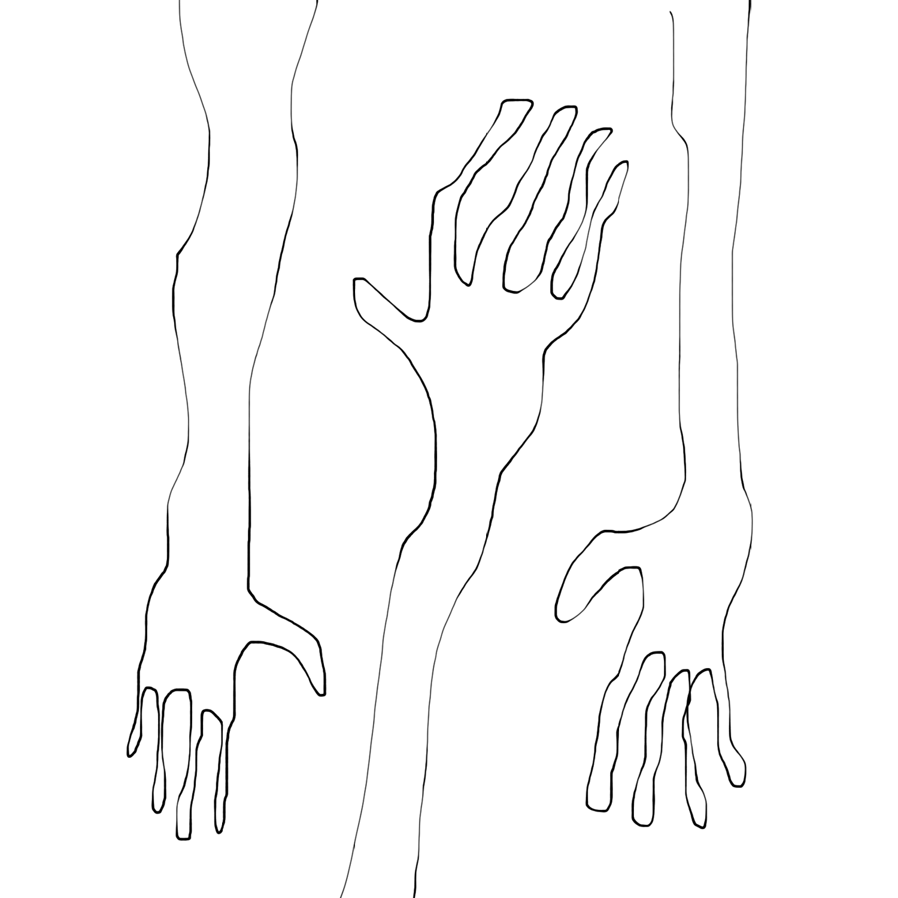

<!---
title: Art of the Living Dead Chapter 7
published: true
folder: Art of the Living Dead
layout: chapter
membersonly: true
--->

# Infestation and Eradication  
> _"The brain is a wonderful organ; it starts the moment you get up in the morning and does not stop until you get to the office."_ — Robert Frost

---

We are about to enter the domain of the professional. The workplace is infested with zombies. If life were a movie, our zombie problem would be easier to solve. With enough weapons and ammo, removing a zombie infestation with force could be possible. Could violence be the answer? There is a place not too far from here that is crawling with walkers where we can test this theory.  

The location is the old UMBRILA facilities. We join Ethan, a former employee who managed to escape without contracting the zombie virus. Ethan's goal is extermination and his plan is to clear out UMBRILA's main office building. As he enters the premises, all seems normal. The parking lot is surprisingly full of cars. Creatures of habit, the zombies inexplicably feel the urge to return to their jobs. They arrive in the morning, punch the clock, and leave at five, repeating the routine that was burned into them through years of service to UMBRILA.  

Entering the parking lot there is a sound and a zombie appears from behind a car. He seems to be a low-level worker. He notices Ethan and starts limping toward him carrying his traveling mug full of coffee.  

The history of UMBRILA began when a brilliant scientist invented a drug for fighting cancer. The drug was a breakthrough and quickly became a hit product. Within a year the company grew to 25 people. The company has doubled every year and today UMBRILA employs over 500 zombies.  

The brilliant scientist left the company soon after the cancer drug hit the market, claiming he had a better opportunity with another drug manufacturer. The truth was that UMBRILA was already showing signs of early zombie infection. He left because he couldn't bear the idea of his art being corrupted by the money-hungry zombies. His exit was welcomed because the zombies already owned his art and the drug would be easier to exploit without his noisy objections and expectations of integrity. Free from the scientist's creative burden, UMBRILA's zombies broadened their portfolio through acquisitions of smaller companies, absorbing new products of questionable quality. 

Now only a car length away from Ethan, the zombie’s face is contorted with apathy, his flesh barely clinging to his skull. His name badge says "Randy."  

The cars are facing different directions, no doubt a habit carried over from when the drivers were still living. Some cars are backed into their spots as if the drivers were plotting their escape before they even started their day. A sports car is parked in a reserved spot at the entrance. No doubt this is the president's car, complete with skid marks documenting his dramatic exits. If we can find the president, perhaps we can get some answers.

Randy drops his mug and lunges at Ethan, whose blade is quick. Randy's body collapses. Spilled coffee mixes with dark blood, swirling between the tire patterns of burnt rubber. Ethan grabs Randy's name badge which also works as a key to enter the building. He steps over the body and continues toward the door. The main entrance is just ahead. There is movement inside.  

Ethan worked for UMBRILA for two years as creative director. He started his job with ambition and optimism unaware of UMBRILA's corruption. His every effort toward beauty was met with opposition. Innovative designs were reduced to mediocrity. Compelling marketing messages were rejected in favor of generic, meaningless taglines. The zombies were just as committed to mediocrity as he was to integrity. Ethan had no choice but to quit, and today he has returned for revenge.  

The door unlocks as Ethan waves Randy's name badge in front of the sensor. The receptionist turns and greets him with a gargle and a gasp. Ethan lifts his crossbow and fires.  

It is hard to say how the receptionist and the parking lot zombie became infected. They didn't accept the job because of ambition, they probably just wanted a steady paycheck. As their knowledge of the company grew and the atrocities happening behind closed doors became known to them, they had choices. They could either look the other way and keep cashing their checks, they could quit, or they could attempt to somehow work to improve the organization through their work. They chose ambivalence and life was choked out of them until finally they became zombies.  

Exiting the foyer Ethan enters the main office space where the sound of zombies clicking on their keyboards and sipping their coffee reminds him how much he hated this place.  

The first cubicle has a kitten calendar and a magnetic sign identifies the zombie as Lynn. A red light blinks at the end of a microphone strapped to her head. She is a customer retention specialist. With her script memorized, she can mimic a tone of sympathy when angry customers call about malfunctioning UMBRILA products. She can replicate a tone of surprise when they describe the flaw that nearly every customer discovers after purchasing the products. Her script is filled with loopholes that allow her to escape the "lifetime warranty" claim that gets stamped proudly on every box that leaves UMBRILA. Ethan's blade swings and the headset falls to the floor, the red light still blinking.  

Ethan passes a zombie he vaguely remembered from the financial department. His greasy grin scared children even when he was alive, but now the corners of his mouth seem pinned to his cheek bones holding up sagging lips that salivate as he scurries by before Ethan can strike him down.  

Ethan continues through a corridor into a hive of tightly packed cubicles buzzing with activity. They press phones against their skulls as their jowls chomp in the memorized rhythm of long forgotten sales pitches. They barely notice the commotion as Ethan quickly clears the cubes.  

The next cubicle, adorned with a poster of the sun setting on an unidentified tropical beach, contains a regulatory zombie named Linda. Her job is to read government documents and apply their vague mandates to UMBRILA's products. This involves identifying anything that differentiates the product from other products on the market, documenting these deviations, and then eliminating them through a grueling "approval" process. If she does her job the output of the company will be completely free of beauty, marketing, and any description of what the product actually does. The packaging would be covered in cryptic government symbols, legal jargon, disclaimers, part numbers, codes, and generic descriptions. In short, her job is to remove the art from the art. Her head, cleanly separated from her body by Ethan's blade, falls onto a thick binder nearly bursting with regulations.  

The next cubicle occupant, Max, belongs to the quality department. On his desk is a miniature zen garden. The name of this department is misleading. Real quality comes from creative thought. Creativity would only cause confusion to Max, whose job consists mainly of checking part numbers, scanning barcodes, and comparing specifications to finished goods. The real function of the quality department is not quality, but accurate documentation. As a result, the quality of the products on paper is high, perfectly documented. The actual quality of the product is questionable. It may malfunction, or it might just lack the real quality that results from living workers infusing the products with integrity. Max will not be mourned when he is gone. A _quality_ blow to his head sends Max into early retirement.  

The human resources cubicle is decorated with motivational quotes. The HR zombie's job is to hire people who would fit in well with the zombie culture at UMBRILA. Her skill is giving the illusion of a well-functioning, highly compensated, conflict-free workplace. A resourceful swing puts an end to the lie. Even in death, her expression still maintains a well rehearsed smile.  

It is harder to deduce the role that other zombies serve in the organization. The plaques on their walls document their years of service, but the output of their position is uncertain. They have gamed the system into thinking that their work is important. They are always busy but never get anything done. These zombies fall easily, their blank stares are giant targets that Ethan fills expertly with arrows.  

Ethan's former cubicle is just ahead. He recalls an afternoon when an accountant was giving a tour of the office. When her tour entered Ethan's creative space she paused and whispered, "I think he is an artist or something." They stared for a few awkward seconds and then continued the tour.  

The marketing zombies are an especially devious breed. Understanding that their products lack integrity, they resort to false claims, advertising lies, and manipulative messages. They eagerly embrace any trend that exploits the behaviors of consumers. What appears to be a designer tries to defend himself with a Nerf gun, but it is no match for Ethan's blade, and his body drains onto his sketchbook. The other marketers fall just as easily. 

Next up is an accountant's cube, with walls completely free of decoration except for a single Dilbert cartoon. He works with a clean conscience, knowing that his excuse for destroying art is completely warranted. By controlling the flow of money he can cut funding to any project that carries the superfluous signs of artistic integrity. A resourceful blow to his head sends glasses flying.  

The buzz of hard drives and the hum of servers tells us that we are entering the IT area. These specialized zombies have cornered the market on technical knowledge giving them control over the infrastructure that the company runs on. When the email system goes down or the website is offline, their defense is a mind-numbing technical excuse. Because they alone have access to the infrastructure, it is impossible for anyone outside to question the authenticity of their claims and therefore they are able to maintain their jobs despite their incompetence. Legacy software will remain obsolete, further ensuring their job security. Software updates and patches will require specialists, allowing them to increase their numbers through new hires. One by one, the IT zombies fall beneath the blows of Ethan's blade. Unfortunately the commotion damages the email server and soon the IT department will be flooded with confused workers incapable of working without email access. 

Realizing the internet is down, a zombie mob appears. There must be a hundred of them blocking the exit. Ethan pushes into the herd, desperately fighting to escape. In the chaos it is unclear what department they represent. Some are defenders of the status quo. Some battle for low standards. Others are cunning conformity warriors. Some proudly display badges of incompetence.  

Ethan swings his blade wildly as he pushes through.  

Academic zombies. Jargon zombies. Nitpicker zombies. One zombie is decisive and the next defers authority.  

As their bodies fall, another batch instantly takes their place.  

Zombies that take pleasure from defending the rules. Zombies that deflect responsibility. Zombies that make excuses. Zombies that procrastinate. Zombies with emotional distance from their work. Experts at passing the buck and covering their butts. Zombies that thrive on drama. The room is churning with apathy, incompetence, and conformity.  

Zombies seeking consensus, zombies who look for shortcuts. Get-rich-quick zombies. Zombies that don't want to do things the hard way. Devil's advocate zombies. Escapist zombies. Addicts. Zombies crippled by indecision. Zombies who rush to decisions too quickly. Zombie that haven't been given a fair chance and feel victimized.  

Wave after wave Ethan cuts through the crowd.  

Angry zombies. Passive aggressive zombies. Zombies with GED's, PHD's, and fake ID's. Know-it-all zombies. Religious and atheist zombies. Democrats, Republicans, and indifferent.  

Finally, Ethan emerges and sprints for the corner office, taking out a couple lawyer zombies as he goes. Kicking open the door, Ethan sees the president sitting behind his oversized desk. Ethan shouts,  

> "Why did you do it? You are the one person who could have stopped the infection. You had the power to inspire your workers with a vision of hope. Your chose corruption over integrity. These people didn't have to become zombies. You could have nurtured their humanity with meaningful jobs, and an environment that encouraged integrity, creativity, and innovation. You are responsible for the atrocities UMBRILA has committed! Why did you do it?"  

The president stares blankly. He seems to vaguely recall Ethan's face as belonging to a former employee. He replies, 

> "Sir, UMBRILA, is far from corrupt. We are the largest employer in northern Oklahoma. Our products save lives. Our profits support the struggling economy. You may not like it, but you can't stop progress."  

This answer stuns Ethan. He expected the president to be an evil genius carefully orchestrating a master plan. He is shocked to discover the president is just another mindless zombie. His role is not special, the president's job is just another gear in a dysfunctional machine. He is no more to blame than any of the other departments. Ethan realizes that the president's last statement about progress is true. It _can’t_ be stopped. Even if todays attack succeeds and UMBRILA is destroyed, there are countless other companies just like this one.  

Devastated, Ethan pulls his crossbow's trigger. The president collapses and Ethan turns to leave. It is too late. The mob is at the door. Ethan tries to push through, but they overwhelm him. He is crushed beneath the pile. Ethan is gone and any contribution his life could have made to the world dies with him.  

The raid of UMBRILA was a failure. Despite their losses, the zombies will rebuild. A new leader will be selected. The vacant cubicles will be filled by zombies eager to advance their careers. The attack was only a temporary setback and they will be shipping dysfunctional products again in a matter of days. Ethan died in vain.  

Violence solves nothing. In real life we don't have the luxury of stalking from office to office killing our zombie co-workers. When a psychopath goes postal in the real world, his workplace violence is not in the pursuit of creative integrity. We are not deranged, and what we fight for is too important to allow anger, hate, or aggression to derail our mission. No, our battle can't be fought with weapons or brute force. Our response must be more nuanced.  

Exaggerated as this chapter is, the cynicism represented by Ethan's rampage might be familiar. As professionals it can be easy to look around and feel like the answer is to strike down the opposition. It is tempting to blame our surroundings for our failure, but if the survival of our creative work is the goal, we must become experts at working within the zombie system peacefully. There isn't a nuclear option, only the day-to-day effort of showing up and doing our job, weathering the highs and the lows. On the best of days, the ones that start with a song on your tongue, when the light of opportunity fills you with possibility, when you celebrate success, savor these moments and remember them when things turn dark.  

On the worst of days, when doing your job tests your sanity, when doing the right thing feels like anarchy, when every step is a step closer to your breaking point, these moments define us. Heroes aren't birthed in Jello molds of frictionless ceremony, they are forged in the furnaces of grinding opposition. Battling zombies is less like a first-person shooter game and more like a cerebral game of chess. 

[Chapter 8. Zugzwang and Kintsugi](chapter8.php)  