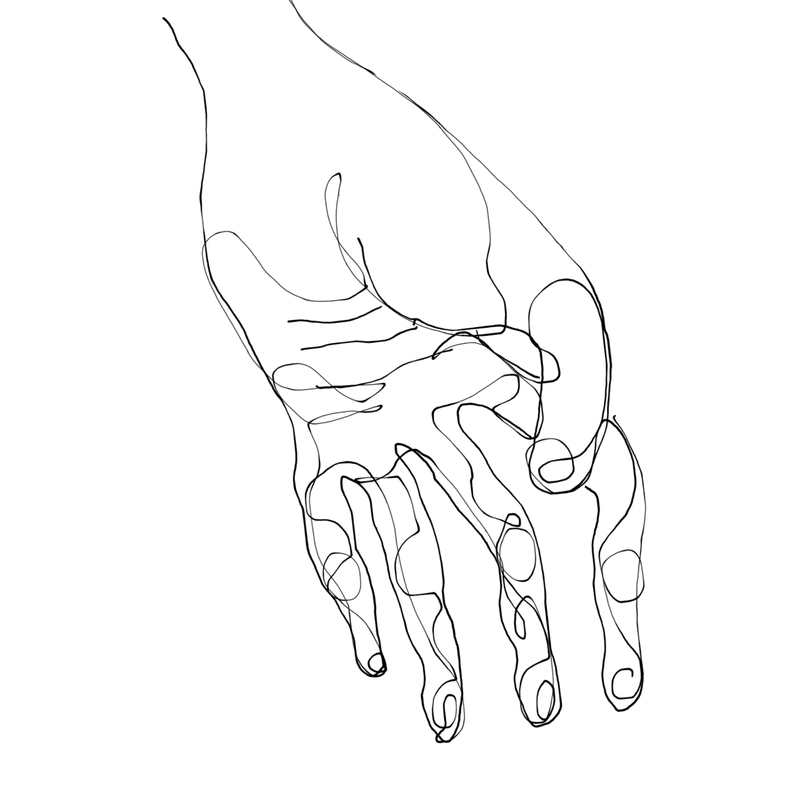
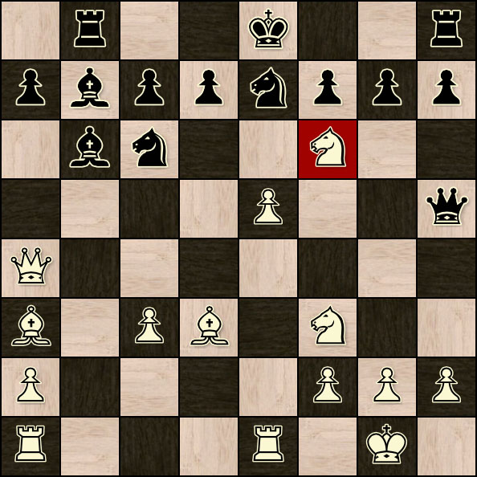
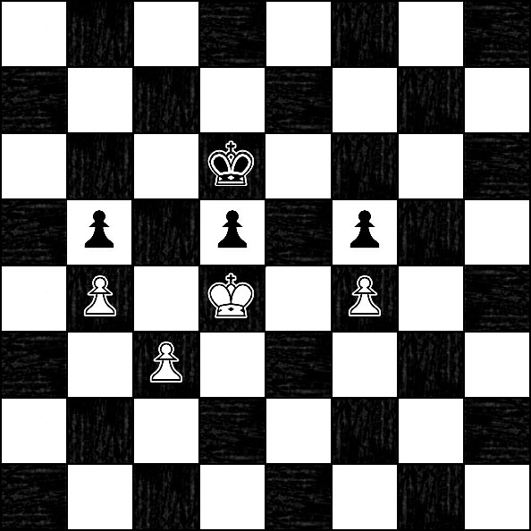
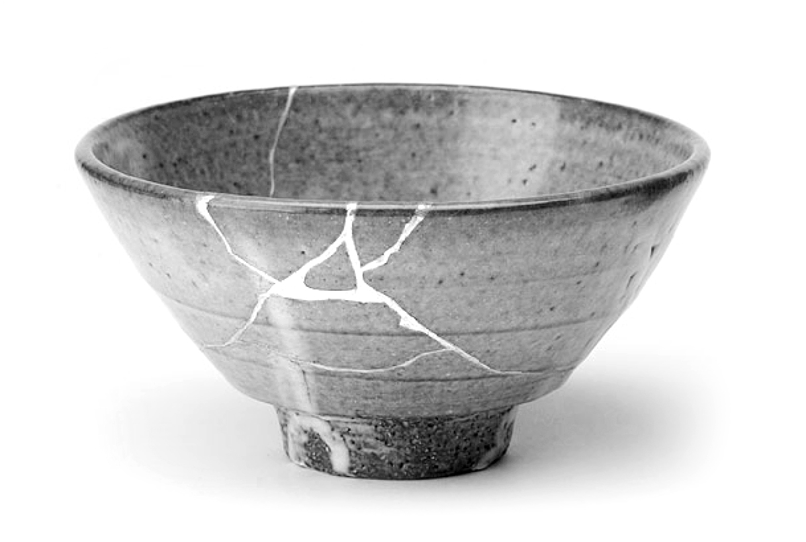

<!---
title: Art of the Living Dead Chapter 8
published: true
folder: Art of the Living Dead
layout: chapter
membersonly: true
--->
# Zugzwang and Kintsugi  
> _"Creativity is allowing yourself to make mistakes. Art is knowing which ones to keep."_ — Scott Adams

---

The previous chapter was violent, and perhaps expected in a zombie-themed book. In certain situations, aggression might be warranted, but the focus of our energy should be on creating art, rather than destroying opposition to it. A human has a limited amount of energy. Being efficient with our attention increases the potency of our actions. 

By forfeiting the press coverage that more bloody encounters may attract, deliberate avoidance of tempting distractions will repay us with more productive output. This approach is similar to chess in that it makes for a dull spectator sport to all but the most dedicated fans. Not all chess games are boring, however. Certain legendary encounters go down in history with nicknames like, "The Immortal Game" or "The Evergreen Game." The annotation of noteworthy games are sprinkled with exclamation marks that seem out of place. Certain moves are so outrageous that the commentators can't resist using double punctuation marks of exuberance. I find it inspiring that even in a centuries old game, a game so explicitly defined by rules, that it is still possible to cause delight and surprise in observers.  

Great chess players have something merely good players lack. What is it that these chess players possess that allows them to produce art in a game notorious for being boring? Most people think it involves being able to see more moves ahead than the opponent. That's not the difference. The secret is that great players make more wrong moves than their opponents. They are able to entertain wrong moves longer than their opponents and see where tradition, training, and experience fails. In other words, they don't rely on shortcuts. Traditional chess skills are built around shortcuts because, like so many aspects of life involving pattern recognition, it is easier to follow simple rules than to create new ideas. Chess students memorize openings, practice combinations, make calculated exchanges, and learn to recognize the tiniest advantages in positions.  

Once you learn these shortcuts, the playing field is level. At the highest levels of chess play, every player can make the correct moves, by the book, selecting the school of thought that best suits the position. They have all memorized the patterns and can process the game data correctly. How do you move ahead in an even playing field? The answer is not to keep making correct moves, the market is cornered in regard to correct moves. The answer is the opposite. A great chess player spends more energy studying the "wrong" moves because brilliance doesn't exist in the well-worn path of tradition, but in the uncharted territory of error.  

The reason the majority of chess games are so excruciatingly boring is because most don't end in victory, but in a draw. The games cling to tradition and lurch along predictably until you run out of pieces and the game ends exactly like it started – dead even. Stalemate.  

You might not play chess, but can you relate to this analogy as it applies to your professional life? Careers are built on a simple set of rules. You start out with a basic understanding of the various pieces and through practice you get better at navigating the squares, using the strengths of your position to win material gains. You make calculated sacrifices. You have some big wins and suffer devastating losses. Then you get to a point where it seems that every day begins and ends in stalemate. You are going through the motions. You do the right thing, make the suggested moves, and recite canonical knowledge, but you are no longer making progress.  

In chess, and I would suggest also in life, brilliance occurs not by following the established formulas precisely, but by knowing when it is imperative to break the rules. Great work is unorthodox. Success is not about finding the recommended square to place your piece. The winners are the people who are willing to spend longer wrestling with seemingly bad options. Amazing only happens when canonical knowledge is abandoned in favor of a decision to do something that everyone else in the world would agree is wrong. In order to make a move that goes against everything you have ever been taught is a rare achievement that takes real courage.  

The reason computers beat humans at chess is because we cling to our shortcuts. A computer doesn't have to worry about breaking from tradition, it just plows through massive amounts of data analyzing every move without bias. The bandwidth of the human brain is limited, so we must rely on our flawed patterns, familiar theories, and limited personal experience out of necessity. Breaking this tradition carries a huge burden because the stakes are so high. When playing a computer you can't risk an unorthodox move because you don't have the processing power required to guarantee that your move is sound. If you lose after making a "correct" move you are forgiven, but if you lose by making an intentionally unorthodox decision, the punishment will be twice as painful. In addition to the normal shame of losing, your failure will be marked by an asterisk that notes your mistake as being avoidable. Most players choose the comfort of a draw over the risk of loss as a result of breaking the rules.  

Risk aversion cripples our courage. Instead of daring, thrilling duals, our encounters are timid and uncontroversial. While we rarely run into catastrophic mistakes, we also rarely encounter amazing victories. Our days are filled with mundane, uninspiring, unexciting routines. We know that tomorrow will be pretty much like yesterday and we like it that way. We prefer the predictability of stalemate to the risk of personal loss.  

What can we do to train ourselves to identify the difference between bad moves and moves that just look bad but prove to be correct in the end? It can be tempting to rely on our access to infinite computing power as a substitute for mental strain. The stats and research that can be so reassuring too often ends up being flawed. We are so used to trusting our machines that we stop questioning conventional wisdom. We need to learn to be open to ideas that seem wrong. We need to train ourselves that the uncomfortable feeling that accompanies a new idea is not the danger, the danger is not learning everything we can from the new ideas.  

Are you familiar with the term "zugzwang"? This word describes a chess situation where you are forced to move even though any movement will weaken your position. It doesn't happen very often because there is almost always _something_ you can do to improve your position. When caught in zugzwang it would be better if you could skip your turn and keep things as they are. Unfortunately, the rules of chess dictate that you must move, so your only option is to fall on your own sword.  

The trap of zugzwang and the idea that doing nothing could be better than doing something is counterintuitive. Could the zombie apocalypse reflect a state of self-imposed zugzwang? As the world spins around us in perpetual movement, we feel pressure to keep moving, too. Rather than maintain our position and recharge our dignity, we push forward. Instead of pausing for reflection, we jump in head first and go, go, go. When we trip and fall on our swords, the failure comes as a shock. Why couldn't we see this coming?  

Life isn't a chess game where you are required to move your pieces. We forget that doing nothing is a legitimate option. Abstaining might be exactly what we need. If we intentionally choose to do nothing, it feels uncomfortable because we are addicted to momentum. How long could you sit at your desk in silent contemplation without producing something? When was the last time you forced yourself to concentrate on nothing? How long could you resist before indulging the urge to plug back in to the devices that ping us constantly?  

We have become dependent on the buzz of constant connectedness. Being surrounded by constant motion produces an illusion that we are actually doing something meaningful. Silence makes us uncomfortable. Stopping seems like an unthinkable strategy for success. Are we our own worst enemy, always overfilling our schedules, always promising more than we can deliver, and never saying no?  

We are rarely in situations where we absolutely have to do something, but we forget that inaction is an option. We _can_ find the time to isolate ourselves from distraction. We _can_ tell our spouse, boss, and friends "no." We _can_ reduce our workload so we can focus on what is really important. Be decisive and stop allowing yourself to get forced into action.  

In our hyper-competitive society it seems foreign to use a non-strategy like skipping our turn. Victory typically gets framed in terms of inflicting damage on your opponent, but there is something very elegant about winning through pacifism. Instead of praising the silent winners, the people who get the attention are the ones who defeat their opponents as graphically as possible. Why exert energy if your enemy is caught in zugzwang? Let him fail on his own, and conserve your energy for when you can inflict maximum impact with minimal effort. Zugzwang won't make headlines, but it's refreshing to think of someone with so much skill that she wins by simply forcing her opponent to make a move – any move.  

Once we manage to escape zugzwang, when our minds have absolved themselves from the pressures of our surroundings, a sense of purpose will arise. The tasks we face are not battles against external forces, they are an opportunity to bring beauty and meaning to our lives. Mistakes are not something to avoid, they are opportunities for growth. They are paths far more fertile than the paths exhausted by conformity.  

In Japan there is an art called Kintsugi. It is the art of repairing broken pottery. The tradition is that broken pots are not discarded, rather the cracks are filled with gold resin. Instead of being seen as flaws that should be hidden, the fault lines of the vessel are emphasized, celebrated, and immortalized with precious metals. The pieces are more beautiful for having been broken.  

Value is not a process of mass-producing flawless clones, but the experience of exploring the rough-edges of failure. Here, where the damage produces scars, we typically obscure the mistakes, or discard the experience all together. These veins of weakness are not flaws, they are opportunities for beauty.  

We often confuse meaningful work with glamorous jobs. We wrongly assume that mundane tasks can't be done with pride and craftsmanship. We desperately hide our weaknesses, avoid mistakes, and never discover our true potential. The selves we project are polished and retouched, never hinting at the wreckage that exists just below the tight skin.  

We all do this and the result is a hyper-realistic world that isn't real. It is an illusion. This uncanny valley is filled with cartoon versions of people we think we know. It is so close to being real that it's creepy. You can't put your finger on what exactly is wrong with the picture. Every surface is so perfectly polished that you can't find perspective. You can't see the flaws, and that's the problem. When everything gets polished beyond realism, the landscape no longer rings true.  

As we navigate the zombie apocalypse we have to be careful of aiming for utopia. In movies we have the luxury of being able to identify zombies by their grotesque bodies. In our apocalypse, the enemy isn't a disfigured monster, and the heroes aren't flawless, unbroken vessels. Victory won't come from indulging in violent abolition of flaws, the journey requires patiently filling the cracks of failure with the gold of authentic work. As we get better at assigning value to things that are truly authentic, perhaps we can break our addiction to the shortcuts that cause us to misvalue objects in the first place.  

[Chapter 9. Shortcut Addiction](chapter9.php)  