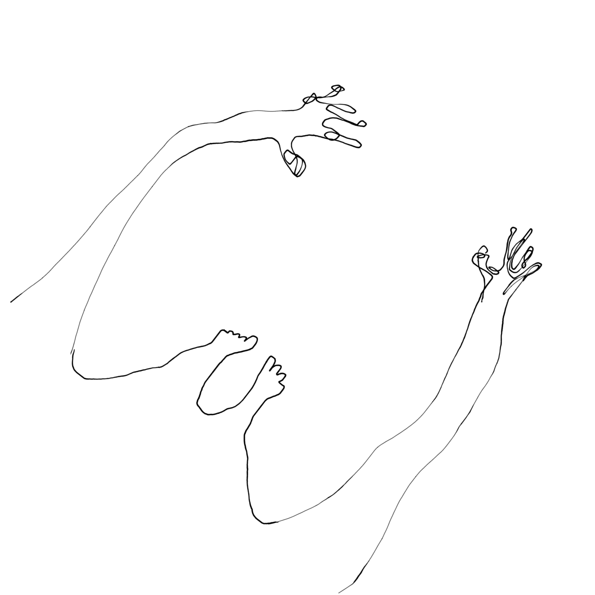

<!---
title: Art of the Living Dead Chapter 9
published: true
folder: Art of the Living Dead
layout: chapter
membersonly: true
--->

# Shortcut Addiction  
> _"I conceive that the great part of the miseries of mankind are brought upon them by false estimates they have made of the value of things."_ — Benjamin Franklin

---

Squeak. Creeeeeek. Squeak.  

It was a beautiful wood floor aside from the one squeaky spot in the middle. It drove the homeowner crazy. Finally, he called a craftsman. The craftsman said that for $100 he could fix the squeak. The homeowner gladly agreed.  

The craftsman walked across the floor several times, applying pressure to different boards. Then he pulled a single nail out of his pocket and hammered it into a precise point on the floorboard. The squeak was gone. "That will be $100," said the craftsman.  

The homeowner was stunned and replied, "I am not paying $100 for a single nail!"  

The craftsman replied, "The nail only cost $0.15. Knowing where to put that nail is worth $99.85."  

There is a similar story about Pablo Picasso who was asked by a fan to sketch her portrait. Picasso obliged and captured her essence with a single pencil stroke. She was amazed and asked, "What do I owe you?" 

Picasso replied, "Five thousand dollars." 

The woman was stunned. "How could you want so much money? It only took you a second to draw!" 

Picasso replied, "Madame, it took me my entire life."  

Humans are terrible at measuring the value of things. We look for shortcuts. The most common mistakes result from assigning value to materials and failing to account for the value of expertise. We assign the value to the nail, not the skill of the craftsman. We assign value to the time it takes to do a task rather than the mastery of the craftsman.  

Nearly every professional has an hourly rate. Depending on how highly we value our skills and how much demand there is for our services, the rate we choose can be affordable or outrageously high compared to competitors. Billing hourly puts you on a level playing field with everyone else in your category. If you want work more you simply lower your rate. If you can earn a reputation for excellence you can survive with a rate higher than your competitors because people will seek you out.  

We tend to look at a person’s hourly rate to assess the value of someone’s work. It is a shortcut that bypasses the difficult task of measuring the skill level of the worker. This is an invitation for zombies to over charge and under deliver. Billing hourly leaves no room for art. It forces a schedule on something that can't be measured in chunks of time. When time expires before we are finished we are forced to ship mediocre work. When we finish early it puts pressure to either discount our art or exaggerate the effort we put into it. The shortcut of hourly rates fails us.  

Another place where we commonly miscalculate the value of expertise is with tools. The zombie brain loves expensive tools. We would rather spend money on better tools than invest the time required to master our old but adequate equipment. The trap is believing that if you can purchase tools that compensate for your lack of skill then you can save the time that it would take to master the craft.  

Tool shortcuts also fool onlookers who have been primed to associate expensive tools with expertise. The zombie gets the job because she has a $20,000 camera, but your wedding photos are worthless because her skills don't match the expensive equipment.  

The "fooled by tools" effect is why the camera industry has made a fortune selling cameras that are better and better at compensating for the unskilled zombie looking through the viewfinder. And yet despite the billions spent on more prestigous cameras, the quality of photography has not managed to get any better. We live in a time when the cameras in our phones are vastly superior to the most expensive cameras of a decade ago, and yet there isn't any better art being created today than there was one hundred years ago when Henri Cartier-Bresson walked the streets.  

Shortcuts waste our money. We regard the price tag as an assurance that the machine can compensate for our lack of skill. The more we spend, the more reassured we are that we have gotten our money's worth. Zombies often use this bias against us to inflate their prices without improving their products. Yet another shortcut fails us.  

Humans are addicted to our shortcuts. As we discussed, memorization is a shortcut for using flawed software, but that is just the beginning. Brands are shortcuts that tell us what to buy (We will revisit this idea in the next chapter). Religions are shortcuts that tell us what to believe in. Political parties are shortcuts that tell us what our policy decisions should be. Few of us can give nuanced explanations of why we are Hindu or Lutheran. Few of us can give persuasive reasoning about why we are Democrat or Republican. Few of us really understand what makes a BMW superior to a Honda. Even fewer of us have the courage to break the tradition of shortcuts and set out into uncharted territory.  

Shortcuts are everywhere. We memorize answers because it is easier than solving problems repeatedly. We paraphrase. We summarize. We have become a population of know-it-alls even though our knowledge is based on generalities and abbreviated summaries. Like walking _CliffsNotes_ we each carry a knowledge base that is very wide, but rarely very deep. With _Wikipedia_ only a click away it is much easier to understand a little bit about everything than it is to be the world's authority on a single subject. The problem with skin deep understanding is that it assumes that there are simple answers to any given question. Louis CK observes,  

> "When you're learning about something and dissecting it, I don't think you're really through until you don't understand anything about it... If you take any subject and keep asking 'Why," without stopping, you'll get to a point where there really aren't any clear answers."  

That is why there are so many "jack-of-all-trades" and so few true masters in any given field. We get the "big picture" concepts and let the internet fill in the blanks if we ever need to support our claims. The result is a catastrophic assumption that we can rely on the shortcuts that have been burned into mankind's collective consciousness.  

When our shortcuts fail, the results might be trivial or catastrophic. Your brand loyalty could be a bias that costs you the benefits of using a superior product from a different brand. Your religious views might lead you to support legislation that does more harm than good. Your political shortcuts could cause you to vote for the wrong candidate just because he has a "D" or an "R" next to his name. Your child could die because you chose not to vaccinate based on the flawed advice of people in your peer group. These consequences are unacceptable because they are avoidable.  

The usual subtext of zombie apocalypse stories is that civilization is inherently fragile in the face of truly unprecedented threats. Society collapses when most individuals can't be relied upon to support the greater good. To break from conformity means that you are accepting personal risk, and most people won't take that risk. When conformity isn't aligned with the survival of the race, doom is inevitable. This is the scenario that mankind finds itself today. Our shortcuts are destroying us. We can't afford to make these mistakes.  

The alternative to shortcuts is expertise. If you are going to become an expert, you need to be aware of the real value of things. There aren't any shortcuts. Strive to be a master. Commit to knowing even the tiniest detail of your craft inside and out. Know exactly what you know as well as what you don't know. Don't ever fake knowledge on a subject that you are fuzzy about. Dig deeper, work harder, and never stop learning. If you can truly attain mastery, making the wrong decision is no longer a risk because while everyone else is blinded by their incomplete knowledge you will be able to avoid mistakes.  

[Chapter 10. The Taste of Zombies](chapter10.php)  